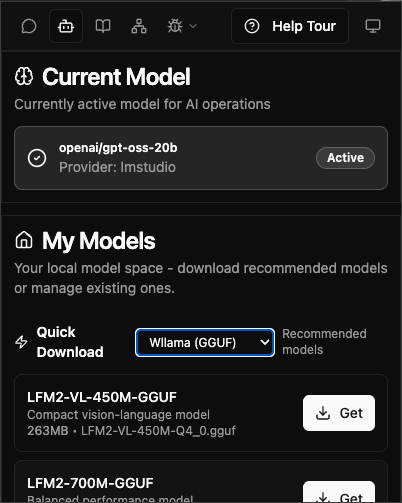
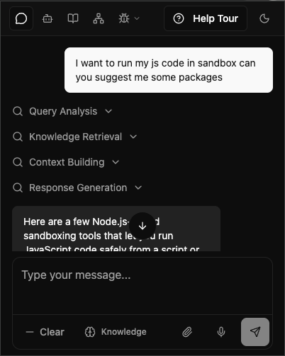
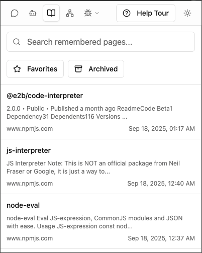
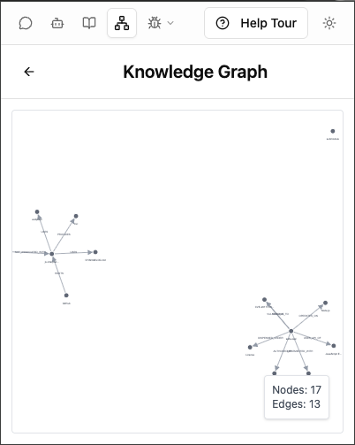
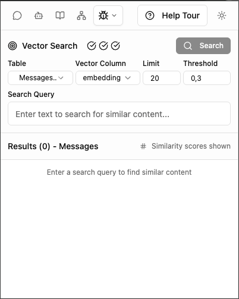
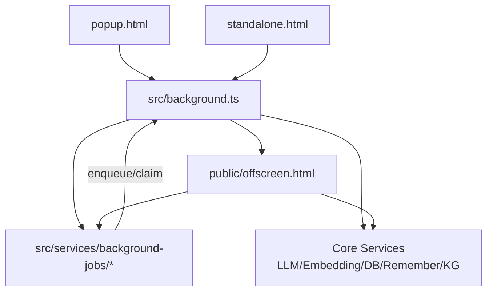

<a href="https://extension.js.org" target="_blank"></a>

# Memorall 🧠

> AI-powered memory and knowledge management browser extension that runs entirely in your browser - no server required!

Memorall helps users manage their digital memories with the power of AI running locally in the browser. Users can ask AI to summarize webpages, remember important information, and recall memories when needed. Everything runs client-side for complete privacy and offline functionality.

## ✨ Key Features

- **🔗 Universal Context Collection**: Seamlessly integrates with webpages, documents, and external tools through MCP (Model Context Protocol). Automatically captures and organizes information from your browsing, research, and workflow to build your personal knowledge base.

- **🤖 Proactive AI Agent**: Actively engages with you to gather information, ask clarifying questions, and suggest connections between your memories. The agent doesn't just wait for queries - it helps you organize thoughts, surfaces relevant context, and proactively assists based on your current activity.

- **🧠 Intelligent Memory Recall**: AI agent provides smart answers based on your accumulated context and memories. Ask natural questions like "What did I learn about that React project?" and get contextual responses from your personal knowledge graph with relevant connections and insights.

- **🔒 Offline Privacy & Free**: Runs entirely in your browser with no server dependencies. Your data stays local, works offline after initial setup, and has zero ongoing costs - no API fees or subscriptions required.

## 📸 Demo

See Memorall in action! The extension seamlessly integrates with your browsing experience to build a personal knowledge base.

### 🎬 Quick Demo


### 📷 Screenshots













## 🎯 Use Cases

- **📚 Research & Learning**: Summarize articles, papers, and documentation while browsing
- **📝 Note Taking**: Ask AI to remember key points from meetings, videos, or conversations
- **🏗️ Knowledge Building**: Build a personal knowledge base that grows with your browsing
- **🔄 Context Switching**: Quickly recall what you were working on across different projects
- **🔗 Information Synthesis**: Let AI help connect related memories and insights

## 🛠️ Technical Architecture

- **⚛️ Frontend**: React with TypeScript
- **🧠 AI Engine**: WebAssembly-based language models (Wllama) + HuggingFace Transformers
- **🗄️ Database**: PGlite (PostgreSQL in the browser) with vector embeddings
- **🔧 Extension Framework**: Extension.js
- **🎨 Styling**: Tailwind CSS with Radix UI components

## 🕸️ Knowledge Graph Engine

The **Knowledge Graph Flow** is Memorall's core intelligence module that transforms unstructured content into interconnected knowledge:

### 🧠 How It Works
1. **📄 Content Processing**: Analyzes web pages, documents, and conversations
2. **🔍 Entity Extraction**: Identifies people, organizations, concepts, and locations
3. **💡 Relationship Discovery**: Finds connections between entities
4. **⏰ Temporal Understanding**: Captures when relationships were established
5. **🕸️ Knowledge Building**: Creates a persistent, searchable knowledge graph

### ✨ Key Capabilities
- **🎯 Smart Deduplication**: Prevents duplicate entities (e.g., "Dr. Smith" = "John Smith")
- **🔄 Incremental Learning**: Continuously builds knowledge from new content
- **🕐 Temporal Awareness**: Tracks how relationships change over time
- **🔍 Semantic Search**: Finds related information through meaning, not just keywords
- **📈 Context Building**: Connects new information to existing knowledge

### 💼 Real-World Examples
- **Research**: *"Alice published a paper on AI safety in 2023"* → Creates entities for Alice (Person), AI Safety (Concept), and their relationship with publication date
- **Professional**: *"Google acquired DeepMind"* → Links companies and captures acquisition relationship
- **Personal**: *"Met Sarah at the conference last week"* → Records social connection with temporal context

The Knowledge Graph enables Memorall to provide contextual, intelligent responses by understanding not just what you've encountered, but how everything connects together.

📚 **[Detailed Documentation](docs/knowledge-pipeline.md)** - Learn more about the architecture and implementation

## 🏗️ Architecture Details

### 🧠 AI Components
- **🤖 Language Model**: Wllama (WebAssembly-based LLM)
- **📊 Embeddings**: HuggingFace Transformers for text embeddings
- **🔍 Vector Search**: PostgreSQL with pgvector for semantic search

### 🗄️ Data Storage
- **💬 Conversations**: Chat history and context
- **🕸️ Knowledge Graph**: Nodes, edges, and relationships between concepts
- **📊 Embeddings**: Vector representations for semantic search
- **📜 Sources**: Webpage content and metadata

### 🔒 Privacy & Security
- **💻 No Server Dependencies**: Everything runs in your browser
- **💾 Local Storage**: Data stored in IndexedDB, never transmitted
- **🔐 Content Security**: Strict CSP policies for secure operation

## 🤝 Contributing

This project is built with Extension.js and follows modern web development practices. Contributions are welcome!

## 📄 License

MIT License - see package.json for details.

## 📚 Documentation

- Services Overview: `docs/services.md`
- LLM Service: `docs/llm-service.md`
- Embedding Service: `docs/embedding-service.md`
- Database Service: `docs/database-service.md`
- Flows Service: `docs/flows-service.md`
- Shared Storage Service: `docs/shared-storage.md`
- Background Jobs: `docs/background-jobs.md`
- Logging Service: `docs/logging-service.md`
- Remember Service: `docs/remember-service.md`
- Knowledge Graph Service: `docs/knowledge-graph-service.md`
- Knowledge Pipeline (concept): `docs/knowledge-pipeline.md`

## 🔀 Extension Flow

High-level flow between UI surfaces, background orchestration, job queue, and the offscreen page for long-running tasks.



- `src/background.ts`: Central orchestrator; initializes services, handles extension events, and coordinates job execution.
- `src/services/background-jobs`: Persistent queue for save/conversion work with progress tracking; producers (UI/background) enqueue, background/offscreen consumers claim and process.
- `standalone.html` and `popup.html`: UI entry points that dispatch actions (e.g., save page, convert to KG) to background.
- `public/offscreen.html`: Dedicated offscreen document for long-running or resource-intensive work to keep the UI responsive and within extension constraints.


## 🚀 Installation

### 🛠️ Development Setup

```bash
📋 git clone <repository-url>
📁 cd memorall
📦 npm install
```

### 📋 Available Commands

#### 🚀 Development Mode
Run the extension in development mode with hot reloading:

```bash
npm run dev
```

This starts both the local AI runner server and the extension in development mode.

#### 📦 Production Build
Build the extension for production:

```bash
npm run build
```

#### 👀 Preview
Preview the built extension:

```bash
npm run preview
```

#### 🔍 Type Checking
Run TypeScript type checking:

```bash
npm run type-check
```

## 🎮 Usage

1. **📥 Install the Extension**: Load the built extension in your browser's developer mode
2. **🚀 First Launch**: The extension will download and initialize AI models (one-time setup)
3. **📊 Summarize Pages**: Click the extension icon and ask "Summarize this page"
4. **💾 Store Memories**: Tell the AI "Remember that [important information]"
5. **🔍 Recall Information**: Ask "What did I learn about [topic]?" or "Remind me about [context]"
