<div align="center">


# Memorall

### Your local-first agent workspace, across browser, web, and desktop.

Memorall combines durable memory, agent tools, and model choice in one shared
React application. The same product code targets the Chrome/Edge extension, a
static web app, and Tauri applications for Windows, macOS, and Linux.

[](LICENSE)
[](https://extension.js.org)
[](https://www.typescriptlang.org/)
[](https://react.dev/)
[](https://github.com/zrg-team/memorall)
[](https://github.com/zrg-team/memorall)
[](https://github.com/zrg-team/memorall)
[](https://github.com/zrg-team/memorall)
[](#memonos)

[MemonOS](#memonos) • [Platforms](#supported-platforms) • [Quick Start](#quick-start) • [Demo](#demo) • [Flow Engine](#flow-engine) • [Agent Power](#agent-power) • [Custom Agents](#custom-agents) • [Architecture](#architecture-at-a-glance) • [Build a MemonOS App](#build-a-memonos-app) • [Documentation](#documentation-map) • [GitHub](https://github.com/zrg-team/memorall)

<br />


**Your browser harness.** Describe an agent and it builds itself, answers arrive as live UI, images and music come from the same app, and a co-agent works on the page beside you.

▶️ [Watch the full trailer with sound (1:41)](./docs/assets/memorall-trailer.webm) — the soundtrack was generated on-device by Memorall's own Audio studio.

🖥️ **New: MemonOS.** Give any agent a computer of its own, watch it work, and take over at any time. [See it run ↓](#memonos)

</div>

<a id="memonos"></a>
## 🖥️ MemonOS: Give Your Agent a Computer

Switch on **MemonOS Bot** for an agent and it gets a computer of its own: a
desktop with a Browser, Files, a Terminal, Tasks and more, shown in
**Runtime → Computer**. The agent works through these apps the way a person
would. It opens pages, writes files, runs commands and ticks off its
checklist, and you see each step as it happens. Press **Take over** at any
moment to drive the computer yourself; the agent waits until you hand it back.

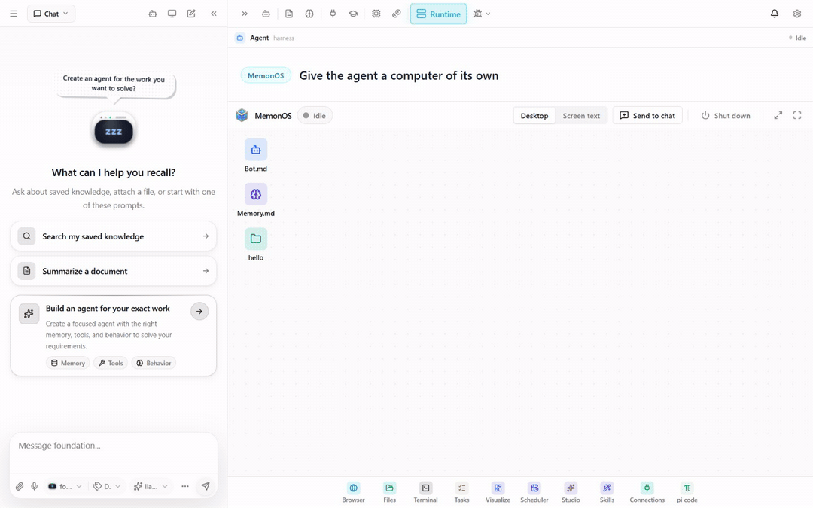

<sub>One request, four apps: the agent plans in Tasks, reads the live Hacker News front page in its Browser, writes <code>~/news/digest.md</code> in its Editor, checks the file in its Terminal, and ticks the task off. Recorded in the Chromium extension. The model's turns were scripted so the take is repeatable; the windows, the page, the file and the commands are the real app.</sub>

### 🧰 What is on the desktop

| App | What the agent does there | Agent tool |
| --- | --- | --- |
| 🌐 Browser | Opens real tabs and reads each page as an outline with a ref on every control; clicks, types, selects, toggles, hovers, scrolls and goes back. Servers started in the Terminal open embedded. | `memon_open`, `memon_act` |
| 📁 Files, Editor, Viewer | Works in its own home, `/agents/<agent name>`: moves, copies, downloads and zips files; edits text in the Editor; reads PDFs, spreadsheets, slides, images and media in the Viewer. | `memon_open`, `memon_act` |
| 💻 Terminal | A shell with `node`, `npm`, `py` (Pyodide), `git`, `curl`, `ffmpeg` and `magick`, in tabs, with long-running servers. | `memon_run` |
| ✅ Tasks | A checklist shared with you, kept in a `.tasks` file. Tasks the agent proposes wait for your approval. | `memon_tasks` |
| 📊 Visualize | Interactive OpenUI visuals, saved as `.openui` files you can reopen and edit. | `memon_visualize` |
| ⏰ Scheduler | The agent's own recurring runs. | `memon_schedule` |
| 🎨 Studio | Image, speech, transcription, audio, text and decision tools, each on the model you chose for that studio. A `.studio` file keeps one set up for a job. | `memon_studio` |
| 🧩 Skills, 🔌 Connections | The skills and connected apps this agent may use. | `memon_skills`, `memon_connections` |
| π pi code | The [pi](https://github.com/badlogic/pi-mono) coding agent in a terminal window. The agent hands it coding work after you confirm in that window. | `memon_code` |

Each agent's home also holds `Bot.md` (your standing instructions) and
`Memory.md` (what it remembers between chats). Both are read at the start of
every chat, and the agent adds to them with `memon_memory`. `memon_screen`
reads the whole screen and `memon_window` arranges the windows.

### 🕹️ You stay in control

- **Watch or take over.** The panel shows who is driving. Pause or Take over,
  and the agent's next tool call waits until you resume. Changes you make are
  reported to the agent at its next step.
- **See what the model sees.** The **Screen text** tab shows exactly the text
  the agent reads, refs included.
- **Ask first.** Per agent, MemonOS Bot can pause and ask you before it submits
  a form, installs a package or deletes a file.
- **Apps follow the agent's features.** Web Browser gives the Browser, File
  System gives Files, Browser Sandbox gives the Terminal, Planner gives Tasks,
  and Visualize response gives Visualize. With MemonOS Bot on, those features'
  own tools fold into the computer, which keeps the prompt small.
- **One computer per agent.** The computer belongs to the agent, not to a chat:
  it carries over to new chats and shuts down after four idle hours, never
  while you are using it.

Turn it on in **Agents → MemonOS Bot**, or choose MemonOS Bot in the agent
wizard. The Browser app needs the extension or the desktop app; the static web
app has every other app.

How it works and how to add your own app:
[MemonOS architecture](#memonos-architecture) ·
[Build a MemonOS app](#build-a-memonos-app)

## 🧠 Why Memorall

Memorall is built for people who do serious work in tabs. Instead of treating the browser as disposable context, it turns pages, selections, documents, and workspaces into durable memory that you can search, inspect, and chat with later.

What makes the current app distinctive:

- 🏠 Local-first by default. The app can run with in-browser runtimes such as Wllama, WebLLM, and Transformers, while still supporting OpenAI, OpenRouter, LM Studio, and Ollama when you want external or local server-backed models.
- 🖥️ An agent computer you can watch. With [MemonOS](#memonos) the agent works in a Browser, Files, a Terminal and Tasks on a desktop beside the chat, and you can take over at any time.
- 🤖 More than a chat window. The shipped UI includes a document library, topic system, knowledge graph explorer, model manager, debug tools, and advanced flow/activity surfaces.
- 🌐 Embedded where work happens. The content script can open a page-aware assistant, capture selected text, visible content, page HTML, and screenshots, and route saved content into a topic.
- ⚙️ Backed by a real agent harness. The Flow Engine turns the model into a composable runtime — graph-based flows, middleware steps, tool execution, memory retrieval, and streaming activity — all running off-thread so the UI stays fast and responsive.
- 🔐 Privacy-aware. Supabase auth is optional, the core app can run local-only, and encrypted provider credentials are restored through the app's passkey flow.

<a id="flow-engine"></a>
## 🔁 Flow Engine

Memorall's agent behavior runs on the **Flow Engine**, which now lives outside the
application as a workspace package family under
[`packages/agent-harness`](./packages/agent-harness). This is the harness system
around the LLM: it turns a model from a text predictor into a scalable agent
runtime that can run graphs, apply middleware, call tools, retrieve memory,
stream activity, and adapt to different host environments.

At a high level:

```text
LLM alone          -> text prediction
LLM + Flow Engine  -> explorable agent system

Flow Engine = runtime + graph + middleware + tools + memory + knowledge + adapters
```

The Flow Engine is important because Memorall is not meant to be one fixed prompt loop. It is designed to stay:

- **Scalable** - capabilities are split into graphs, steps, tools, feature bundles, services, and adapters instead of one monolithic agent.
- **Explorable** - registries and catalogs expose available flows, steps, tools, and features so builder UIs and host code can inspect what exists.
- **Portable** - browser, backend, CLI, sandbox, worker, edge, and test environments can provide their own adapters while the harness stays stable.
- **Composable** - chat, tool agents, RAG, memory agents, extraction flows, and deterministic test flows are assembled from the same building blocks.
- **Testable** - LLMs, embeddings, databases, filesystems, browser sessions, and sandbox services can be swapped for fakes.
- **Streamable** - clients receive OpenAI-compatible chunks plus harness events for progress, tool execution, retrieval, memory, and graph state.

### 🌊 The engine itself: `@memorall/agent-harness-flows`

`core`, `langgraph` and `standard` describe an agent runtime you compose from
plugins. [`flows`](./packages/agent-harness/flows) is a complete, working one -
the engine Memorall runs on every chat turn. It arrives with the pieces already
in it:

| Inside `flows` | What you get |
| --- | --- |
| `registries/` | Step, tool, graph, and service registries plus their schemas |
| `graph/` | Two working graphs: `agent` (a ReAct loop) and `foundation` (a linear pipeline) |
| `steps/common/` | System prompt, chat completion, agent completion, skill context, current time, GPT boost |
| `steps/features/` | Filesystem, web, planner, multi-agent, MCP, Node sandbox, artifact, auto-compact - switchable per run |
| `tools/` | The tools those features expose: fs, web, planner, sandbox, calculator, skills, agent messaging |
| `runtime/`, `context/` | The flow engine, run lifecycle, and runtime variables |

Every step is on or off in a config object, so the same graph is a plain chat or
a full agent depending on that object rather than on different code.

### 🌊 Two rules that keep it portable

- **Importing is registering.** `flows` declares `sideEffects: true`, alone among
  the harness packages, because importing a module here registers what it
  defines. Never re-export it through a tree-shakeable barrel - `full`
  deliberately omits it - or a bundler will drop the registrations and leave an
  agent with no steps.
- **It holds no product behaviour.** Nothing in the package reaches for
  `window`, `document`, or a Node builtin, so it loads under either runtime.
  What it cannot do alone it asks the host for: services (LLM, filesystem, web
  browser, sandbox, logger, skills) through the service registry, HTML parsing
  through `setHtmlParser`, and host-owned tools named with `hostTool("…")`.

### 🧩 The harness family

| Package | Use it for |
| --- | --- |
| [`agent-harness`](./packages/agent-harness/full) | 🚀 The complete facade and explicit presets |
| [`agent-harness-core`](./packages/agent-harness/core) | ⚙️ Contracts, plugins, runs, events, lifecycle, persistence ports |
| [`agent-harness-langgraph`](./packages/agent-harness/langgraph) | 🔁 ReAct loops and ordered step pipelines backed by LangGraph |
| [`agent-harness-standard`](./packages/agent-harness/standard) | 🧰 Filesystem, web, planner, skills, chat, compaction, delegation |
| [`agent-harness-sandbox`](./packages/agent-harness/sandbox) | 🧪 Provider-neutral sandbox sessions, tools, profiles, workspace sync |
| [`agent-harness-mcp`](./packages/agent-harness/mcp) | 🔌 HTTP/SSE MCP discovery, schema normalization, tool adaptation |
| [`agent-harness-flows`](./packages/agent-harness/flows) | 🌊 The flow engine in production use |
| [`agent-harness-browser`](./packages/agent-harness/browser) | 🌐 Browser/worker platform, OPFS, IndexedDB, DOM content |
| [`agent-harness-node`](./packages/agent-harness/node) | 🟢 Node platform, filesystem, stores, stdio MCP, Playwright, local sandbox |
| [`agent-harness-compat`](./packages/agent-harness/compatibility) | 🧭 Explicit bridges for legacy graph, step, and tool IDs |

### 🏠 What stays in the application

Anything that names a Memorall concept or needs a platform API lives in the app
and is registered into the engine at startup:

- [`src/services/flows-integrations`](./src/services/flows-integrations) - visual
  (OpenUI) responses, HyperFrames, Lottie, PDF generation, co-agent, embedded
  chat, thread history, and document conversion steps and tools
- [`src/services/flows-memory`](./src/services/flows-memory) - knowledge
  retrieval, active memory, citations, and knowledge-graph growth
- [`src/services/flows-features`](./src/services/flows-features) - packaged
  domain agents such as travel planner, finance tracker, news collection,
  shopping assistant, job application, language tutor, and meal planner
- [`src/services/flows-service.ts`](./src/services/flows-service.ts) - the thin
  app service over the graph registry
- [`src/services/agent-harness`](./src/services/agent-harness) - bridges a flow
  run into `agent-harness-core`, so runs, events, cancellation, and deadlines
  are owned by the harness

Full architecture notes: [Agent Harness family README](./packages/agent-harness/README.md) ·
[Flow engine package README](./packages/agent-harness/flows/README.md) ·
[Agent Harness architecture](./docs/agent-harness-architecture.md)

<a id="agent-power"></a>
## ⚡ Agent Power

While the Flow Engine defines *how* the agent runs, these are the runtime capabilities it can reach out to from your machine.

- 🧪 Sandbox container access. The agent can use the browser-hosted sandbox runtime to execute Node.js code, install pnpm packages, work with files, start backend servers, and render UI/server output for iterative workflows such as Vite-style app work.
- 🌐 Browser access. The agent can open pages, keep an active browser session, inspect DOM state, search rendered HTML, wait for selectors, and perform DOM actions instead of working from raw text alone.
- 📁 Workspace access. The agent is not isolated from your knowledge base. It can work across the document library and writable workspace trees, giving it access to documents, notes, and workspace files.
- 🛠️ MCP integration is WIP. The repository already includes MCP adapter groundwork, but this should be treated as in-progress rather than a stable, documented feature today.

With MemonOS Bot on, the agent reaches the browser, workspace and sandbox through the apps on its [computer](#memonos) instead of separate tools, so you can follow and steer every step.

<a id="demo"></a>
## 🎬 Demo

First run to a working agent: connect a provider key, pick a model, build an
agent in the wizard with **Visualize Response** enabled, then ask it something
and get an interactive answer instead of a wall of text.


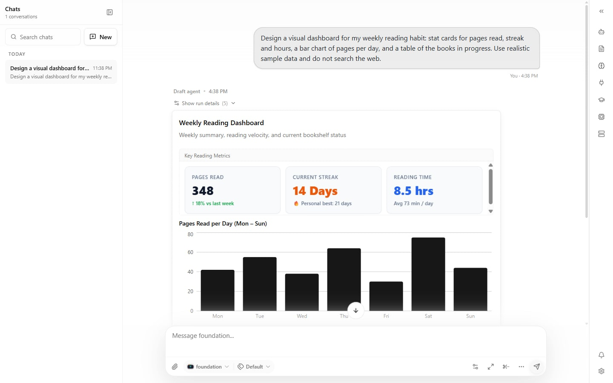

### The same run, step by step

| | |
| --- | --- |
| 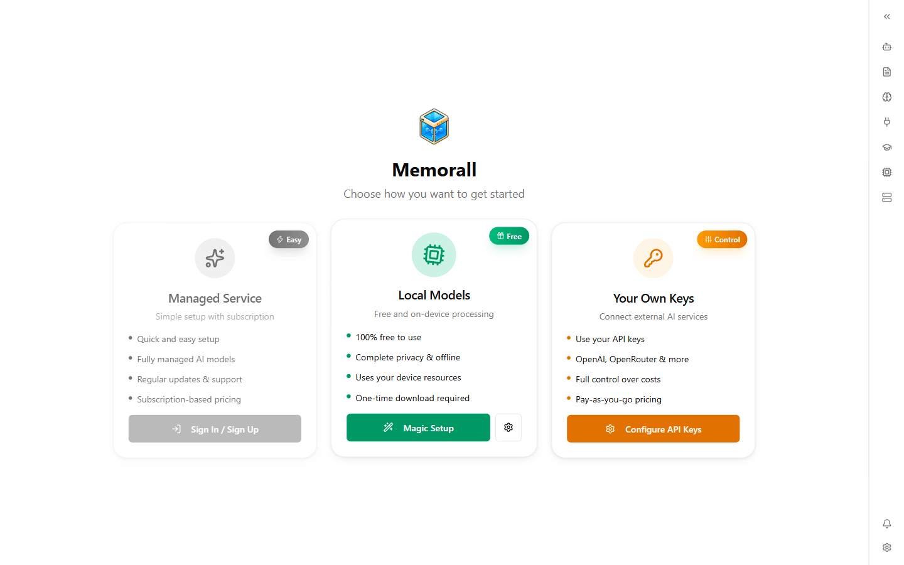<br>**1. Start your way.** A managed service, free on-device models, or your own provider keys - the app is usable in all three modes. | 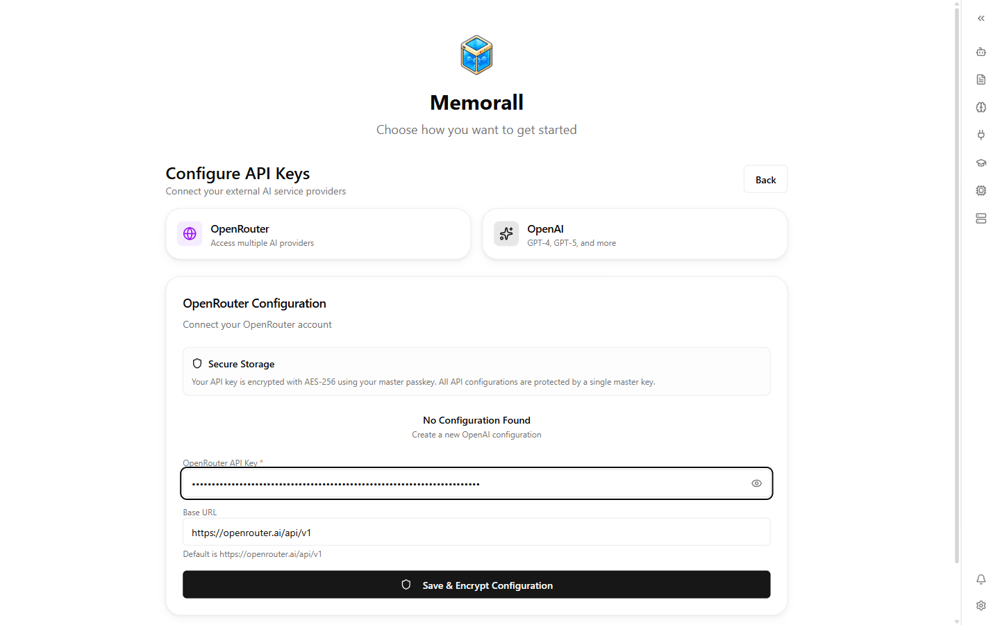<br>**2. Bring your own key.** OpenRouter or OpenAI credentials are encrypted with AES-256 behind a single master passkey. |
| 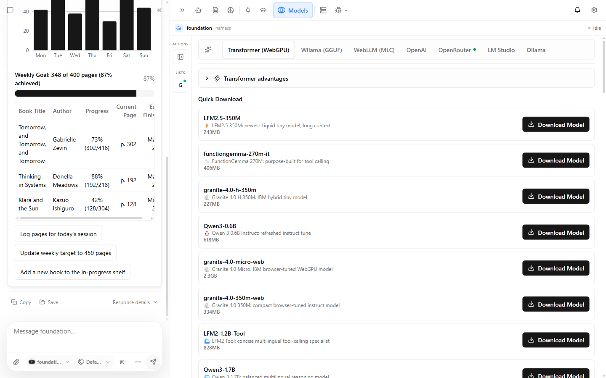<br>**3. Pick a model.** Local WebGPU/WASM runtimes and remote catalogs sit in the same model space, so local-first and remote are one choice. | 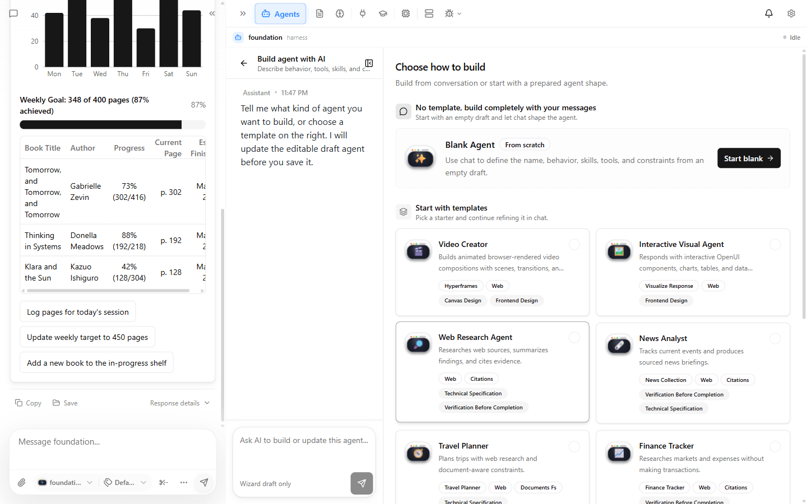<br>**4. Build an agent.** Start blank and describe it in chat, or take a template and keep refining it with the wizard. |
| 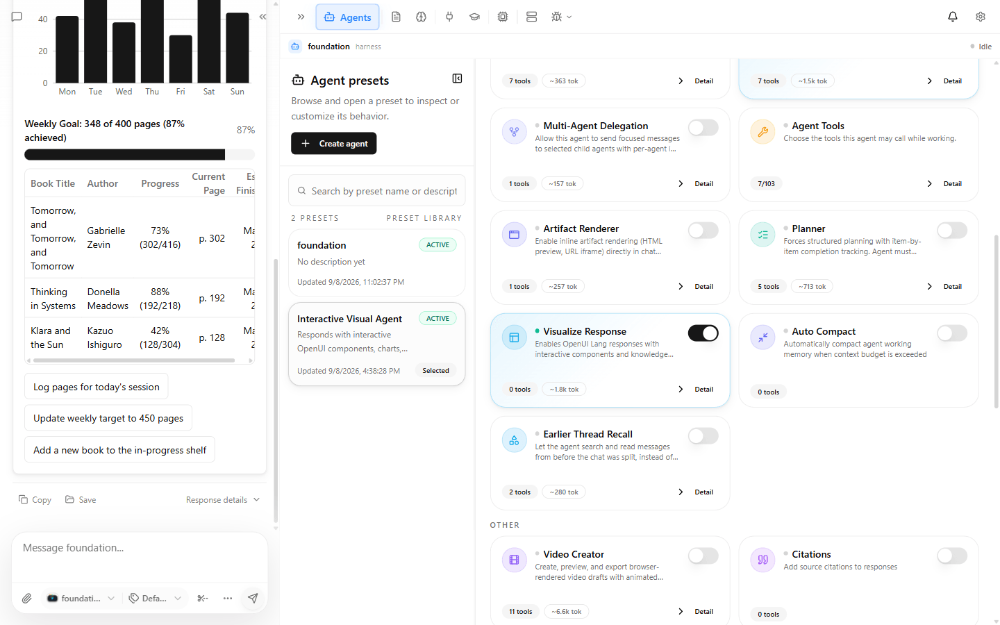<br>**5. Switch on capabilities.** Every feature - memory, tools, web, sandbox, **Visualize Response** - is a switch on the agent, not a fork of the code. | 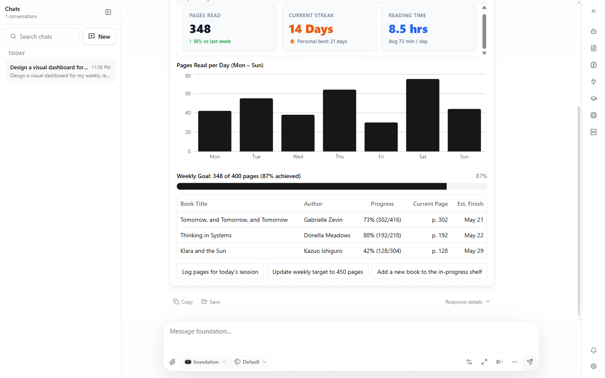<br>**6. Get an answer you can use.** The agent replies with OpenUI components: stat cards, charts, tables, and actions you can click. |

### On the page you are already reading

Both surfaces below are the extension's content script running on a live
Wikipedia article - no copying into a separate app, no tab switching.

**💬 Ask about this page** - right-click anywhere and the panel opens beside the
article. Attach the page (or just a selection) as context and ask about it; the
answer arrives next to what you were reading.

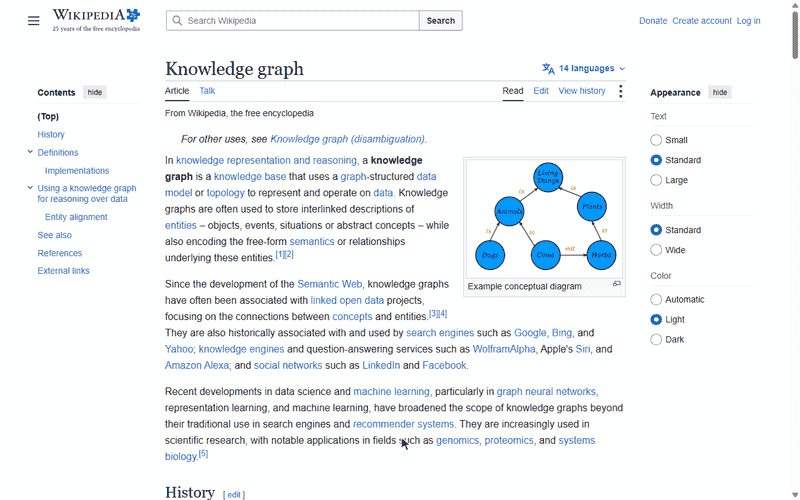

**🤖 Co-agent** - the agent joins you *on* the page. It reads the DOM, scrolls,
points at what it found, and can click safe targets, narrating each step from a
dock in the corner.


<a id="supported-platforms"></a>
## 🖥️ Supported Platforms

Memorall uses one shared product application and small platform adapters. The
extension remains the primary production target while web and desktop progress
through explicit, testable rollout checkpoints.

| Platform | Current status | Build or run |
| --- | --- | --- |
| Chrome/Edge MV3 extension | ✅ Primary target; development and production artifacts are loaded directly in Chromium E2E | `yarn test:e2e:extension` |
| Static web / GitHub Pages | ✅ Shared workspace and static deployment layout verified at `/memorall/studio/` | `yarn test:e2e:web` |
| Windows desktop (Tauri 2) | ✅ Native executable, MSI, and NSIS builds verified; the WebView2 release app opens without a terminal | `yarn build:desktop:windows` |
| macOS desktop (Tauri 2) | ◐ Build support present; must be compiled, opened, signed, and notarized on macOS | `yarn build:desktop:macos` |
| Linux desktop (Tauri 2) | ◐ Build support present; must be compiled and opened on a Linux host with WebKit/GTK dependencies | `yarn build:desktop:linux` |

Legend: ✅ implemented and locally verified; ◐ available as a rollout checkpoint,
provider-dependent capability, or native-host verification requirement; — not
available by design.

| Capability | Extension | Desktop | Static web |
| --- | :---: | :---: | :---: |
| Shared React workspace, routes, flows, RAG, and agent UI | ✅ | ✅ | ✅ |
| PGlite memory, topics, graph, and document workspace | ✅ | ✅ | ✅ |
| Remote-provider chat | ✅ | ✅ | ◐ provider CORS |
| Local CPU/WASM models and embeddings | ✅ | ✅ | ✅ single-thread baseline |
| WebGPU acceleration | ◐ browser/device | ◐ system webview/device | ◐ browser/device |
| In-page assistant, selection capture, and active-tab capture | ✅ | — | — |
| Browser activity tracking | ✅ | — | — |
| Agent browser automation | ✅ extension tabs | ✅ bundled isolated Chromium | — |
| Native folders, local commands, npm, local servers, and MCP stdio | — | ◐ native bridge rollout | — |
| MCP HTTP/SSE | ✅ | ✅ | ✅ |
| Native or browser notifications | ✅ | ✅ | ◐ permission |
| Portable `.memorall` export/import | ◐ integration rollout | ◐ integration rollout | ◐ integration rollout |
| Automatic cross-device synchronization | — | — | — |

Data remains local to each installation. Cross-device cloud synchronization is
not part of this architecture; portable export/import is the migration path.

## ✨ Core Capabilities

| Area | Capabilities |
| --- | --- |
| Chat workspace | Stream conversations, switch between chat and knowledge-aware flows, choose topics, manage agent settings, and inspect active runtime sessions for sandbox/browser tooling. |
| In-page assistant | Open an embedded chat overlay on any page, send selected text or extracted page context into chat, capture screenshots, and jump to the full app when needed. |
| Topic capture | Save selected content or full-page context into a topic from the page itself using the embedded topic selector. |
| Document library | Manage two trees: stored documents and writable workspace files. Upload/create/rename/move/delete/download files, preview PDFs/images/Excel, edit text/Markdown, and tag files with topics. |
| Knowledge conversion | Convert text, Markdown, PDF pages, and Excel sheets into topic-scoped knowledge graph data through the background job pipeline. |
| Knowledge graph | Explore nodes and edges in a D3 graph, filter by topic, search nodes, and curate graph data directly from the graph view. |
| Models and embeddings | Load local/browser models, connect remote providers, inspect current model status, and switch embedding sizes with live reload support. |
| Agent tooling | Let the agent use browser tools, filesystem-style tools, and sandbox runtime tools instead of responding with plain text only. |
| Diagnostics | Query the database, inspect vector similarity results, browse/export logs, and monitor long-running jobs from the UI. |
| Power-user routes | Use a visual flow builder and an activity timeline that can feed captured activity sessions back into AI analysis. |

## 🕸️ Memory And Knowledge Context

Memorall is not just a retrieval cache. It is meant to build an evolving memory context that the agent can follow over time.

- Topic-scoped knowledge graphs let the system keep relationships, facts, and sources grouped around what you are actually working on.
- Document-to-knowledge conversion turns notes, Markdown files, PDF pages, and Excel sheets into graph-ready context instead of leaving them as disconnected files.
- Hybrid retrieval combines structured storage, text matching, and embeddings so the agent can recall both exact facts and semantically related context.
- The result is a stronger "knowledge context" for the agent: not only what you saved, but what it means, how it connects, and where it came from.
- This makes the assistant better at staying aligned with your projects, vocabulary, past work, and long-running research threads.

<a id="custom-agents"></a>
## 🧩 Custom Agents

Memorall is not a fixed assistant — it is a foundation for building any agent you need.

Every agent is a **graph you fully own**: define any nodes, any flow logic, any tools, any conditions. Plug in new graphs, tools, or capability steps without touching existing code. Toggle features like web browsing, sandbox execution, or filesystem access per-agent at runtime.

The shipped graphs are examples of what the system can do, not the limit of what it supports.

→ Architecture and extension guide: [docs/customize-agents.md](./docs/customize-agents.md)

## 💾 Local-First Architecture

Offline-first in Memorall is architectural, not decorative. The product is fully functional without any external service.

- Local/browser-hosted model runtimes — Wllama, WebLLM, Transformers — are first-class citizens, not fallbacks.
- PGlite keeps the entire knowledge store in-browser; no server database required.
- Background jobs and offscreen services keep heavy embedding and LLM work local to the extension runtime.
- Supabase auth is optional. The app runs local-only by default; Supabase becomes available when configured.
- Remote providers — OpenAI, OpenRouter, LM Studio, Ollama — are available when you want them, not when you need them.
- Embedding sizes: small `384d`, medium `768d`, and large `1536d` (remote-backed).
- Storage: PGlite + Drizzle with vectors, migrations, topics, conversations, sources, nodes/edges, activities, and flow-builder state.

---

## 🗂️ Product Surfaces

### Main app surfaces

Routes currently wired in [`src/main/App.tsx`](./src/main/App.tsx):

- `/` - home (the document library); the chat panel sits beside every app route
- `/runtime` - live runtime sessions and the MemonOS **Computer**
- `/agents` - agents, their features, and MemonOS Bot settings
- `/skills` and `/connections` - skills and connected apps agents may use
- `/usage` - model usage and cost per conversation
- `/files` - file and resource library
- `/knowledge-graph` - graph explorer
- `/llm` - model and provider management
- `/embeddings` - vector search/debug view
- `/database` - database inspector/query builder
- `/logs` - log viewer/export surface
- `/auth` - optional Supabase auth flow
- `/activities` - activity timeline and AI session analysis
- `/flow-builder` - visual flow authoring surface

### Embedded page surfaces

The content script and embedded pages provide two user-facing overlays:

- [`src/embedded/pages/EmbeddedChat.tsx`](./src/embedded/pages/EmbeddedChat.tsx) - a page-aware chat panel that can include selected text, visible content, full-page content, HTML structure, and captured images as context
- [`src/embedded/pages/TopicSelector.tsx`](./src/embedded/pages/TopicSelector.tsx) - a lightweight topic picker for saving page content into the knowledge system

### App shell

[`src/main/components/RightApplicationLayout.tsx`](./src/main/components/RightApplicationLayout.tsx) shows what the shared shell actually supports today:

- primary navigation for chat, documents, knowledge graph, and models
- a debug dropdown for embeddings, database, and logs
- theme switching
- English and Vietnamese UI switching
- embedding-size management
- process monitoring and standalone launch from popup mode
- optional account sign-in/sign-out

<a id="architecture-at-a-glance"></a>
## 🏗️ Architecture At A Glance

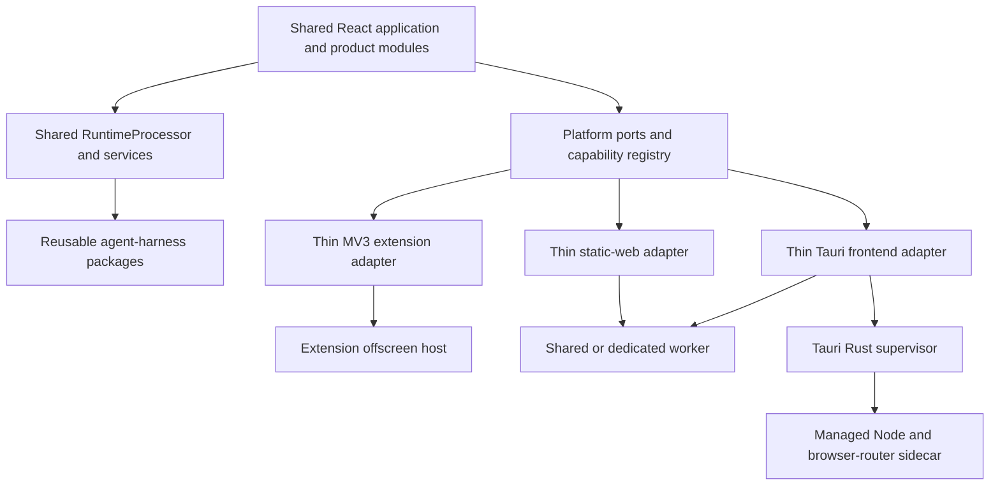
```mermaid
flowchart TD
  UI["Shared React application and product modules"]
  PORTS["Platform ports and capability registry"]
  RUNTIME["Shared RuntimeProcessor and services"]
  HARNESS["Reusable agent-harness packages"]

  EXT["Thin MV3 extension adapter"]
  WEB["Thin static-web adapter"]
  DESKTOP["Thin Tauri frontend adapter"]
  OFFSCREEN["Extension offscreen host"]
  WORKER["Shared or dedicated worker"]
  RUST["Tauri Rust supervisor"]
  SIDECAR["Managed Node and browser-router sidecar"]

  UI --> PORTS
  UI --> RUNTIME
  RUNTIME --> HARNESS
  PORTS --> EXT
  PORTS --> WEB
  PORTS --> DESKTOP
  EXT --> OFFSCREEN
  WEB --> WORKER
  DESKTOP --> WORKER
  DESKTOP --> RUST
  RUST --> SIDECAR
```

The core rule is **share product behavior; isolate host integration**:

- [`src/main`](./src/main) owns one React route tree for every environment.
- [`src/services`](./src/services) owns shared database, jobs, filesystems, models,
  flows, RAG, and business behavior.
- [`src/platform`](./src/platform) contains injected contracts and thin extension,
  web, and desktop adapters.
- [`packages/agent-harness`](./packages/agent-harness) provides reusable browser,
  Node, worker, and test execution contracts.
- [`apps/web`](./apps/web) contains only the Vite/static-site entry and deployment
  configuration.
- [`apps/desktop`](./apps/desktop) contains only the Tauri entry, Rust supervisor,
  native capabilities, and Node sidecar.

Build-time aliases select exactly one platform composition, allowing unused
extension, web, Tauri, and Node-sidecar code to be excluded from each artifact.
Architecture and compiled-bundle checks enforce those boundaries.

Runtime-heavy database, embedding, LLM, and job work is exposed through the
shared `RuntimeProcessor` and injected transports. MV3 hosts it through the
offscreen document, web uses worker transports, and desktop combines worker-hosted
JS/WASM services with a narrow Tauri bridge for native operations.

The full decision record, critique, security model, feature matrix, test plan,
and rollout status live in
[`docs/plans/multi-environment-architecture.md`](./docs/plans/multi-environment-architecture.md).

<a id="memonos-architecture"></a>
## 🧬 MemonOS Architecture

MemonOS is a small operating system that lives inside the shared runtime. One
machine holds the state of the computer; the agent and the user are two drivers
of that same machine.

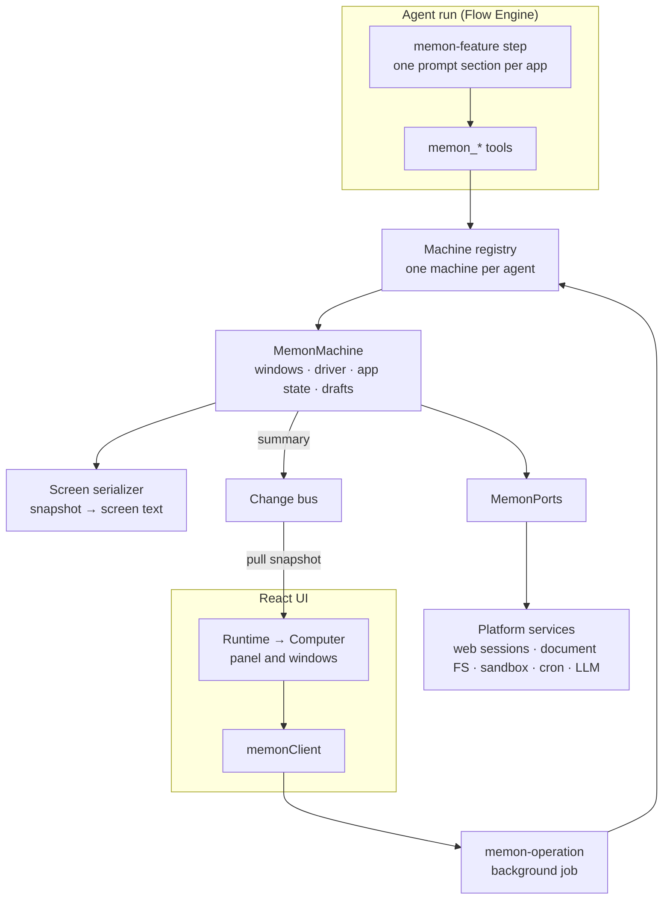
```mermaid
flowchart TD
  subgraph RUN["Agent run (Flow Engine)"]
    STEP["memon-feature step<br/>one prompt section per app"]
    TOOLS["memon_* tools"]
  end
  subgraph UI["React UI"]
    PANEL["Runtime → Computer<br/>panel and windows"]
    CLIENT["memonClient"]
  end
  JOB["memon-operation<br/>background job"]
  REG["Machine registry<br/>one machine per agent"]
  MACHINE["MemonMachine<br/>windows · driver · app state · drafts"]
  SCREEN["Screen serializer<br/>snapshot → screen text"]
  PORTS["MemonPorts"]
  SERVICES["Platform services<br/>web sessions · document FS · sandbox · cron · LLM"]
  BUS["Change bus"]

  STEP --> TOOLS --> REG
  PANEL --> CLIENT --> JOB --> REG
  REG --> MACHINE
  MACHINE --> SCREEN
  MACHINE --> PORTS --> SERVICES
  MACHINE -->|summary| BUS -->|pull snapshot| PANEL
```

- **One machine, two drivers.**
  [`MemonMachine`](./src/services/memon/memon-machine.ts) holds the open
  windows, which driver is in control, each app's state, and the drafts (form
  fields) that both drivers type into. Everything the user sees and the agent
  reads comes from one `MemonMachineSnapshot`.
- **One screen for both.**
  [`screen-serializer.ts`](./src/services/memon/screen-serializer.ts) turns the
  snapshot into the text the model reads: the focused window in full and the
  others in one line each, within about 6,000 characters. Each control gets a
  ref (`[b12]`, `[e1]`, `[n3]`) that `memon_act` takes. The panel's Screen text
  tab shows the same string.
- **Ports instead of platform imports.** The machine reaches the browser,
  files, terminal sandbox, scheduler, studio, skills, connections, downloads,
  homes, pi code and models only through `MemonPorts`
  ([`ports.ts`](./src/services/memon/ports.ts)), created on first use. Each
  platform passes its own ports and tests pass fakes.
- **Runs where the runtime runs.** Agent tools call the
  [machine registry](./src/services/memon/machine-registry.ts) directly inside
  the run. The UI sends operations such as `snapshot.get`, `control.takeover`
  and `app.action` through the `memon-operation` background job
  ([`operations.ts`](./src/services/memon/operations.ts)), which runs offscreen
  in the extension and in a local processor on web and desktop. Changes go out
  as a throttled summary on the change bus (BroadcastChannel, or extension
  messaging), and the windows pull the full snapshot when its revision moves.
- **Scoped to the agent.** The machine key is the agent id (the conversation
  when a run has no agent). The registry is pinned on `globalThis`, so a
  hot-reloaded module or a second bundle chunk finds the same machines instead
  of orphaning open browser windows.
- **Features become apps.** `applyMemonAbsorption`
  ([`feature-config.ts`](./src/services/memon/feature-config.ts)) turns the
  agent's web, file system, sandbox, planner and visualize features into apps
  and switches those steps off for the run, so their tools and prompts never
  reach the model.
  [`memon-feature.ts`](./src/services/flows-integrations/steps/features/memon-feature.ts)
  writes one prompt section per enabled app, and the tools live in
  [`tools/memon`](./src/services/flows-integrations/tools/memon).

<a id="build-a-memonos-app"></a>
### 🧱 Build a MemonOS App

Most apps are **kit apps**. You describe the window once, as nodes, in
[`app-kit/types.ts`](./src/services/memon/app-kit/types.ts) terms. MemonOS
draws those nodes as a window for the user, prints them as screen text with
refs for the agent, and sends both drivers' actions to the same `act` handler.
Tasks, Scheduler, Studio, Skills and Connections are all kit apps.

```ts
// src/services/memon/apps/bookmarks-view.ts (an example)
import { englishKitText, type MemonKitApp } from "../app-kit/types";

const NEW = "bookmarks:new";

export const bookmarksApp: MemonKitApp = {
	// One letter, unique. Taken: b f e t (built in), n h s k c (kit apps).
	refPrefix: "m",

	view(snapshot, t = englishKitText) {
		const draft = String(snapshot.drafts[NEW] ?? "");
		return [
			{ type: "heading", text: t("bookmarks.title", "Bookmarks") },
			{ type: "input", id: "new", label: t("bookmarks.url", "Address"), value: draft },
			{
				type: "button",
				id: "add",
				label: t("kit.new", "New"),
				variant: "primary",
				disabled: draft.trim() ? undefined : t("bookmarks.empty", "type an address first"),
			},
		];
	},

	act(machine, id, value) {
		if (id === "new") {
			machine.setDraft(NEW, value);
			return "";
		}
		if (id === "add") {
			// Change the machine's state here, then say what happened.
			machine.setDraft(NEW, undefined);
			return "added a bookmark";
		}
		throw new Error(`Bookmarks has no control ${id}.`);
	},
};
```

The string `act` returns is what the agent reads back, and it is logged as the
user's change when the user pressed the control. To wire the app in:

1. **State.** Keep what the app shows on the snapshot
   ([`types.ts`](./src/services/memon/types.ts) and the machine), and keep form
   fields in `drafts` so the user and the agent fill in the same form.
2. **Register.** Add the app to `MEMON_KIT_APPS` in
   [`apps/index.ts`](./src/services/memon/apps/index.ts). `memon_act` then
   routes refs with your prefix to it, and
   [`KitWindow`](./src/main/components/molecules/MemonComputer/windows/KitWindow.tsx)
   draws it.
3. **Give it a window id.** Add the id to `MEMON_BUILTIN_APPS` (always on the
   desktop), or to `MEMON_APP_IDS` and `MEMON_APP_FEATURES` (comes with a
   feature), in [`constants.ts`](./src/services/memon/constants.ts). Then run
   `yarn typecheck`: each exhaustive map and switch that needs your app
   (default layout, screen label and brief, icon, tint, window title) fails
   until it has a case. The panel's `renderBody` switch in
   [`MemonComputerPanel.tsx`](./src/main/components/molecules/MemonComputer/MemonComputerPanel.tsx)
   is not checked, so add your id to its kit-app cases yourself.
4. **Translate.** Put every `t(key, english)` the view uses under
   `memonComputer` in both the `en` and `vn` `common.json`. A test renders every
   kit app and fails on a missing key.
5. **Agent shortcut (optional).** Kit controls already work through
   `memon_act` and `memon_window`. Add a `memon_<app>` tool and a prompt
   section only when the agent needs something the window does not offer.

Apps that need their own surface, such as a terminal or a live page, are
**custom window apps**, built the way Terminal and pi code are:

- Machine-side logic goes in `src/services/memon/apps/<app>/`. It is an app,
  never a top-level `src/services/<app>` service, and the machine owns it, so
  it keeps running when no window is attached.
- Whatever the app needs from the platform goes behind a new port in
  `MemonPorts`, loaded with a dynamic `import()` so computers that never open
  the app do not carry it.
- The React window in
  [`MemonComputer/windows`](./src/main/components/molecules/MemonComputer/windows)
  only streams input in and output out.
- A brief in the screen serializer lets the agent read the window like any
  other.

### 📈 How MemonOS Scales

- **An app is data plus one handler.** View nodes give the user a window, the
  agent screen text and refs, and translations in one place, with no per-app
  React or prompt code.
- **Ports keep the machine host-neutral.** The extension, web and desktop pass
  different ports to the same machine.
- **The screen stays inside its budget.** Only the focused window is printed in
  full, so adding apps does not grow every request.
- **Only enabled apps cost anything.** The prompt has a section only for the
  apps an agent has, and heavy apps such as pi code load on first use.

## 📦 Core `src/` Layout

```text
src/
  background.ts
  content.ts
  popup.tsx
  standalone.tsx
  background/          MV3 worker helpers, messaging, menus, watchdogs
  embedded/            in-page assistant, topic selector, extractors, trackers
  main/                React pages, modules, layout, auth, documents, chat UI
  services/            shared runtime services and infrastructure
    background-jobs/   cross-context job queue and handlers
    database/          PGlite, Drizzle schema, entities, migrations, RPC bridge
    embedding/         local and remote embedding implementations
    filesystem/        document/workspace virtual filesystem
    agent-harness/     bridge from a flow run into the harness runtime
    flows-features/    packaged domain agents (travel, finance, news, tutor, …)
    flows-integrations/ visual responses, artifacts, co-agent, page/document steps
    flows-memory/      knowledge retrieval, active memory, citations, graph growth
    flows-service.ts   thin app service over the graph registry
    llm/               local/browser/API-backed model adapters
    memon/             MemonOS: machine, registry, ports, screen, app kit
      apps/            kit apps (Tasks, Scheduler, Studio, Skills, Connections) and pi code
      terminal/        the Terminal app's shell, tabs and approvals
    sandbox-container/ browser-hosted execution runtime
    shared-storage/    cross-context shared state
    web-browser/       browser session and DOM automation service
  platform/            portable contracts plus thin environment adapters

apps/
  web/                 Vite entry and GitHub Pages configuration
  desktop/             Tauri frontend, Rust supervisor, and Node sidecar

packages/
  agent-harness/       reusable execution contracts and environment adapters
    core/              contracts, plugins, runs, events, lifecycle, persistence
    flows/             the flow engine: registries, graphs, steps, tools, runtime
    langgraph/         ReAct loops and ordered step pipelines
    standard/          filesystem, web, planner, skills, chat, compaction
    sandbox/ mcp/      sandbox sessions and MCP discovery
    browser/ node/     platform adapters for each host
```

If you want the shortest accurate mental model:

- [`src/main`](./src/main) is the user application
- [`src/embedded`](./src/embedded) is the page-integrated assistant/capture layer
- [`src/background`](./src/background) is the MV3 coordination layer
- [`src/services`](./src/services) is the real engine room

<a id="documentation-map"></a>
## 📚 Documentation Map

These are the current docs that match the codebase today:

### MemonOS

- [MemonOS overview](#memonos) and [architecture](#memonos-architecture)
- [Build a MemonOS app](#build-a-memonos-app)
- [App kit types](./src/services/memon/app-kit/types.ts) and the
  [kit apps](./src/services/memon/apps)
- [Agent tools](./src/services/flows-integrations/tools/memon) and the
  [MemonOS Bot step](./src/services/flows-integrations/steps/features/memon-feature.ts)

### Architecture and services

- [Services overview](./docs/services.md)
- [Background jobs](./docs/background-jobs.md)
- [Shared storage](./docs/shared-storage.md)
- [Database service](./docs/database-service.md)
- [Embedding service](./docs/embedding-service.md)
- [LLM service](./docs/llm-service.md)
- [Agent Harness family README](./packages/agent-harness/README.md)
- [Flow engine package README](./packages/agent-harness/flows/README.md)
- [Agent Harness architecture](./docs/agent-harness-architecture.md)
- [Sandbox architecture review](./docs/agent-harness-sandbox-review.md)
- [Multi-environment architecture and rollout](./docs/plans/multi-environment-architecture.md)
- [Web static E2E and GitHub Pages deployment](./e2e/web/README.md)
- [Desktop build and E2E](./e2e/desktop/README.md)
- [Extension dev/build E2E](./e2e/extension/README.md)

### Knowledge system

- [Knowledge graph service and flow](./docs/knowledge-graph-service.md)
- [Knowledge RAG flow](./docs/knowledge-rag-service.md)
- [Smart retrieval notes](./docs/graph/smart_retrieval.md)
- [MMR usage notes](./docs/graph/mmr_usage.md)

### Auth, storage, and migration

- [Supabase docs index](./docs/supabase/index.md)
- [Supabase quickstart](./docs/supabase/quickstart.md)
- [Supabase setup](./docs/supabase/setup.md)
- [Supabase implementation](./docs/supabase/implementation.md)
- [Migration notes](./docs/migration.md)

Notes about stale docs:

- `knowledge-pipeline.md` has been replaced by [`docs/knowledge-graph-service.md`](./docs/knowledge-graph-service.md)
- `remember-service.md` no longer exists as a standalone current doc
- [`docs/flows-service.md`](./docs/flows-service.md),
  [`docs/customize-agents.md`](./docs/customize-agents.md) and
  [`docs/co-agent.md`](./docs/co-agent.md) still describe the pre-extraction
  `src/services/flows` layout. The concepts still hold, but the paths moved to
  [`packages/agent-harness/flows`](./packages/agent-harness/flows) and the
  app-side `flows-*` directories; read the package READMEs for current paths.

<a id="quick-start"></a>
## 🚀 Quick Start

```bash
git clone https://github.com/zrg-team/memorall.git
cd memorall
yarn install
```

Then:

1. Create `.env` from `.env.example`.
2. Set `CHROME_PATH` if you want to use `yarn run dev`.
3. Optionally add Supabase keys, or configure Supabase later through the app.
4. Build or run the extension.

Recommended Chrome build flow:

```bash
yarn build:extension:chrome
```

Load the unpacked extension from `publish/extension/chrome`.

If you want live development:

```bash
yarn dev:extension
```

Run the static web application at the same path used by GitHub Pages:

```bash
yarn build:web
yarn serve:web
# http://127.0.0.1:4173/memorall/studio/
```

Run the native desktop application on the current host:

```bash
yarn dev:desktop
```

Tauri packages must be built on their native operating system. The target
commands fail early on the wrong OS instead of claiming a cross-platform package
was produced.

## 🛠️ Script Families

Scripts use `family:environment[:target]`. The conventional `dev`, `build`, and
`package` aliases continue to target the extension, while explicit commands make
cross-environment work unambiguous.

| Command | Purpose |
| --- | --- |
| `yarn dev:extension` | Watch Agent Harness and the hot-reloading Chromium extension (`CHROME_PATH` required). |
| `yarn dev:web` | Run the shared app through the web Vite development server. |
| `yarn dev:desktop` | Stage Node and open the current host's Tauri development app. |
| `yarn dev:harness` | Watch only the reusable Agent Harness package family. |
| `yarn build:extension[:chrome|edge|firefox|all]` | Produce audited unpacked extension artifacts under `publish/extension`. |
| `yarn build:web` | Produce the complete Pages tree in `publish/web`, preserving the landing and privacy pages and adding the app at `studio/`. |
| `yarn build:desktop[:windows|macos|linux]` | Produce frontend, native app, sidecar, and installer artifacts for the current native host. |
| `yarn build:all` | Build extension stores, web, and the current host's desktop target. |
| `yarn package:extension[:chrome|edge|all]` | Build and ZIP store-ready extension packages. |
| `yarn package:web` | Build the deployable static Pages tree. |
| `yarn package:desktop[:windows|macos|linux]` | Build native packages on the matching host. |
| `yarn package:all` | Package extensions, web, and the current host's desktop target. |
| `yarn deploy:web:github-pages:dry-run` | Validate the exact Pages deployment without changing GitHub. |
| `yarn deploy:web` | Publish `publish/web` to `gh-pages` and configure branch-based Pages deployment. |
| `yarn typecheck` | Run shared TypeScript validation without emitting application files. |
| `yarn lint` | Run Extension.js lint. |
| `yarn format` | Format project TypeScript and scripts with Biome. |
| `yarn test:e2e:extension` | Load and test both Extension.js development output and the production unpacked extension in Chromium. |
| `yarn test:e2e:web` | Verify `/`, `/privacy`, `/privacy_policy.html`, and `/studio/` through a plain static server. |
| `yarn test:e2e:desktop` | Build the current native target, open the executable for a health interval, and stop only that test process. |
| `yarn check:platform:boundaries` | Enforce shared-code and environment-adapter import boundaries. |
| `yarn check:platform:bundles` | Scan built web/desktop artifacts for environment-specific code leakage. |

All consumable artifacts are written under `publish/`. Extension.js may create a
temporary internal `dist/` directory while compiling. Tauri keeps Cargo and
sidecar staging intermediates in `publish/.cache/`; unpacked extensions, static
web files, native executables, and installers are exposed only from `publish/`.

Extension build and package commands compile the standalone workspaces first.
Their ignored `dist/` exports are therefore never expected to come from an
older checkout or an earlier developer session.

## 🤝 Contributing

Issues and pull requests are welcome at [github.com/zrg-team/memorall](https://github.com/zrg-team/memorall).

When contributing, it helps to understand the runtime split first:

- UI and interaction work usually lives in [`src/main`](./src/main) or [`src/embedded`](./src/embedded)
- extension wiring lives in [`src/background`](./src/background), [`src/background.ts`](./src/background.ts), and [`src/content.ts`](./src/content.ts)
- anything stateful or heavy likely belongs in [`src/services`](./src/services)
- a MemonOS app goes in [`src/services/memon/apps`](./src/services/memon/apps), with its window in [`src/main/components/molecules/MemonComputer/windows`](./src/main/components/molecules/MemonComputer/windows); see [Build a MemonOS app](#build-a-memonos-app)

## 📄 License

Memorall is licensed under the [MIT License](LICENSE).

<div align="center">

Built on Extension.js, Vite, Tauri, React, TypeScript, PGlite, and local AI runtimes.

</div>
