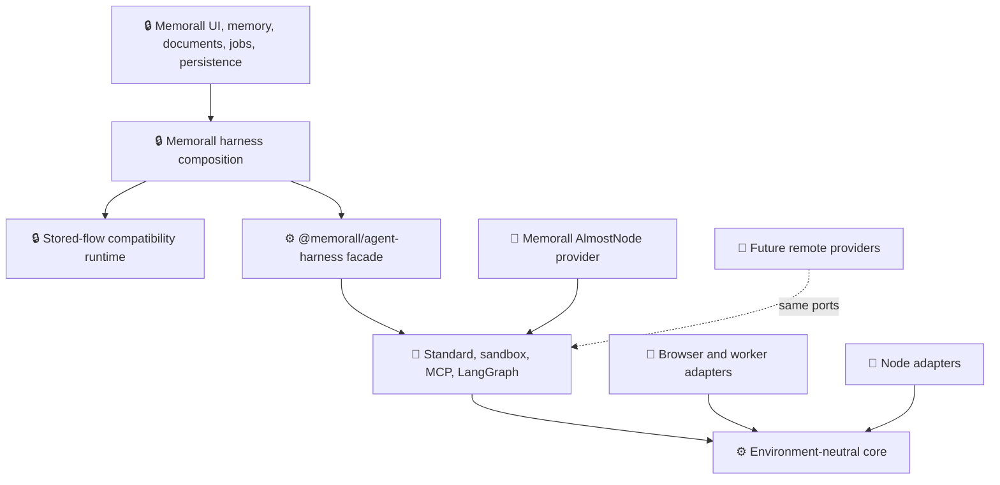
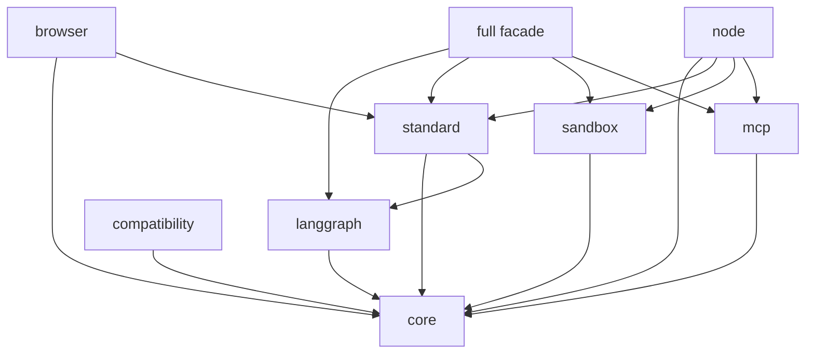
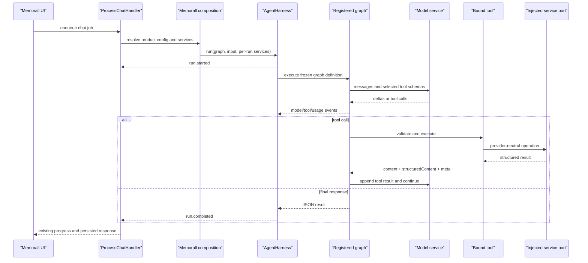
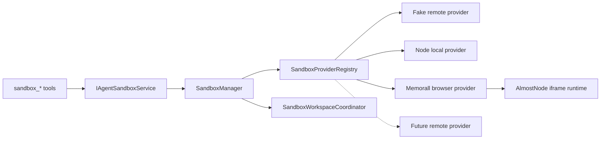

# Agent Harness Architecture

> **Purpose:** define the implemented standalone agent harness, its package and
> runtime boundaries, its integration with Memorall, and the evidence required
> to release changes safely.

| Mark | Meaning |
|---|---|
| ✅ | Implemented and covered by an automated gate |
| 🧩 | Optional capability installed through an explicit plugin |
| 🔌 | Replaceable host or platform adapter |
| 🔒 | Memorall-owned product or compatibility logic |

## 🎯 Executive Answer

The reusable agent harness is now an independent, all-private Yarn workspace
family under [`packages/agent-harness`](../packages/agent-harness). It contains
nine ESM packages with direct dependencies, strict TypeScript project
references, explicit export maps, declarations, independent tests, and clean
tarball-consumer verification.

The standalone boundary contains no Memorall prompts, topics, documents,
knowledge graph policy, database records, React components, Chrome APIs,
extension jobs, AlmostNode transport, or product catalogs. A static boundary
gate rejects those imports and rejects environment-specific globals from
universal packages.

Memorall consumes the harness through an app-owned composition layer in
[`src/services/agent-harness`](../src/services/agent-harness). Stored graph,
step, feature, and tool behavior remains in
[`src/services/flows-legacy`](../src/services/flows-legacy), explicitly outside
the standalone packages. `process-chat` starts an `AgentHarness` run and consumes
harness events; the compatibility plugin adapts the stored graph runtime without
placing product state in the reusable contracts.



The dependency direction is one-way: application code may depend on public
harness exports; no harness workspace may depend on `src/`.

## 🧱 Ownership Boundary

### Standalone harness

The package family owns domain-neutral execution:

- model, message, tool, step, graph, service, event, error, and JSON contracts;
- immutable instance registries and explicit plugin dependency resolution;
- run-scoped context, lifecycle cleanup, cancellation, deadlines, and limits;
- bounded event streaming and structured tool results;
- generic ReAct and linear graph execution through the LangGraph adapter;
- filesystem, web, planning, skills, compaction, and delegation capabilities;
- provider-neutral sandbox lifecycle, tools, profiles, and workspace sync;
- browser-compatible MCP HTTP/SSE adaptation;
- browser, worker, and Node platform adapters;
- legacy ID descriptors and host-supplied compatibility registration.

### Memorall application

The application continues to own product meaning and concrete transports:

- memory extraction, retrieval, citations, topic policy, and knowledge schemas;
- Foundation and product prompts, presets, and saved-flow configuration;
- document/PDF behavior and Memorall filesystem path policy;
- feature catalog labels, icons, colors, ordering, and agent-editor state;
- PGlite, extension jobs, chat persistence, and UI event translation;
- Chrome tabs, offscreen documents, sandbox iframe transport, and AlmostNode;
- concrete LLM, embedding, web-browser, and application filesystem services;
- HyperFrames, Lottie, artifacts, OpenUI, and other product authoring features.

Use this decision rule:

> A module may enter `packages/agent-harness` only when it still makes sense if
> Memorall, documents, topics, knowledge graphs, Chrome extensions, and
> AlmostNode do not exist.

## 📦 Package Family

All packages are private and versioned in lockstep at `0.1.0`. They are already
structured for selective publication later; publishing credentials and registry
release policy are intentionally outside this implementation.

| Workspace | Package | Runtime | Responsibility |
|---|---|---|---|
| [`core`](../packages/agent-harness/core) | `@memorall/agent-harness-core` | Browser, worker, Node | Contracts, registries, plugins, run API, events, limits, persistence ports |
| [`langgraph`](../packages/agent-harness/langgraph) | `@memorall/agent-harness-langgraph` | Browser, worker, Node | Generic ReAct loop, linear graph, LangGraph event adaptation |
| [`standard`](../packages/agent-harness/standard) | `@memorall/agent-harness-standard` | Browser, worker, Node | Chat, filesystem, web, planner, skills, compaction, delegation plugins |
| [`sandbox`](../packages/agent-harness/sandbox) | `@memorall/agent-harness-sandbox` | Browser, worker, Node | Providers, manager, workspace sync, grouped tools, profiles, fake provider |
| [`mcp`](../packages/agent-harness/mcp) | `@memorall/agent-harness-mcp` | Browser, worker, Node | MCP HTTP/SSE lifecycle and structured tool adaptation |
| [`browser`](../packages/agent-harness/browser) | `@memorall/agent-harness-browser` | Browser, worker | Platform primitives, DOM content processing, OPFS, IndexedDB stores |
| [`node`](../packages/agent-harness/node) | `@memorall/agent-harness-node` | Node 22+ | Platform, filesystem, stores, MCP stdio, Playwright, local process sandbox |
| [`compatibility`](../packages/agent-harness/compatibility) | `@memorall/agent-harness-compat` | Browser, worker, Node | Stable legacy IDs and host-supplied migration registration |
| [`full`](../packages/agent-harness/full) | `@memorall/agent-harness` | Browser, worker, Node | Side-effect-free facade and explicit full preset |



Forbidden edges are enforced:

- no workspace imports a Memorall alias, application module, or another
  package's `src/` path;
- no leaf workspace imports the full facade;
- normal packages do not depend on compatibility;
- universal packages do not import Node built-ins or use DOM/Chrome globals;
- browser and Node packages never import one another;
- every runtime import must be declared by its owning package.

## 🔌 Public Contracts

### Services and plugins

Services use runtime string tokens instead of ambient declaration merging:

```ts
interface ServiceToken<T> {
  readonly id: string;
  readonly description?: string;
  readonly optional?: boolean;
}

interface HarnessPlugin {
  readonly id: string;
  readonly version: string;
  readonly requires?: readonly { id: string; range: string }[];
  register(registrar: HarnessPluginRegistrar): void;
}
```

Each harness instance owns its frozen tool, step, and graph registries. Plugin
installation rejects duplicate IDs, missing dependencies, incompatible semantic
versions, and dependency cycles before a run begins. Importing any package does
not register a plugin or mutate process-global state.

### Run API

```ts
interface AgentHarness {
  run(request: HarnessRunRequest): HarnessRun;
  inspect(): HarnessDescriptor;
  close(): Promise<void>;
}

interface HarnessRunRequest {
  runId?: string;
  graph: string;
  input: unknown;
  scope?: Readonly<Record<string, string>>;
  services?: ServiceBindings;
  deadlineMs?: number;
  signal?: AbortSignal;
  checkpoint?: string;
}

interface HarnessRun extends AsyncIterable<HarnessEvent> {
  readonly id: string;
  result(): Promise<HarnessRunResult>;
  cancel(reason?: string): Promise<void>;
}
```

`scope` is opaque. Memorall may map a topic or graph identifier into it, but the
core does not define either concept. Base services are immutable harness
bindings; request services override them for one run, enabling tenant and
request isolation.

### Platform primitives

```ts
interface HarnessPlatform {
  readonly runtime: "browser" | "worker" | "node" | string;
  now(): number;
  randomUUID(): string;
  schedule(delayMs: number, callback: () => void): CancelHandle;
  fetch?: typeof globalThis.fetch;
}
```

Deterministic execution uses this port for clocks, IDs, and scheduling. LLMs,
filesystems, web sessions, sandboxes, MCP, and stores remain separate service
ports.

### Tools and results

Tools accept Zod or JSON Schema input and return plain text or a structured
envelope:

```ts
interface ToolExecutionResult<T = JsonValue> {
  content: string;
  structuredContent?: T;
  isError?: boolean;
  meta?: {
    operationId?: string;
    sessionId?: string;
    processId?: string;
    previewId?: string;
    snapshotId?: string;
    nextCursor?: string;
    durationMs?: number;
    truncated?: boolean;
    warnings?: readonly string[];
  };
}
```

The execution context carries run and operation IDs, cancellation, deadline,
scope, state, run-local variables, service resolution, and platform primitives.
Retries require both an idempotent tool annotation and a retryable
`HarnessError`; the operation ID remains stable. Parallel calls require
`parallelSafeHint` and remain bounded by provider and harness limits.

### Events, persistence, and errors

Public events are engine-neutral and JSON-serializable:

- `run.started`, `run.completed`, and `run.failed`;
- `node.started` and `node.completed`;
- `model.delta` and `usage.updated`;
- `tool.started` and `tool.completed`.

The bounded async queue is the host backpressure boundary. The default maximum
is 256 buffered events; a stalled consumer cannot create an unbounded stream.
Default limits also cap a run at 10 model iterations, one concurrent tool, and
64 KiB per tool output. Hosts may override positive finite limits.

Checkpoint and event-store contracts are optional. Checkpoints include the
contract version, graph ID/version, plugin versions, JSON state, and opaque
provider continuations. Incompatible restores fail explicitly rather than
loading into a different runtime topology.

## 🔄 Execution Path



The app bridge in
[`memorall-flow-harness.ts`](../src/services/agent-harness/memorall-flow-harness.ts)
registers only `memorall.compatibility-flow`. Its config and concrete services
are request bindings, so simultaneous chats do not share request state. Legacy
custom LangGraph chunks become `model.delta` events; final state becomes
`run.completed`. Cancellation propagates into the legacy graph's signal.

## 🧩 Explicit Composition

The full facade creates descriptors but performs no import-time registration:

```ts
import {
  createFullHarness,
  MODEL_SERVICE,
} from "@memorall/agent-harness";
import { createBrowserPlatform } from "@memorall/agent-harness-browser";

const harness = createFullHarness({
  platform: createBrowserPlatform(),
  services: { [MODEL_SERVICE.id]: model },
  preset: {
    standard: { filesystem: true, web: true },
    sandbox: { profile: "web_app" },
    mcp: false,
  },
});
```

A minimal consumer can install only core and one graph adapter. Owning a tool in
a package does not expose it to every model call: plugins register available
capabilities, graph input selects tools, and provider capabilities remove
unsupported sandbox surfaces.

## 🧪 Sandbox Architecture

The reusable sandbox package separates lifecycle, provider operations, model
tools, and host workspace ownership:



Provider IDs are open strings. Session, process, preview, snapshot, and cursor
identifiers are opaque strings. Every operation receives an operation ID,
optional signal, and deadline. Providers advertise extensible capabilities and
limits; unsupported operations are not exposed.

### Model-facing tools

There is no claimed industry-standard tool count or naming convention. These
seven grouped tools are stable Memorall harness contracts based on recurring
sandbox provider domains:

| Tool | Operations |
|---|---|
| `sandbox_inspect` | `status`, `logs`, `clear_logs`, `reset` |
| `sandbox_run` | `code`, `file`, `command`, `repl` |
| `sandbox_process` | `list`, `read`, `stdin`, `stop` |
| `sandbox_packages` | `install`, `install_from_package_json`, `list` |
| `sandbox_preview` | `start`, `restart`, `stop`, `list`, `request`, `render` |
| `sandbox_network` | `fetch` |
| `sandbox_snapshot` | `create`, `restore` |

Profiles control model context size:

| Profile | Tools |
|---|---|
| `execution` | inspect, run, process, packages |
| `web_app` | execution plus preview and network, six tools total |
| `stateful` | web app plus snapshots, seven tools total |

External filesystem tools remain the sole model-facing file API. Session
selection, provider selection, workspace bind/flush, conflict detection,
reconnection, and release are harness responsibilities.

### Provider implementations

- The fake remote provider proves tools, profiles, result parsing, and prompts
  do not import browser code or depend on a provider identity.
- The Memorall browser provider adapts the existing iframe/AlmostNode transport
  and remains in `src/services/agent-sandbox`.
- The Node package supplies a capability-gated local process provider. It does
  not advertise REPL, previews, or snapshots that it cannot implement.
- A future E2B, Daytona, Vercel, or internal provider registers a new string ID
  and implements the same session contract; core types do not change.

## 🌍 Browser And Node Portability

Universal packages target ES2022 ESM and may use promises, async iterables,
typed arrays, URL, `AbortSignal`, and injected platform primitives. They may not
use DOM, Chrome, Node built-ins, provider SDK objects, native streams, or
non-serializable wire results.

| Capability | Browser/worker adapter | Node adapter |
|---|---|---|
| Platform | Web timers, crypto, fetch | Node clock, crypto, timers, fetch |
| Filesystem | OPFS | `node:fs/promises` |
| Checkpoint/events | IndexedDB | JSON files |
| HTML processing | DOM parser adapter | Optional Playwright adapter |
| MCP | HTTP/SSE | HTTP/SSE plus stdio |
| Sandbox | Host-supplied browser/remote provider | Local process or remote provider |

Every package emits declarations and declaration maps using NodeNext resolution
and `.js` relative specifiers. Export maps put `types` first and provide ESM
`import` plus runtime-neutral `default` targets. CommonJS is intentionally not
published.

## 📈 Scalability Guarantees

| Concern | Implemented behavior |
|---|---|
| Concurrency | Registries freeze before execution; each run owns context, lifecycle, signal, queue, and overrides |
| Backpressure | Bounded async event queues and bounded tool/process/network output |
| Cancellation | One signal and deadline propagate through graph, model, tools, sandbox, and stores |
| Tool parallelism | Disabled unless tools opt in and the configured concurrency limit permits it |
| Retry | Idempotent annotation + retryable stable error + stable operation ID |
| Multi-tenancy | Base or per-run service bindings and opaque scope data |
| Persistence | Optional versioned checkpoint and append-only event-store ports |
| Remote execution | JSON contracts, opaque IDs/cursors, capabilities, operation IDs, normalized errors |
| Shutdown | Harness close cancels active runs; lifecycle callbacks drain deterministically |
| Observability | Stable run/node/model/tool/usage events with timestamps, IDs, and durations |

## ✅ Verification Evidence

### Package and static gates

`yarn check:harness` runs:

1. AST-based forbidden import/global/dependency checks for all nine workspaces.
2. Lockstep/private/ESM/side-effect/export-map validation.
3. Composite TypeScript builds and independent declarations.
4. All package unit and contract suites.
5. Packing and inspection of all nine tarballs.
6. Clean npm installation of only those tarballs into external fixtures.
7. A fake-model, real-tool ReAct run in Node and Chromium.
8. Chromium page, Web Worker, and module service-worker imports.
9. Browser-bundle scans for Node, Chrome, app alias, and legacy runtime code.
10. A minimal-core tree-shaking build that rejects optional sandbox, MCP, Node,
    or LangGraph capability code.

The package suite currently contains 39 tests across nine files. The root suite
contains 498 tests across 88 files, including five Memorall composition tests for
stored graph IDs, event translation, cancellation, and concurrent run isolation.

### Sandbox operation matrix

| Domain | Unit/contract evidence | Extension E2E evidence |
|---|---|---|
| Inspect | status, logs, filtering, clear, reset | health, logs, clear, reset |
| Runtime | code, file, command, REPL, errors, limits | code stdout/stderr/value/error, file, command, persistent REPL |
| Processes | list, cursor pages, no skips/duplicates, stdin, stop, long-poll | list, two cursor reads, two stdin writes, stop |
| Packages | install, manifest install, list, normalized output | pinned install/import, package.json install, resolved versions |
| Previews | start, restart, stop, list, request, render | start, list, HTML request, extension render URL/DOM, stop |
| Network | request/response normalization, limits, timeout | deterministic data fetch in Node and HTTPS registry fetch in browser |
| Snapshots | capture, generated ID, reset, restore, invalid/provider mismatch | capture, mutate, restore file |
| Workspace | bind, incremental sync, write/delete/rename, flush, conflict detection | runtime mutation, filesystem lifecycle, flush |
| Lifecycle | create, reuse, reconnect, release, close, expired session | service-worker stop/recovery and singleton one-worker execution |

Deterministic extension E2E has eight passing scenarios. Network E2E is isolated
and has four passing scenarios. Both use a worker-scoped persistent Chromium
context, derive the extension ID from the service worker, and send real
`JOB_ENQUEUED`/`JOB_COMPLETED` jobs through background, offscreen, iframe, and
AlmostNode layers. Failures retain traces, screenshots, video, page logs,
service-worker logs, and normalized sandbox logs.

### Continuous integration

[`agent-harness.yml`](../.github/workflows/agent-harness.yml) runs package
contracts on Node 22 and 24. A Node 24 browser job installs Chromium and runs
packed consumers, root typecheck/tests, deterministic sandbox E2E, network E2E,
and the production extension build. This follows the package's declared Node
`>=22` support rather than relying on a developer machine's active version.

## 🔍 Post-Implementation Critique

### What is strong

1. **The package boundary is executable.** Clean tarballs and consumers prove
   independence; it is not only a folder convention.
2. **Composition is explicit.** Imports are inert and registry ownership is per
   harness instance.
3. **The browser is a first-class runtime.** Page, worker, service worker, OPFS,
   IndexedDB, HTTP MCP, and browser sandbox paths have real verification.
4. **Remote replacement is structural.** Sandbox tools and lifecycle code depend
   on open provider contracts, opaque IDs, capabilities, and JSON results.
5. **Compatibility is isolated.** Stored IDs remain supported without making
   legacy tools or product prompts part of the new default package surface.
6. **Operational output is bounded.** Tool, event, cursor, network, and process
   APIs have explicit continuation or truncation behavior.

### Remaining product debt, outside the standalone harness

- `src/services/flows-legacy` still uses its historical global registries and
  import-time feature registration internally. That is deliberate compatibility
  code, not an API for new development. New product flows should be converted to
  native plugins before the compatibility runtime can be deleted.
- The production extension build reports existing bundle-budget warnings,
  especially for AlmostNode/esbuild WASM, the options page, and the content
  script. The build succeeds, but startup bundle reduction remains a separate
  product performance project.
- The Node local sandbox is a development adapter, not a cloud isolation system.
  Cloud provider integration, PTY resize, Git tools, and snapshot list/export/
  delete remain intentionally out of scope.
- All packages remain private. Public release requires API stability policy,
  provenance/signing, registry credentials, and a published support matrix.

These limitations do not weaken the standalone boundary: none requires a core
contract change, and each can be addressed by adding or replacing a plugin or
adapter.

## 🚦 Change Checklist

A harness change is complete only when:

- package imports stay side-effect free and application independent;
- public inputs, outputs, events, errors, IDs, and cursors stay serializable;
- capabilities are advertised only when implemented;
- tool output is bounded and returns continuation/truncation metadata;
- browser, worker, and Node consumers resolve public exports from tarballs;
- provider adapters pass reusable conformance tests;
- `yarn check:harness`, `yarn typecheck`, and `yarn test:unit` pass;
- deterministic and network sandbox E2E pass for sandbox changes;
- `yarn build:extension:all` succeeds;
- stored-flow IDs remain covered whenever compatibility code changes.

## 📚 Source Map

- Core run API: [`core/src/harness.ts`](../packages/agent-harness/core/src/harness.ts)
- Plugin resolution: [`core/src/plugins.ts`](../packages/agent-harness/core/src/plugins.ts)
- ReAct graph: [`langgraph/src/agent-graph.ts`](../packages/agent-harness/langgraph/src/agent-graph.ts)
- Standard plugins: [`standard/src/plugin.ts`](../packages/agent-harness/standard/src/plugin.ts)
- Sandbox contracts: [`sandbox/src/contracts.ts`](../packages/agent-harness/sandbox/src/contracts.ts)
- Sandbox manager: [`sandbox/src/sandbox-manager.ts`](../packages/agent-harness/sandbox/src/sandbox-manager.ts)
- Browser adapters: [`browser/src`](../packages/agent-harness/browser/src)
- Node adapters: [`node/src`](../packages/agent-harness/node/src)
- Full facade: [`full/src/index.ts`](../packages/agent-harness/full/src/index.ts)
- Memorall composition: [`src/services/agent-harness`](../src/services/agent-harness)
- App compatibility runtime: [`src/services/flows-legacy`](../src/services/flows-legacy)
- Sandbox provider review: [`agent-harness-sandbox-review.md`](./agent-harness-sandbox-review.md)
- Sandbox container transport: [`sandbox-container.md`](./sandbox-container.md)

External design references:

- [OpenAI sandbox agents](https://developers.openai.com/api/docs/guides/agents/sandboxes)
- [Model Context Protocol tools](https://modelcontextprotocol.io/specification/2026-07-28/server/tools)
- [Playwright Chrome extensions](https://playwright.dev/docs/chrome-extensions)
- [Yarn workspaces](https://yarnpkg.com/features/workspaces)
- [TypeScript project references](https://www.typescriptlang.org/docs/handbook/project-references)
- [Node package exports](https://nodejs.org/api/packages.html)
