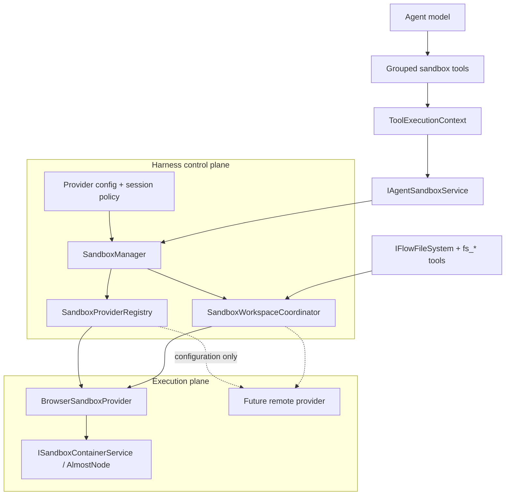
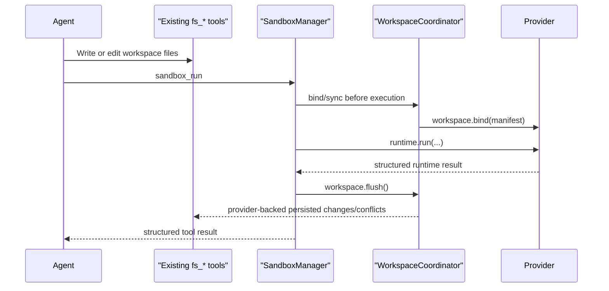
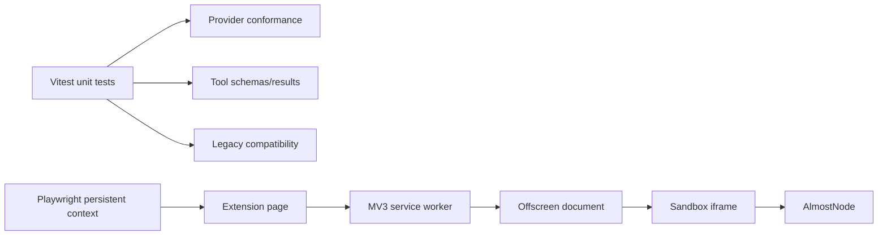

# 🧭 Browser Sandbox Architecture

<p align="center">
  
  
  
  
</p>

> **Decision record:** Memorall keeps its AlmostNode browser runtime, adds a provider-neutral session layer above it, and exposes a small capability-driven tool surface to agents. The same tools can later target a remote sandbox by changing provider configuration only.

## 🎯 Scope

This architecture is for a sandbox that runs **inside the browser extension**, not Node.js on the host. It supports:

- JavaScript and TypeScript execution through AlmostNode
- npm dependency installation and package manifests
- one-shot and background commands with incremental output
- persistent REPL evaluation
- host workspace mounting and generated-file synchronization
- web preview lifecycle, requests, and rendered output
- network fetches from the runtime
- in-session snapshot capture and restore

Security-policy redesign, a real cloud provider, PTY resize, Git tools, and snapshot list/export/delete are deliberately outside this change.

## ✅ Architecture Decisions

| Decision | Rationale | Status |
|---|---|---:|
| Open provider registry keyed by arbitrary strings | Adding E2B, Daytona, Vercel, or an internal service must not change a core union. | Implemented |
| Separate runtime APIs from model tools | Provider SDK namespaces are broad; agent tools should be concise and task-oriented. | Implemented |
| Harness-owned session lifecycle | Provider choice, reconnection, workspace bind/flush, and release do not belong in model inputs. | Implemented |
| Existing `fs_*` tools remain file authority | Avoids two file systems and two sets of agent-visible file semantics. | Implemented |
| Opaque IDs and process cursors | Remote continuation tokens can replace browser numeric offsets without changing tools. | Implemented |
| Capability-driven tool profiles | The model sees only relevant and supported tools. | Implemented |
| MCP-style rich results | UI, tracing, MCP, tests, and models share structured output without parsing terminal prose. | Implemented |
| Legacy `container_*` compatibility | Stored flows continue to work during migration. | Implemented; deprecated |

## 🔬 What External Systems Actually Standardize

There is **no industry-standard sandbox tool list or tool count**. The standards and services establish recurring runtime domains and tool-description conventions.

### Agent SDK and protocol interfaces

| System | Verified interface | Architectural evidence |
|---|---|---|
| MCP | `tools/list`, `tools/call`; tool `name`, `title`, `description`, `icons`, `inputSchema`, optional `outputSchema` and annotations; result `content`, optional `structuredContent`, `isError`, and metadata. | Use MCP-compatible definitions and results. MCP does not prescribe names such as `sandbox_run`. [MCP Tools specification](https://modelcontextprotocol.io/specification/2026-07-28/server/tools) |
| OpenAI Sandbox Agents | Manifests, sandbox clients, sessions, capabilities, run configuration, and saved state separate control-plane configuration from execution. | The harness selects/binds a sandbox; the model receives capabilities. [Sandbox agents guide](https://developers.openai.com/api/docs/guides/agents/sandboxes) |
| OpenAI Agents SDK | Function tools, hosted tools, MCP tools, and agents-as-tools use typed definitions around callable behavior. | Tool schema is a model contract, not the provider SDK itself. [Agents SDK tools](https://openai.github.io/openai-agents-python/tools/) |
| Vercel AI SDK | A tool has a description, input schema, and execute function; runtime context is separate from tool arguments. | Bind session identity through execution context. [Tool use](https://vercel.com/academy/ai-sdk/tool-use), [runtime and tool context](https://vercel.com/kb/guide/ai-sdk-runtime-and-tool-context) |
| LangChain | Structured tools have stable names, descriptions, schemas, and call results. | Existing Memorall registry remains a suitable tool factory boundary. [LangChain JS tools](https://reference.langchain.com/javascript/langchain-core/tools) |
| AutoGen | Code execution tools are backed by replaceable executors such as command-line, Docker, or Jupyter implementations. | `sandbox_run` can remain stable while its executor changes. [Code executors](https://microsoft.github.io/autogen/stable/user-guide/core-user-guide/components/command-line-code-executors.html) |

### Sandbox provider interfaces

| Provider/runtime | Documented API shape | Reusable signal |
|---|---|---|
| WebContainers | `boot`, `mount`, `fs`, `spawn`, process streams, `server-ready`/port events, and export. | Browser providers need workspace, process, preview, and export/state domains. [API](https://webcontainers.io/api), [running processes](https://webcontainers.io/guides/running-processes) |
| CodeSandbox Sandpack | Files, dependencies, preview updates, dispatch/listen, and browser preview clients. | Preview is a domain API rather than many unrelated tools. [Sandpack client](https://sandpack.codesandbox.io/docs/advanced-usage/client) |
| E2B | Sandbox lifecycle plus `commands`, `files`, PTY, IDs, host URLs, reconnect, and kill. | Keep lifecycle, process, files, and exposed hosts separate internally. [JavaScript SDK](https://e2b.dev/docs/sdk-reference/js-sdk/v1.6.0/sandbox), [PTY](https://e2b.dev/docs/sandbox/pty) |
| Modal | Create/detach/reuse sandboxes, execute commands, stream stdout/stderr, write stdin, access files, and expose tunnels. | Operations need workdir/env/timeout and resumable streams. [Sandboxes](https://modal.com/docs/guide/sandboxes), [JavaScript Sandbox](https://modal.com/docs/reference/modal.Sandbox) |
| Daytona | Filesystem, process, code interpreter, Git, computer use, preview links, snapshots/forks, lifecycle, resources, and MCP tooling. | A rich provider can map only supported domains into the common contract. [TypeScript SDK](https://www.daytona.io/docs/en/typescript-sdk/sandbox/), [MCP server](https://www.daytona.io/docs/mcp) |
| Vercel Sandbox | Create/run commands, files, snapshots, runtime selection, persistence, resume, fork, and stop. | Remote replacement needs lifecycle, command, file transfer, preview, and snapshot adapters. [Sandbox docs](https://vercel.com/docs/sandbox), [persistence](https://vercel.com/changelog/sandbox-persistence-is-now-ga) |
| Cloudflare Sandbox SDK | Lifecycle, commands/background processes, log streaming, files/watch, code interpreter, ports/tunnels, storage, backups, sessions, and terminals. | Domain-oriented provider APIs are common; the model surface may still be grouped. [API](https://developers.cloudflare.com/sandbox/api/), [commands](https://developers.cloudflare.com/sandbox/api/commands/), [files](https://developers.cloudflare.com/sandbox/api/files/) |
| Sandbox SDK | Provider-neutral files, processes, ports, snapshots, capabilities, and provider escape hatches. | Normalize common domains and retain an extension map for provider-specific data. [Sandbox SDK](https://sandbox-sdk.sh/) |

### Common capability matrix

| Domain | WebContainers | E2B | Modal | Daytona | Vercel | Cloudflare | Memorall contract |
|---|:---:|:---:|:---:|:---:|:---:|:---:|---|
| Session lifecycle | ✓ | ✓ | ✓ | ✓ | ✓ | ✓ | Harness-only manager |
| Workspace/files | ✓ | ✓ | ✓ | ✓ | ✓ | ✓ | Existing `fs_*` + workspace port |
| Code/commands | ✓ | ✓ | ✓ | ✓ | ✓ | ✓ | `sandbox_run` |
| Background process/logs | ✓ | ✓ | ✓ | ✓ | ✓ | ✓ | `sandbox_process` |
| Packages | command | command | command | command | command | command | `sandbox_packages` |
| Preview/ports | ✓ | host URL | tunnel | preview link | preview | port/tunnel | `sandbox_preview` |
| Network request | runtime | runtime | runtime | runtime | policy/runtime | runtime | `sandbox_network` |
| Snapshot/state | export | ✓ | reuse | ✓ | ✓ | backup | `sandbox_snapshot` |

The table justifies the **domains**, not Memorall's exact names.

## 🏗️ Implemented Architecture



### Layer responsibilities

| Layer | Owns | Must not own |
|---|---|---|
| Model tools | Validated operation inputs and structured outputs | Provider selection, raw ports as identity, mounting, reconnection |
| `IAgentSandboxService` | Provider-neutral facade and capability checks | Browser iframe or remote SDK details |
| `SandboxManager` | Acquire/reuse/reconnect/release, provider policy, flush timing | Model-visible lifecycle fields |
| `SandboxWorkspaceCoordinator` | Bind/flush ordering, baselines, conflict aggregation | Agent file commands |
| `SandboxProviderRegistry` | Open string provider IDs | Closed provider unions |
| Provider session | Runtime/process/package/preview/network/snapshot transports | Tool names and prompts |
| Existing `fs_*` tools | Model-visible workspace file authority | Sandbox lifecycle |

## 🔌 Provider Contract

```ts
interface SandboxProvider {
  readonly id: string;
  readonly contractVersion: 1;
  createSession(
    request: SandboxSessionRequest,
    context: SandboxCallContext,
  ): Promise<SandboxProviderSession>;
  reconnectSession?(
    providerSessionId: string,
    context: SandboxCallContext,
  ): Promise<SandboxProviderSession>;
}

interface SandboxProviderSession {
  readonly descriptor: SandboxSessionDescriptor;
  readonly capabilities: SandboxCapabilities;
  runtime: SandboxRuntimeApi;
  processes: SandboxProcessApi;
  workspace: SandboxWorkspacePort;
  packages?: SandboxPackageApi;
  previews?: SandboxPreviewApi;
  network?: SandboxNetworkApi;
  snapshots?: SandboxSnapshotApi;
  inspect(request: SandboxInspectRequest, context: SandboxCallContext): Promise<unknown>;
  reset(context: SandboxCallContext): Promise<void>;
  close(context: SandboxCallContext): Promise<void>;
}
```

Provider configuration is open:

```ts
{
  providerId: "browser", // or "e2b", "daytona.team", "internal.v2", ...
  providerOptions: unknown // validated by that provider
}
```

Core code never switches on `"browser" | "remote"`. A missing provider is normalized to `SandboxError { code: "provider_error" }`.

### Stable identities and errors

- `sessionId`, `providerSessionId`, `processId`, `previewId`, `snapshotId`, and cursors are opaque strings.
- Browser command offsets are converted to string cursors at the adapter boundary.
- Every operation receives `operationId`, optional `sessionKey`, cancellation signal, and deadline.
- Stable errors: `session_not_found`, `capability_unavailable`, `invalid_request`, `timeout`, `process_not_found`, `preview_not_found`, `snapshot_not_found`, `transport_error`, and `provider_error`.
- Expected runtime failures become structured tool errors; programming defects and invalid schemas still throw.

## 📁 Workspace Ownership

The agent-visible file API remains:

`fs_read`, `fs_write`, `fs_edit`, `fs_ls`, `fs_glob`, `fs_grep`, `fs_mkdir`, `fs_remove`

There is no `sandbox_files`, `workspace_files`, or model-visible mount tool.



The browser provider maps bind/flush to the existing `fs.mountWorkspace`, `fs.materializeWorkspaceFile`, and `fs.flushWorkspaceWrites` protocol. A remote provider can instead upload an archive, call a files API, or mount shared storage.

Dependency trees such as `/node_modules` are provider-owned runtime state. They participate in snapshots and execution but are excluded from host workspace flushes; source files and package manifests remain host-backed. This prevents a package install from copying thousands of generated files through the document filesystem.

## 🧰 Agent Tool Surface

| Tool | Operations | Required domain |
|---|---|---|
| `sandbox_inspect` | `status`, `logs`, `clear_logs`, `reset` | Session inspection |
| `sandbox_run` | `code`, `file`, `command`, `repl` | Runtime execution |
| `sandbox_process` | `list`, `read`, `stdin`, `stop` | Background processes |
| `sandbox_packages` | `install`, `install_from_package_json`, `list` | npm packages |
| `sandbox_preview` | `start`, `restart`, `stop`, `list`, `request`, `render` | Web previews |
| `sandbox_network` | `fetch` | Runtime HTTP(S) |
| `sandbox_snapshot` | `create`, `restore` | Saved state |

Each tool has one strict root object with an `operation` enum. Operation-specific validation rejects missing fields, unknown fields, and irrelevant cross-operation fields. There is no root `anyOf`.

### Tool profiles

| Profile | Sandbox tools | Use |
|---|---:|---|
| `execution` | 4 | Inspect, run, process, packages |
| `web_app` | 6 | Execution plus preview and network; current default |
| `stateful` | 7 | Web app plus snapshots |

Capability filtering removes a tool if the selected provider lacks its required domain. Unsupported features are not advertised.

## 📤 Structured Results

`BaseTool` remains backward compatible with string and text-part results, and now accepts:

```ts
interface ToolExecutionResult<T = unknown> {
  content: ToolMessageContent;
  structuredContent?: T;
  isError?: boolean;
  meta?: {
    operationId?: string;
    sessionId?: string;
    processId?: string;
    previewId?: string;
    snapshotId?: string;
    nextCursor?: string;
    durationMs?: number;
    truncated?: boolean;
    warnings?: string[];
  };
}
```

The graph serializes structured content for Chat Completions, preserves the native object for writer events and UI consumers, and avoids duplicating identical JSON content. MCP adapters preserve `structuredContent`, output schemas, titles, icons, annotations, and metadata.

Example success:

```json
{
  "ok": true,
  "operation": "command",
  "result": {
    "processId": "opaque-process-id",
    "status": "running",
    "nextCursor": "opaque-continuation"
  }
}
```

Example expected failure:

```json
{
  "ok": false,
  "operation": "read",
  "error": {
    "code": "process_not_found",
    "message": "Sandbox process not found",
    "retryable": false
  }
}
```

Outputs, logs, response bodies, and process pages are bounded. Truncation and continuation are metadata, not hidden string conventions.

## 🌐 Remote Replacement

Replacing the browser runtime follows one adapter path:

1. Implement `SandboxProvider` and `SandboxProviderSession`.
2. Validate provider-specific options inside that provider.
3. Map native files/upload/storage behavior to `SandboxWorkspacePort`.
4. Map native command logs to opaque cursors and normalized events.
5. Advertise only supported capability IDs.
6. Register the provider under an arbitrary string ID.
7. Change `{ providerId, providerOptions }` configuration.

No tool, prompt, flow definition, graph parser, or structured-result consumer changes. The test-only `remote.fake` provider proves this boundary without importing browser modules.

### Scalability rules

| Concern | Browser provider | Future remote provider |
|---|---|---|
| Session concurrency | Advertises `maxConcurrentSessions: 1` | Advertises actual quota |
| Session policy | Reuse per conversation | Reuse, reconnect, pool, or close by policy |
| Process continuation | Numeric offset encoded as opaque string | Native token or stream cursor |
| Workspace transfer | Existing mount/materialize/flush bridge | Archive, native files API, object storage, or volume |
| Preview identity | Opaque ID mapped to browser port | Native deployment/port ID |
| Snapshot storage | Session-local opaque map over AlmostNode snapshot | Provider snapshot/checkpoint ID |
| Provider extensions | `runtime: almostnode`, `ptyResize: false` | Provider-specific metadata under `extensions` |

## 📦 Package Decisions

| Package | Decision | Reason |
|---|---|---|
| `almostnode` | Keep | Existing browser execution provider and current feature base. |
| `zod` | Reuse | Provider options, strict operation inputs, and structured output validation. |
| `@playwright/test` | Added as dev dependency | Repository-owned persistent MV3 extension E2E tests. |
| `@sandbox-sdk/core` | Do not bundle yet | Useful future control-plane adapter, but browser compatibility and bundle cost must be measured first. [Project](https://sandbox-sdk.sh/) |
| `@modelcontextprotocol/sdk` | Do not add yet | Internal tools already use compatible contracts; add only when exposing an external MCP server. |

## 🧪 Test Architecture



### Unit and contract coverage

| Area | Required assertions | Implemented coverage |
|---|---|---:|
| Registry | Arbitrary IDs, unknown provider, duplicate policy | Yes |
| Manager | Create/reuse/reconnect/provider switch/release | Yes |
| Calls | Cancellation, deadlines, normalized errors | Yes |
| Provider conformance | Same suite against fake remote and mocked browser | Yes |
| Browser mapping | All 24 grouped-tool operations plus workspace lifecycle and exact-path rename | Yes |
| Cursor behavior | Repeated reads use exact next cursor without skipped pages | Yes |
| Workspace | Bind baseline, flush, deduplicate paths/conflicts, release ownership | Yes |
| Tool schemas | Root object, required fields, strict and cross-operation rejection | Yes |
| Profiles | Default six, stateful snapshot, capability filtering | Yes |
| Structured results | Success, operational error, exact JSON, MCP preservation, writer event | Yes |
| Compatibility | Legacy `sandboxContainer` registration and `container_*` tools | Yes |
| Catalog/prompt | Browser title and feature-exported tool/prompt metadata | Yes |

### Extension E2E design

The E2E suite follows [Playwright's Chrome extension guidance](https://playwright.dev/docs/chrome-extensions):

- one worker-scoped persistent Chromium context
- extension ID resolved from the MV3 service worker URL
- no hard-coded extension ID or preview URL
- jobs sent through production `JOB_ENQUEUED`/`JOB_COMPLETED` messages
- deterministic and network-tagged projects separated
- one worker because the browser provider is singleton
- traces, screenshots, video, page console, and worker console retained on failure

Deterministic scenarios cover health, successful and failed structured code output, workspace execution/flush, filesystem create/list/rename/read/delete, paged background process output/list/stdin/stop, snapshots, package-free HTTP preview lifecycle, rendered URL, Runtime Sessions UI, service-worker restart behavior, persistent REPL state, logs/clear, and reset.

Network scenarios cover a pinned npm install/import, package.json installation/listing, HTTPS fetch from inside the sandbox, and a package-backed rendered preview.

### Commands

```bash
npm run test:sandbox:unit
npm run test:e2e:sandbox
npm run test:e2e:sandbox:network
npm run check:sandbox
```

Both E2E commands build the extension before launching Chromium, preventing stale artifacts. `check:sandbox` requires `typecheck`, focused sandbox unit/compatibility tests, the extension build, and deterministic E2E. Network tests are intentionally separate.

## 🔄 Compatibility and Migration

| Item | Migration behavior |
|---|---|
| Persisted step name | Remains `nodejs-sandbox-feature` |
| Persisted catalog key | Remains `step-nodejs-sandbox-feature` |
| Visible feature | Renamed to **Browser Sandbox** |
| New aliases | Browser-oriented exports point to the persisted feature |
| Legacy tools | Registered for stored flows, marked deprecated, omitted from new profile |
| Legacy service | `sandboxContainer` remains registered |
| New service | `sandboxRuntime` registered beside it |
| Feature prompt | Concise, capability-generated, sourced from feature descriptor |
| Default model surface | Six grouped sandbox tools plus existing artifact/file tools |

## 🚦Acceptance Checklist

- [x] Default Browser Sandbox profile exposes six sandbox tools.
- [x] Snapshots appear only in the stateful profile.
- [x] Existing `fs_*` tools are the only model-facing file API.
- [x] New tools depend only on `sandboxRuntime`.
- [x] Provider IDs and options are open and registry-driven.
- [x] Fake remote provider requires configuration changes only.
- [x] Current browser operations map to provider domains or harness lifecycle APIs.
- [x] Unsupported capabilities are not advertised.
- [x] Structured outputs are preserved for models, UI, writers, MCP, and tests.
- [x] Legacy service and tool registrations remain available.
- [x] Unit and provider contract suites pass.
- [x] Deterministic extension E2E passes in the local Chrome environment.
- [x] Network-tagged extension E2E passes when network access is available.

### Verified locally on 2026-08-10

| Gate | Result |
|---|---|
| TypeScript | Pass |
| Focused sandbox unit and contract suite | 59/59 tests pass across 9 files |
| Deterministic extension E2E | 8/8 scenarios pass |
| Network-tagged extension E2E | 4/4 scenarios pass |
| Production extension build | Pass; existing asset-size budget warnings remain |
| Repository-wide Vitest matrix | 491/491 tests pass across 86 files with bounded workers |

## 🗺️ Future Work

1. Add one real remote provider only after measuring browser bundle impact and control-plane requirements.
2. Persist browser snapshot payloads outside session memory if cross-restart restore becomes a product requirement.
3. Add provider session quotas, idle eviction, and metrics when multiple remote sessions are introduced.
4. Add conflict-aware remote workspace commits with provider-side compare-and-swap revisions.
5. Consider PTY resize, snapshot listing/export/deletion, and first-class Git as separate capability extensions, not changes to existing tool inputs.

This design keeps the current browser harness useful today while making the execution plane replaceable, observable, and testable at the contracts agents actually depend on.
