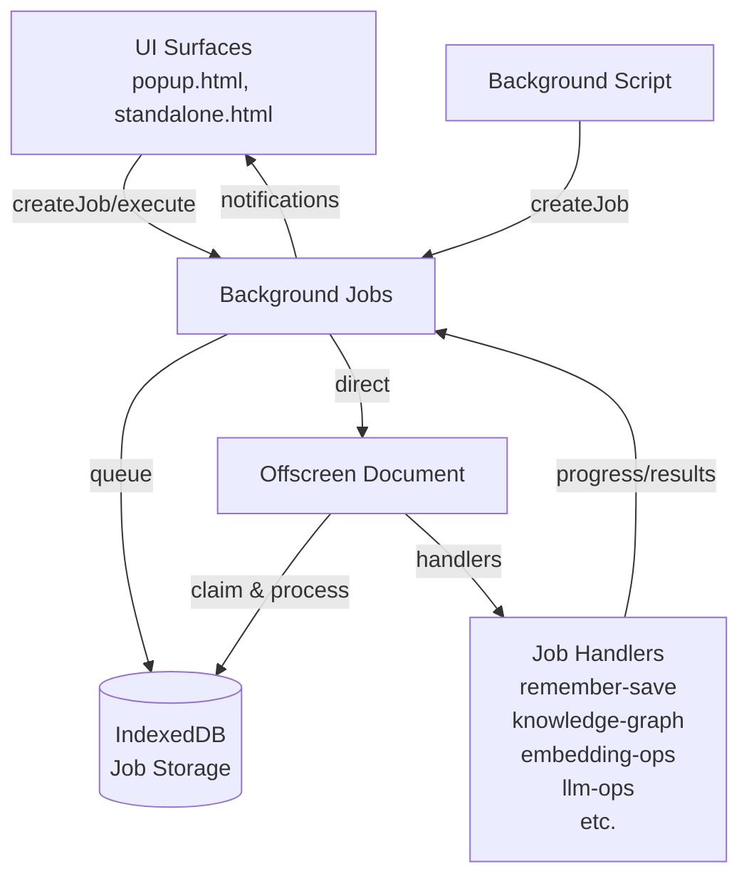

# 🧵 Background Jobs Documentation

## 📋 Overview

The Background Jobs system provides a cross-context job queue for processing tasks between UI contexts and the offscreen document. It supports two execution modes: queued processing with persistence and direct execution, enabling both heavy background operations and responsive UI interactions.

## 🏗️ Architecture

### 🔧 Cross-Context Communication



### 📦 Component Architecture

- **Job Queue**: Cross-context persistent storage in IndexedDB
- **Job Handlers**: Specialized processors for different job types
- **Progress Tracking**: Real-time updates via progress streams
- **Result Management**: Type-safe result handling with completion promises

## 🎯 Execution Modes

### 1. 🚀 createJob() - Queued Processing

Enqueues jobs in IndexedDB for sequential processing by offscreen document.

```typescript
// Queued execution - handled one by one
const result = await backgroundJob.createJob(
  "remember-save",
  contentData,
  { stream: false }
);
const completionResult = await result.promise;
```

**Characteristics:**
- ✅ **Persistent**: Survives extension restarts
- ✅ **Sequential**: Jobs processed one at a time
- ✅ **Recoverable**: Failed jobs can be retried
- ✅ **Progress Tracking**: Full progress updates
- ⏳ **Slower**: Queue overhead and sequential processing

### 2. ⚡ execute() - Direct Processing

Bypasses queue for immediate processing in offscreen document.

```typescript
// Direct execution - immediate processing
const result = await backgroundJob.execute(
  "text-to-vector",
  { text: "hello world" },
  { stream: false }
);
const immediateResult = await result.promise;
```

**Characteristics:**
- ⚡ **Fast**: No queue overhead
- 🎯 **Immediate**: Direct handler invocation
- 💾 **Non-persistent**: Lost on extension restart
- 🔄 **Concurrent**: Multiple executions possible
- ⚠️ **No Recovery**: Failures require manual retry

## 🛠️ Available Job Types & Handlers

### 📚 Remember & Knowledge Graph
- **`remember-save`**: Save content to database with processing
- **`knowledge-graph`**: Extract entities and relationships

### 🤖 AI Operations
- **`text-to-vector`**: Convert text to embedding vector
- **`texts-to-vectors`**: Batch text embedding
- **`create-embedding`**: Create new embedding model
- **`get-embedding`**: Retrieve embedding model
- **`initialize-embedding-service`**: Bootstrap embedding service

### 🦙 LLM Operations
- **`get-all-models`**: List available LLM models
- **`get-models-for-service`**: Get models for specific service
- **`serve-model`**: Load and serve LLM model
- **`unload-model`**: Unload active model
- **`delete-model`**: Remove model from storage

### 🔧 System Operations
- **`restore-local-services`**: Restore service state
- **`basic-async`**: Simple async task (testing)
- **`basic-stream`**: Streaming task (testing)

## 📚 Usage Examples

### 🚀 Queued Processing (UI → Offscreen)

```typescript
import { backgroundJob } from '@/services/background-jobs/background-job';

// Save content with full persistence and progress tracking
const contentData = {
  sourceType: "user_input" as const,
  title: "My Note",
  rawContent: "Important information",
  cleanContent: "Important information",
  textContent: "Important information",
  sourceMetadata: { inputMethod: "popup" },
  extractionMetadata: { extractedAt: new Date().toISOString() }
};

const result = await backgroundJob.createJob(
  "remember-save",
  contentData,
  { stream: false }
);

// Wait for completion
const saveResult = await result.promise;
console.log("Saved with ID:", saveResult.pageId);
```

### ⚡ Direct Execution (UI → Offscreen)

```typescript
// Fast embedding generation
const result = await backgroundJob.execute(
  "text-to-vector",
  { text: "Convert this text to vector" },
  { stream: false }
);

const embedding = await result.promise;
console.log("Vector:", embedding.vector);
```

### 📊 Progress Streaming

```typescript
// Stream progress updates
const result = await backgroundJob.createJob(
  "knowledge-graph",
  { pageId: "abc123", contentData },
  { stream: true }
);

for await (const progress of result.stream) {
  console.log(`Progress: ${progress.progress}% - ${progress.status}`);
  if (progress.type === 'completed') {
    console.log("Knowledge graph created:", progress.result);
    break;
  }
}
```

### 👀 Queue State Monitoring

```typescript
// Subscribe to overall queue state
const unsubscribe = backgroundJob.subscribe((state) => {
  console.log("Active jobs:", Object.keys(state.jobs).length);

  Object.values(state.jobs).forEach(job => {
    console.log(`${job.id}: ${job.status} (${job.jobType})`);
  });
});

// Later: cleanup
unsubscribe();
```

## 🎯 Job Handler Development

### 📋 Handler Structure

```typescript
// Define job types and payloads
const JOB_NAMES = {
  myOperation: "my-operation",
} as const;

export interface MyOperationPayload {
  input: string;
  options?: { timeout?: number };
}

export interface MyOperationResult {
  output: string;
  metadata: Record<string, unknown>;
}

// Extend global registries for type inference
declare global {
  interface JobTypeRegistry {
    "my-operation": MyOperationPayload;
  }
  interface JobResultRegistry {
    "my-operation": MyOperationResult;
  }
}

// Handler implementation
export class MyOperationHandler extends BaseProcessHandler<MyOperationJob> {
  async process(
    jobId: string,
    job: MyOperationJob,
    dependencies: ProcessDependencies,
  ): Promise<ItemHandlerResult> {
    await this.addProgress(jobId, "Starting operation...", 10, dependencies);

    // Process the job
    const result = await processOperation(job.payload);

    await this.addProgress(jobId, "Operation completed", 100, dependencies);

    return this.createSuccessResult(result);
  }
}

// Self-register the handler
backgroundProcessFactory.register({
  instance: new MyOperationHandler(),
  jobs: Object.values(JOB_NAMES),
});
```

### 🔄 Progress Updates

```typescript
// In your handler
await this.addProgress(
  jobId,
  "Processing step 2 of 5...",
  40,  // 40% complete
  dependencies,
  { currentStep: "validation" }  // Additional metadata
);
```

## 📝 API Reference

### 🧰 BackgroundJob Core Methods

```typescript
// Job creation (queued)
createJob<T>(
  jobType: T,
  payload: JobTypeRegistry[T],
  options: { stream: boolean }
): Promise<JobStreamResult | JobPromiseResult<T>>

// Direct execution (immediate)
execute<T>(
  jobType: T,
  payload: JobTypeRegistry[T],
  options: { stream: boolean }
): Promise<JobStreamResult | JobPromiseResult<T>>

// State management
subscribe(listener: (state: JobQueueState) => void): () => void
getState(): Promise<JobQueueState>
```

### 📊 Result Types

```typescript
// Promise-based result
interface JobPromiseResult<T> {
  jobId: string;
  promise: Promise<JobResultFor<T>>;
}

// Stream-based result
interface JobStreamResult {
  jobId: string;
  stream: AsyncIterable<JobProgressEvent>;
}

// Progress events
interface JobProgressEvent {
  type: 'progress' | 'completed' | 'failed';
  jobId: string;
  progress?: number;
  status?: string;
  result?: unknown;
  error?: string;
}
```

## ⚠️ Error Handling & Best Practices

### 🛡️ Error Recovery

```typescript
try {
  const result = await backgroundJob.execute("risky-operation", payload, { stream: false });
  return await result.promise;
} catch (error) {
  console.error("Job failed:", error);
  // Handle failure appropriately
}
```

### 🎯 Best Practices

- **Use `createJob()` for**: Heavy operations, data persistence, batch processing
- **Use `execute()` for**: UI interactions, quick operations, real-time responses
- **Progress Updates**: Update frequently for responsive UIs
- **Error Handling**: Always wrap job operations in try-catch
- **Type Safety**: Leverage TypeScript inference for payload validation
- **Handler Registration**: Self-register handlers for automatic discovery
- **Resource Management**: Unsubscribe from listeners to prevent memory leaks

### 🔒 Concurrency Considerations

- **Queued Jobs**: Sequential processing prevents resource conflicts
- **Direct Execution**: Concurrent by design - ensure handler thread safety
- **Shared Resources**: Use proper locking/coordination for shared state
- **Memory Management**: Monitor memory usage for large batch operations

## 🏆 Performance Guidelines

### ⚡ Optimization Tips

1. **Choose the Right Mode**:
   - Queue for persistence and reliability
   - Direct execution for speed and responsiveness

2. **Batch Operations**:
   - Use `texts-to-vectors` instead of multiple `text-to-vector` calls
   - Group related operations when possible

3. **Progress Granularity**:
   - Update progress every 5-10% for UI responsiveness
   - Avoid excessive progress updates (performance overhead)

4. **Resource Cleanup**:
   - Unsubscribe from progress streams when done
   - Clear completed jobs periodically