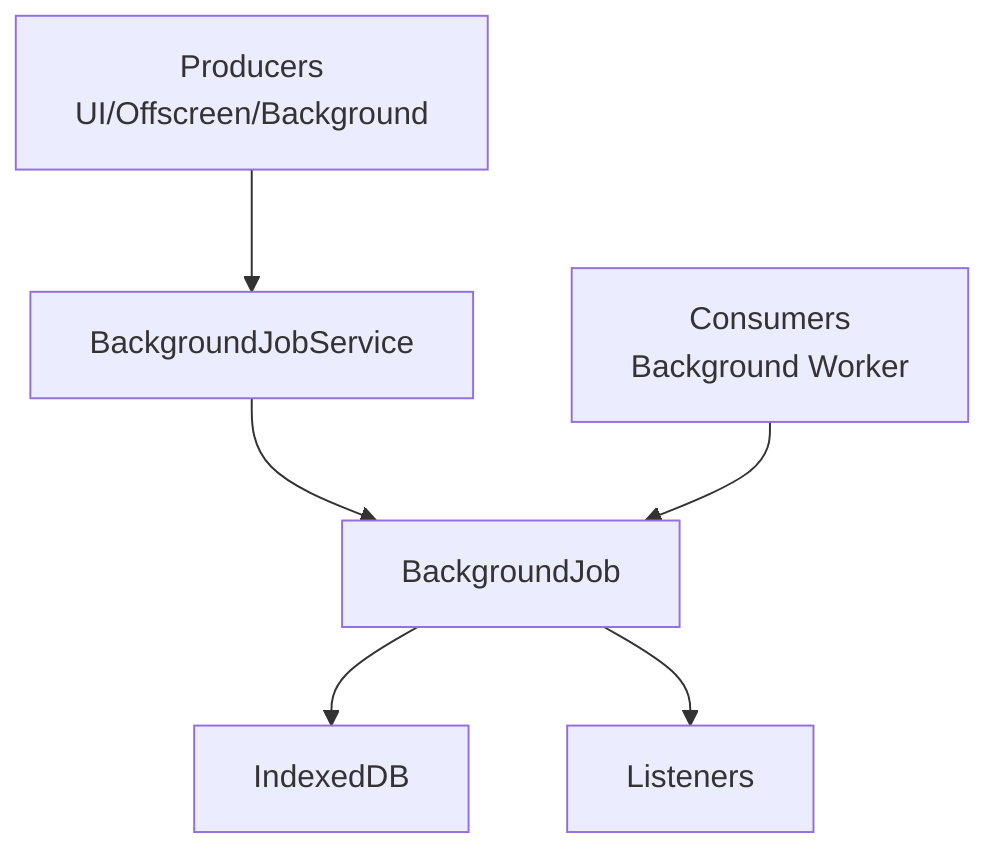

# 🧵 Background Jobs Documentation

## 📋 Overview

The Background Jobs subsystem provides a lightweight queue for offloading work like saving content and converting pages to knowledge graph data. It persists job state in IndexedDB, exposes a subscription model for UI updates, and offers helpers to enqueue, claim, update, and complete jobs.

## 🏗️ Architecture

### 🔧 Service Architecture



Key characteristics:
- Jobs stored as rows in an IndexedDB object store (`jobs`) keyed by job ID
- Queue exposes subscription for reactive UIs
- Service provides polling + subscription to mirror queue state in views

## 🛠️ Job Types

- `remember-save`: Persist content (page/content payload) and track progress
- `knowledge-graph-conversion`: Convert `RememberedContent` into KG entities/relations

## 📚 Usage Examples

### 🚀 Enqueue Jobs
```typescript
import { backgroundJobService } from '@/services/background-jobs/background-job-service';

// Save content job
const saveJobId = await backgroundJobService.addSaveContentJob({
  sourceType: 'selection',
  title: 'Snippet',
  rawContent: 'raw',
  cleanContent: 'clean',
  textContent: 'text',
  sourceMetadata: {} as any,
  extractionMetadata: {},
});

// Knowledge graph conversion job
const kgJobId = await backgroundJobService.addKnowledgeGraphJob(rememberedContent);
```

### 👀 Subscribe to Updates
```typescript
const unsubscribe = backgroundJobService.subscribe((state) => {
  console.log('Jobs:', state.jobs);
});
await backgroundJobService.startPolling();

// later
unsubscribe();
backgroundJobService.stopPolling();
```

### 🧹 Maintenance
```typescript
await backgroundJobService.clearCompletedJobs();
```

## 📝 API Reference

### 📦 Types (selected)
```typescript
export type JobType = 'remember-save' | 'knowledge-graph-conversion'

export interface BackgroundJobBase {
  id: string
  jobType: JobType
  status: 'pending' | 'running' | 'completed' | 'failed'
  createdAt: Date
  startedAt?: Date
  completedAt?: Date
  error?: string
}

export interface RememberSaveJob extends BackgroundJobBase {
  jobType: 'remember-save'
  payload: SaveContentData | SavePageData
  progress: ConversionProgress
}

export interface KnowledgeGraphJob extends BackgroundJobBase {
  jobType: 'knowledge-graph-conversion'
  pageId: string
  pageData: RememberedContent
  progress: ConversionProgress
}
```

### 🧰 BackgroundJob
```typescript
// Lifecycle & subscription
async initialize(): Promise<void>
subscribe(listener: (state: JobQueueState) => void): () => void

// Producers
async addRememberSaveJob(payload: SaveContentData | SavePageData): Promise<string>
async addKnowledgeGraphJob(pageData: RememberedContent): Promise<string>

// Consumers
async claimNextPendingJob(): Promise<BackgroundJob | null>
async updateJobProgress(jobId: string, progress: Partial<ConversionProgress>): Promise<void>
async completeJob(jobId: string, result: { success: boolean; error?: string }): Promise<void>

// Query & housekeeping
async getJob(jobId: string): Promise<BackgroundJob | null>
async getAllJobs(): Promise<BackgroundJob[]>
async clearCompletedJobs(): Promise<void>
```

### 🏢 BackgroundJobService
```typescript
subscribe(listener: (state: BackgroundJobServiceState) => void): () => void
async startPolling(): Promise<void>
stopPolling(): void

async addKnowledgeGraphJob(page: RememberedContent): Promise<string | null>
async addSaveContentJob(payload: SaveContentData | SavePageData): Promise<string | null>
async clearCompletedJobs(): Promise<boolean>

async getJobProgress(jobId: string): Promise<BackgroundJob | null>
async loadJobs(): Promise<void>

// Helpers
getJobsByStatus(status: BackgroundJob['status']): BackgroundJob[]
getRunningJobs(): BackgroundJob[]
getPendingJobs(): BackgroundJob[]
getCompletedJobs(): BackgroundJob[]
getFailedJobs(): BackgroundJob[]
isAnyJobRunning(): boolean
getTotalProgress(): { completed: number; total: number; percentage: number }
```

## ⚠️ Error Handling

- All storage operations are guarded by availability checks
- Queue and service log failures; state remains consistent or returns empty

## 🔒 Concurrency & Delivery

- Single-claim semantics via `claimNextPendingJob()` for simple work-stealing
- Persistent state enables recovery across extension restarts

## 🏆 Best Practices

- Use descriptive job IDs and include meaningful payload fields (titles/URLs)
- Update progress frequently for responsive UIs
- Clear completed/failed jobs periodically to keep state compact
