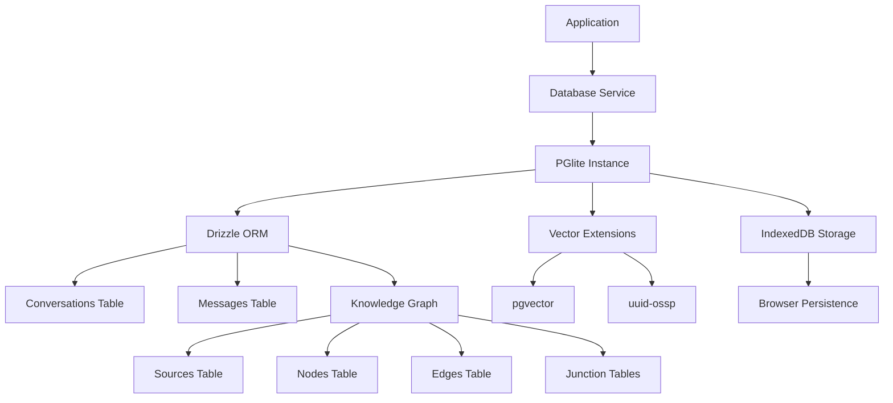

# 🗄️ Database Service Documentation

## 📋 Overview

The Database Service is a core component of Memorall that provides persistent storage for conversations, knowledge graphs, and vector embeddings. It uses PGlite (PostgreSQL in the browser) with vector extensions to enable semantic search, relationship tracking, and AI-powered memory retrieval. The service is designed for complete offline operation with IndexedDB persistence.

## 🏗️ Architecture

### 🔧 Database Architecture



The Database Service provides:
- **PGlite**: PostgreSQL running in the browser via WebAssembly
- **Drizzle ORM**: Type-safe database operations
- **Vector Extensions**: Semantic search capabilities
- **Knowledge Graph**: Structured relationship storage

## 🛠️ Database Entities

### 💬 Conversations & Messages

Stores chat history and user interactions with AI agents.

**Key Features:**
- Conversation threading and organization
- Message embeddings for semantic search
- JSONB metadata for flexible data storage
- Timestamp tracking for conversation history

**Entities:**
- **Conversations**: Chat sessions with titles and metadata
- **Messages**: Individual messages with role, content, and embeddings

### 🕸️ Knowledge Graph

Represents structured knowledge as interconnected nodes and relationships.

**Key Features:**
- Entity-relationship modeling
- Temporal data with validity periods  
- Provenance tracking and weight caching
- Vector embeddings for semantic similarity
- Flexible attributes via JSONB

**Entities:**
- **Sources**: External references (webpages, documents, etc.)
- **Nodes**: Knowledge entities (concepts, people, objects)
- **Edges**: Relationships between nodes with temporal validity
- **Junction Tables**: Many-to-many relationships between sources and graph entities

### 🔍 Vector Search

Enables semantic search across all stored content using embeddings.

**Key Features:**
- 768-dimensional vector storage
- Cosine similarity search
- Multi-table vector queries
- Integration with embedding service

## 📚 Entity Details

### 🗣️ Conversations Configuration
- **id**: Auto-incrementing primary key
- **title**: Optional conversation title
- **metadata**: JSONB for flexible data
- **timestamps**: Creation and update tracking

### 📝 Messages Configuration  
- **id**: Auto-incrementing primary key
- **conversationId**: Foreign key to conversations
- **role**: 'system', 'user', 'assistant', 'developer'
- **content**: Message text content
- **embedding**: 768-dimensional vector for semantic search
- **metadata**: JSONB for additional data

### 📚 Sources Configuration
- **id**: UUID primary key
- **targetType**: Type of external source
- **targetId**: External identifier
- **name**: Human-readable source name
- **weight**: Importance/relevance weight
- **embedding**: Vector representation of source

### 🔘 Nodes Configuration
- **id**: UUID primary key  
- **nodeType**: Category of knowledge entity
- **name**: Entity name
- **summary**: Optional description
- **attributes**: JSONB for flexible properties
- **embedding**: Vector representation

### 🔗 Edges Configuration
- **id**: UUID primary key
- **sourceId/destinationId**: Node references
- **edgeType**: Relationship type
- **factText**: Natural language description
- **temporal fields**: validAt, invalidAt, recordedAt
- **embeddings**: Separate vectors for facts and types

## 🔗 Integration with Memorall

The database service integrates with other Memorall services to provide persistent storage for AI conversations, knowledge extraction, and semantic memory retrieval.

## 📊 Performance Characteristics

| Component | Initialization Time | Query Speed | Storage | Network Required | Persistence |
|-----------|-------------------|-------------|---------|------------------|-------------|
| PGlite | 2-5s (first time) | Fast | Browser IndexedDB | No | Local |
| Vector Search | <100ms | Medium | Memory + Disk | No | Persistent |
| Knowledge Graph | <50ms | Fast | Disk | No | Persistent |
| Conversations | <10ms | Very Fast | Disk | No | Persistent |

## ⚠️ Error Handling

The database service implements comprehensive error handling:

1. **Auto-initialization**: Database and tables created automatically on first use
2. **Transaction Safety**: Atomic operations with rollback on failure  
3. **Schema Migration**: Automatic table creation and index management
4. **Error Recovery**: Graceful handling of connection and query failures

## 🔒 Data Safety & Persistence

The service ensures data integrity through:
- **Local Storage**: All data stays in browser IndexedDB
- **Transaction Management**: ACID compliance for data operations
- **Backup Ready**: Easy export/import capabilities  
- **Privacy First**: No data transmission to external servers

## 📚 Usage Examples

### 🚀 Basic Database Operations

```typescript
import { databaseService } from '@/services/database/database-service';

// Using the recommended 'use' function
const conversation = await databaseService.use(async ({ db, schema }) => {
  // Create a conversation
  const [conversation] = await db.insert(schema.conversations).values({
    title: 'Learning React Hooks',
    metadata: { topic: 'development', difficulty: 'intermediate' }
  }).returning();

  // Add messages to conversation
  await db.insert(schema.messages).values({
    conversationId: conversation.id,
    role: 'user',
    content: 'What are React hooks?',
    metadata: { timestamp: new Date() }
  });
  
  return conversation;
});
```

### ⭐ Vector Search Operations

```typescript
import { embeddingService } from '@/services/embedding/embedding-service';
import { sql } from 'drizzle-orm';

// Store message with embedding
async function storeMessageWithEmbedding(conversationId: number, content: string) {
  const embedding = await embeddingService.textToVector(content);
  
  return await databaseService.use(async ({ db, schema }) => {
    return await db.insert(schema.messages).values({
      conversationId,
      role: 'user', 
      content,
      embedding
    }).returning();
  });
}

// Search similar messages
async function findSimilarMessages(query: string, limit: number = 10) {
  const queryVector = await embeddingService.textToVector(query);
  
  return await databaseService.use(async ({ db, schema }) => {
    return await db
      .select()
      .from(schema.messages)
      .orderBy(sql`embedding <=> ${queryVector}`)
      .limit(limit);
  });
}
```

### 🕸️ Knowledge Graph Operations

```typescript
// Create knowledge nodes and relationships
const result = await databaseService.use(async ({ db, schema }) => {
  // Create knowledge nodes
  const [personNode] = await db.insert(schema.nodes).values({
    nodeType: 'person',
    name: 'Alan Turing',
    summary: 'British mathematician and computer scientist',
    attributes: { 
      birthYear: 1912, 
      field: 'computer science',
      nationality: 'British' 
    }
  }).returning();

  const [conceptNode] = await db.insert(schema.nodes).values({
    nodeType: 'concept',
    name: 'Turing Machine',
    summary: 'Abstract computational model'
  }).returning();

  // Create relationship edge
  const [edge] = await db.insert(schema.edges).values({
    sourceId: personNode.id,
    destinationId: conceptNode.id,
    edgeType: 'invented',
    factText: 'Alan Turing invented the concept of Turing Machine',
    validAt: new Date('1936-01-01'),
    attributes: { confidence: 0.95 }
  }).returning();
  
  return { personNode, conceptNode, edge };
});
```

### 🔍 Complex Queries

```typescript
import { eq } from 'drizzle-orm';

// Find conversations about specific topics
async function findConversationsByTopic(topic: string) {
  return await databaseService.use(async ({ db, schema }) => {
    return await db
      .select({
        conversation: schema.conversations,
        messageCount: sql<number>`count(${schema.messages.id})`.as('message_count')
      })
      .from(schema.conversations)
      .leftJoin(schema.messages, eq(schema.conversations.id, schema.messages.conversationId))
      .where(sql`${schema.conversations.metadata}->>'topic' = ${topic}`)
      .groupBy(schema.conversations.id);
  });
}

// Knowledge graph traversal
async function findRelatedConcepts(nodeId: string, edgeType?: string) {
  return await databaseService.use(async ({ db, schema }) => {
    let query = db
      .select({
        node: schema.nodes,
        edge: schema.edges,
        relationship: sql<string>`${schema.edges.edgeType}`.as('relationship')
      })
      .from(schema.edges)
      .innerJoin(schema.nodes, eq(schema.nodes.id, schema.edges.destinationId))
      .where(eq(schema.edges.sourceId, nodeId));
      
    if (edgeType) {
      query = query.where(eq(schema.edges.edgeType, edgeType));
    }
    
    return await query;
  });
}
```

### 📊 Analytics and Insights

```typescript
// Conversation analytics
async function getConversationStats() {
  return await databaseService.use(async ({ db, schema }) => {
    return await db
      .select({
        totalConversations: sql<number>`count(*)`.as('total'),
        avgMessagesPerConversation: sql<number>`avg(message_counts.count)`.as('avg_messages'),
        mostActiveDay: sql<string>`date_trunc('day', created_at)`.as('day')
      })
      .from(schema.conversations)
      .leftJoin(
        db.select({
          conversationId: schema.messages.conversationId,
          count: sql<number>`count(*)`.as('count')
        }).from(schema.messages).groupBy(schema.messages.conversationId).as('message_counts'),
        eq(schema.conversations.id, sql`message_counts.conversation_id`)
      );
  });
}

// Knowledge graph metrics
async function getKnowledgeGraphStats() {
  return await databaseService.use(async ({ db, schema }) => {
    const nodeStats = await db
      .select({
        nodeType: schema.nodes.nodeType,
        count: sql<number>`count(*)`.as('count')
      })
      .from(schema.nodes)
      .groupBy(schema.nodes.nodeType);
      
    const edgeStats = await db
      .select({
        edgeType: schema.edges.edgeType,
        count: sql<number>`count(*)`.as('count')
      })
      .from(schema.edges)
      .where(eq(schema.edges.isCurrent, true))
      .groupBy(schema.edges.edgeType);
      
    return { nodeStats, edgeStats };
  });
}
```

### ⚠️ Error Handling

```typescript
// Robust database operations with transactions
async function safeCreateConversation(title: string, metadata: any) {
  try {
    return await databaseService.use(async ({ transaction }) => {
      return await transaction(async ({ db, schema }) => {
        const [conversation] = await db.insert(schema.conversations).values({
          title,
          metadata
        }).returning();
        
        // Initialize with system message
        await db.insert(schema.messages).values({
          conversationId: conversation.id,
          role: 'system',
          content: 'How can I help you today?'
        });
        
        return conversation;
      });
    });
  } catch (error) {
    console.error('Failed to create conversation:', error);
    throw new Error(`Conversation creation failed: ${error.message}`);
  }
}

// Health check using service
async function checkDatabaseHealth() {
  try {
    const isHealthy = await databaseService.healthCheck();
    return { healthy: isHealthy, message: isHealthy ? 'Database operational' : 'Database not healthy' };
  } catch (error) {
    return { healthy: false, error: error.message };
  }
}
```

## 📝 API Reference

### 🏢 DatabaseService

#### 🔧 Core Methods
```typescript
// Singleton access
static getInstance(): DatabaseService

// Initialization
async initialize(): Promise<void>
isReady(): boolean

// Main usage method
async use<T>(
  fn: (ctx: {
    db: ReturnType<typeof getDB>;
    query: ReturnType<typeof getDB>['query'];
    schema: typeof schema;
    raw: (sql: string, params?: any[]) => Promise<any>;
    transaction: <R>(cb: (ctx: {...}) => Promise<R>) => Promise<R>;
  }) => Promise<T> | T,
  options?: { transactional?: boolean }
): Promise<T>
```

#### ℹ️ Utility Methods
```typescript
async getDatabase(): Promise<ReturnType<typeof getDB>>
async getPGLiteInstance(): Promise<PGlite>
async getTable<K>(tableName: K): Promise<TableRegistry[K]['table']>
async getStatus(): Promise<DatabaseStatus>
async healthCheck(): Promise<boolean>
async close(): Promise<void>
```

### 📊 Type Definitions

All entities export both select and insert types:
- `Conversation` / `NewConversation`
- `Message` / `NewMessage`  
- `Source` / `NewSource`
- `Node` / `NewNode`
- `Edge` / `NewEdge`
- `SourceNode` / `NewSourceNode`
- `SourceEdge` / `NewSourceEdge`

## 🏆 Best Practices

### 1. 🚀 Initialization Strategy
```typescript
// Initialize database service at app startup
async function initializeApp() {
  try {
    await databaseService.initialize();
    console.log('✅ Database service initialized successfully');
    
    // Run health check
    const isHealthy = await databaseService.healthCheck();
    if (!isHealthy) {
      throw new Error('Database health check failed');
    }
    
    return databaseService;
  } catch (error) {
    console.error('❌ Database initialization failed:', error);
    throw error;
  }
}
```

### 2. 🔍 Efficient Queries
```typescript
import { eq, desc } from 'drizzle-orm';

// Use indexes for better performance
const messages = await databaseService.use(async ({ db, schema }) => {
  return await db
    .select()
    .from(schema.messages)
    .where(eq(schema.messages.conversationId, conversationId)) // Uses index
    .orderBy(desc(schema.messages.createdAt));
});

// Batch operations when possible
const newMessages = await databaseService.use(async ({ db, schema }) => {
  return await db.insert(schema.messages).values([
    { conversationId, role: 'user', content: 'First message' },
    { conversationId, role: 'assistant', content: 'Response' }
  ]).returning();
});
```

### 3. 💾 Transaction Management
```typescript
// Use transactions for related operations
async function createConversationWithMessages(title: string, initialMessages: any[]) {
  return await databaseService.use(async ({ transaction }) => {
    return await transaction(async ({ db, schema }) => {
      const [conversation] = await db.insert(schema.conversations)
        .values({ title }).returning();
        
      await db.insert(schema.messages).values(
        initialMessages.map(msg => ({ 
          ...msg, 
          conversationId: conversation.id 
        }))
      );
      
      return conversation;
    });
  });
}
```

### 4. 🔍 Vector Search Optimization
```typescript
// Pre-compute embeddings for better performance
const embeddingCache = new Map<string, number[]>();

async function cachedTextToVector(text: string): Promise<number[]> {
  if (embeddingCache.has(text)) {
    return embeddingCache.get(text)!;
  }
  
  const vector = await embeddingService.textToVector(text);
  embeddingCache.set(text, vector);
  return vector;
}
```

This documentation provides a comprehensive overview of the database service architecture, entities, and usage patterns for building persistent, offline-capable applications with Memorall.