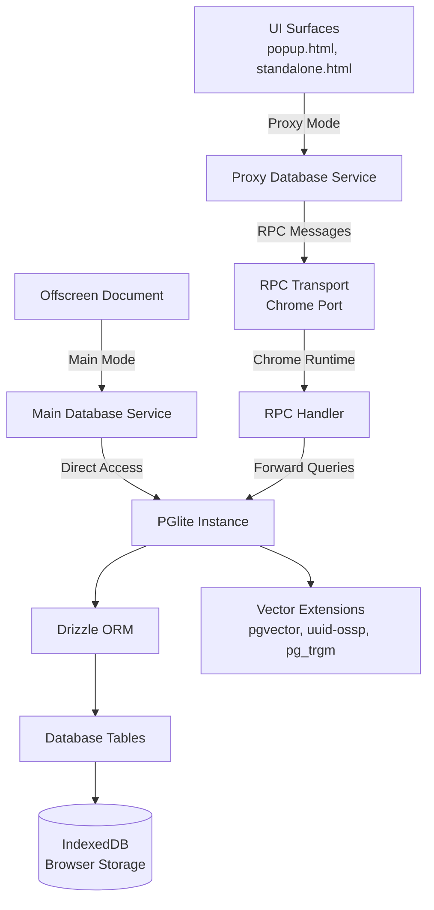
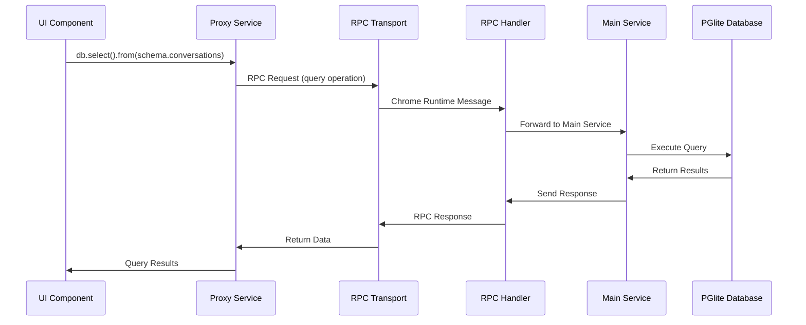

# 🗄️ Database Service Documentation

## 📋 Overview

The Database Service provides a dual-mode architecture for persistent storage using PGlite (PostgreSQL in the browser) with RPC bridge capabilities. It supports both **Main Mode** with direct database access and **Proxy Mode** for cross-context communication, enabling complete offline operation with seamless integration across extension contexts.

## 🏗️ Dual-Mode Architecture

### 🔧 Architecture Overview



### 🎯 Mode Characteristics

| Aspect | **Main Mode** | **Proxy Mode** |
|--------|---------------|----------------|
| **Context** | Offscreen Document | UI Surfaces (popup, standalone) |
| **Database Access** | Direct PGlite instance | RPC forwarding |
| **Performance** | Fast (direct) | Slight latency (RPC overhead) |
| **Features** | Full functionality | Same interface via proxy |
| **Migrations** | Handles migrations | No migration responsibility |
| **Resource Usage** | High (loaded models/DB) | Low (lightweight proxy) |

## 🔄 Service Modes

### 🖥️ Main Mode (Offscreen Document)

The authoritative database instance with full functionality.

```typescript
// Initialize in main mode (offscreen document)
await databaseService.initialize({ mode: DatabaseMode.MAIN });

// Direct database access
const result = await databaseService.use(async ({ db, schema }) => {
  return await db.select().from(schema.conversations);
});
```

**Features:**
- ✅ **Real PGlite Instance**: Direct PostgreSQL access
- ✅ **Migration Handling**: Automatic schema updates
- ✅ **Full Performance**: No RPC overhead
- ✅ **Vector Operations**: Direct embedding storage/retrieval
- ✅ **Transaction Support**: Full ACID compliance

### 🎨 Proxy Mode (UI Contexts)

Lightweight proxy that forwards operations to the main instance.

```typescript
// Initialize in proxy mode (UI contexts)
await databaseService.initialize({ mode: DatabaseMode.PROXY });

// Same interface, RPC forwarding
const result = await databaseService.use(async ({ db, schema }) => {
  return await db.select().from(schema.conversations);
});
```

**Features:**
- 🚀 **Lightweight**: Minimal resource usage
- 🔄 **RPC Forwarding**: Transparent operation forwarding
- 🎯 **Same Interface**: Identical API to main mode
- ⚡ **Responsive UI**: Non-blocking database operations
- 🔗 **Auto-Connection**: Handles RPC connection management

## 🌉 Bridge System

### 🔧 RPC Bridge Architecture

The bridge system enables seamless communication between proxy and main database instances.



### 📡 RPC Transport Layer

**Chrome Port Transport** (`src/services/database/bridges/chrome-port-rpc.ts`):
- High-performance structured cloning
- Automatic reconnection with exponential backoff
- Connection pooling and message queuing
- Type-safe request/response handling

**Proxy Driver** (`src/services/database/bridges/proxy-driver.ts`):
- PGlite-compatible interface
- Request timeout management
- Transaction wrapper support
- Progress tracking for long operations

### 🛠️ RPC Operations

| Operation | Description | Payload | Response |
|-----------|-------------|---------|----------|
| `health` | Database health check | None | `{ status: "ok" }` |
| `query` | SELECT/INSERT/UPDATE operations | `{ sql, params, rowMode }` | `{ rows, rowCount }` |
| `exec` | DDL operations | `{ sql }` | None |
| `transaction` | Transaction wrapper | `{ stmts[] }` | Results array |
| `close` | Connection cleanup | None | None |

## 🗄️ Database Entities

### 💬 Conversations & Messages
- **Conversations**: Chat sessions with metadata
- **Messages**: Individual messages with embeddings and role information

### 🧠 Remembered Content
- **RememberedContent**: Captured information from various sources
- Supports: `webpage`, `selection`, `user_input`, `raw_text`
- Vector embeddings for semantic search
- Flexible metadata storage via JSONB

### 🕸️ Knowledge Graph
- **Sources**: External references and provenance
- **Nodes**: Knowledge entities (concepts, people, objects)
- **Edges**: Relationships with temporal validity
- **Junction Tables**: Many-to-many relationships

### 🔐 Security & Configuration
- **Encryption**: Sensitive data encryption
- **Configurations**: Application settings and preferences

## 📚 Usage Examples

### 🚀 Cross-Context Operations

```typescript
// UI Component (Proxy Mode)
import { serviceManager } from '@/services';

// Initialize with proxy mode
await serviceManager.initialize({ proxy: true });
const databaseService = serviceManager.getDatabaseService();

// Same interface works transparently
const conversations = await databaseService.use(async ({ db, schema }) => {
  return await db
    .select()
    .from(schema.conversations)
    .orderBy(desc(schema.conversations.createdAt))
    .limit(10);
});
```

```typescript
// Offscreen Document (Main Mode)
import { serviceManager } from '@/services';

// Initialize with main mode
await serviceManager.initialize({ proxy: false });
const databaseService = serviceManager.getDatabaseService();

// Direct database access
const result = await databaseService.use(async ({ db, schema }) => {
  // This runs directly on PGlite
  return await db.insert(schema.conversations).values({
    title: 'New Conversation',
    metadata: { source: 'offscreen' }
  }).returning();
});
```

### 🔄 Mode-Aware Development

```typescript
// Check current mode
const config = databaseService.getConfig();
if (config?.mode === DatabaseMode.MAIN) {
  console.log('Running in main mode - direct database access');
} else {
  console.log('Running in proxy mode - RPC forwarding');
}

// Mode-specific optimizations
if (databaseService.isMainMode()) {
  // Heavy operations only in main mode
  await performBulkVectorOperations();
} else {
  // Lightweight operations in proxy mode
  await fetchSummaryData();
}
```

### 🌉 Bridge Configuration

```typescript
// Custom proxy configuration
await databaseService.initialize({
  mode: DatabaseMode.PROXY,
  proxyOptions: {
    channelName: 'custom-db-rpc',  // Custom RPC channel
  }
});

// Main mode with custom data directory
await databaseService.initialize({
  mode: DatabaseMode.MAIN,
  dataDir: 'idb://custom-memorall-db'
});
```

### 📊 Vector Operations Across Modes

```typescript
// Vector search works identically in both modes
async function semanticSearch(query: string, limit: number = 5) {
  const queryVector = await embeddingService.textToVector(query);

  return await databaseService.use(async ({ db, schema }) => {
    return await db
      .select()
      .from(schema.rememberedContent)
      .orderBy(sql`embedding <=> ${queryVector}`)
      .limit(limit);
  });
}

// Works in UI (proxy mode)
const resultsFromUI = await semanticSearch('AI concepts');

// Works in offscreen (main mode)
const resultsFromOffscreen = await semanticSearch('machine learning');
```

### 🔄 Transaction Handling

```typescript
// Transactions work across both modes
async function createConversationWithInitialMessage(title: string, content: string) {
  return await databaseService.use(async ({ db, schema }) => {
    return await db.transaction(async (tx) => {
      // Create conversation
      const [conversation] = await tx
        .insert(schema.conversations)
        .values({ title })
        .returning();

      // Add initial message
      const [message] = await tx
        .insert(schema.messages)
        .values({
          conversationId: conversation.id,
          role: 'user',
          content
        })
        .returning();

      return { conversation, message };
    });
  }, { transaction: true });
}
```

## 🎯 Bridge Development

### 📋 Custom Transport Implementation

```typescript
// Create custom RPC transport
import type { RpcTransport, RpcRequest, RpcResponse } from './bridges/types';

class CustomTransport implements RpcTransport {
  post(msg: RpcRequest): void {
    // Send message via custom channel
    customChannel.send(msg);
  }

  subscribe(handler: (msg: RpcResponse) => void): () => void {
    // Subscribe to responses
    customChannel.onMessage(handler);
    return () => customChannel.offMessage(handler);
  }
}

// Use custom transport
const customProxy = new PGliteSharedProxy(new CustomTransport());
```

### 🔧 RPC Handler Extension

```typescript
// Extend RPC handler for custom operations
class CustomDatabaseRpcHandler extends DatabaseRpcHandler {
  protected async handleMessage(request: RpcRequest): Promise<void> {
    // Handle custom operations
    if (request.op === 'custom-bulk-insert') {
      await this.handleBulkInsert(request.payload);
      return;
    }

    // Delegate to parent for standard operations
    return super.handleMessage(request);
  }

  private async handleBulkInsert(payload: any): Promise<void> {
    // Custom bulk insert logic
    const pglite = getPGLite();
    await pglite.transaction(async (tx) => {
      // Bulk operation
    });
  }
}
```

## 📝 API Reference

### 🏢 DatabaseService Core

```typescript
// Initialization with mode
async initialize(config?: DatabaseConfig): Promise<void>

interface DatabaseConfig {
  mode: DatabaseMode;
  dataDir?: string;
  proxyOptions?: {
    channelName?: string;
  };
}

// Mode checking
getMode(): DatabaseMode | null
isMainMode(): boolean
isProxyMode(): boolean
getConfig(): DatabaseConfig | null
```

### 🌉 Bridge Components

```typescript
// RPC Transport Interface
interface RpcTransport {
  post(msg: RpcRequest): void;
  subscribe(handler: (msg: RpcResponse) => void): () => void;
}

// Proxy Driver Interface
interface PGliteLike {
  query<R>(sql: string, params?: unknown[], options?: QueryOptions): Promise<QueryResult<R>>;
  exec(sql: string): Promise<void>;
  transaction<T>(fn: TransactionFn<T>): Promise<T>;
  waitReady: Promise<void>;
  close(): Promise<void>;
}
```

### 📊 Type Definitions

```typescript
// Database modes
enum DatabaseMode {
  MAIN = "main",
  PROXY = "proxy"
}

// RPC operation types
type RpcOp = 'health' | 'query' | 'exec' | 'transaction' | 'close';

// All entity types support both modes
type Conversation = typeof schema.conversations.$inferSelect;
type NewConversation = typeof schema.conversations.$inferInsert;
// ... (all other entity types)
```

## ⚠️ Error Handling & Recovery

### 🛡️ Connection Recovery

```typescript
// Automatic reconnection handling
try {
  const result = await databaseService.use(async ({ db, schema }) => {
    return await db.select().from(schema.conversations);
  });
} catch (error) {
  if (error.message.includes('RPC timeout')) {
    // Connection lost - proxy will auto-reconnect
    console.log('Connection lost, retrying...');
    // Retry logic here
  }
}
```

### 🔧 Mode-Specific Error Handling

```typescript
// Handle mode-specific issues
async function robustDatabaseOperation() {
  try {
    return await databaseService.use(async ({ db, schema }) => {
      return await db.select().from(schema.conversations);
    });
  } catch (error) {
    if (databaseService.isProxyMode() && error.message.includes('RPC')) {
      // RPC-specific error handling
      console.error('Proxy communication failed:', error);
      throw new Error('Database communication error');
    } else if (databaseService.isMainMode()) {
      // Direct database error handling
      console.error('Database operation failed:', error);
      throw new Error('Database operation error');
    }
    throw error;
  }
}
```

## 🏆 Best Practices

### 1. 🎯 Mode Selection Guidelines

```typescript
// Use Main Mode for:
// - Offscreen document contexts
// - Heavy data processing
// - Migration handling
// - Bulk operations

// Use Proxy Mode for:
// - UI contexts (popup, standalone)
// - Interactive operations
// - Real-time queries
// - User-facing features
```

### 2. ⚡ Performance Optimization

```typescript
// Batch operations in main mode
if (databaseService.isMainMode()) {
  // Efficient bulk operations
  await databaseService.use(async ({ db, schema }) => {
    return await db.insert(schema.messages).values(bulkMessages);
  });
} else {
  // Smaller operations in proxy mode
  for (const message of messages) {
    await databaseService.use(async ({ db, schema }) => {
      return await db.insert(schema.messages).values(message);
    });
  }
}
```

### 3. 🔄 Context Awareness

```typescript
// Design components to work in both modes
class ConversationManager {
  async createConversation(title: string) {
    // This works in both main and proxy modes
    return await databaseService.use(async ({ db, schema }) => {
      return await db.insert(schema.conversations)
        .values({ title })
        .returning();
    });
  }

  async getOptimizedData() {
    if (databaseService.isMainMode()) {
      // Complex queries in main mode
      return await this.getDetailedAnalytics();
    } else {
      // Simplified data for UI
      return await this.getSummaryData();
    }
  }
}
```

### 4. 🛡️ Resource Management

```typescript
// Proper cleanup in both modes
class DatabaseManager {
  async initialize() {
    const isOffscreen = typeof window !== 'undefined' &&
                       window.location.pathname.includes('offscreen');

    await databaseService.initialize({
      mode: isOffscreen ? DatabaseMode.MAIN : DatabaseMode.PROXY
    });
  }

  async cleanup() {
    // Cleanup works in both modes
    await databaseService.close();
  }
}
```

This documentation provides comprehensive coverage of the dual-mode database architecture, bridge system, and best practices for building robust cross-context database applications with Memorall.