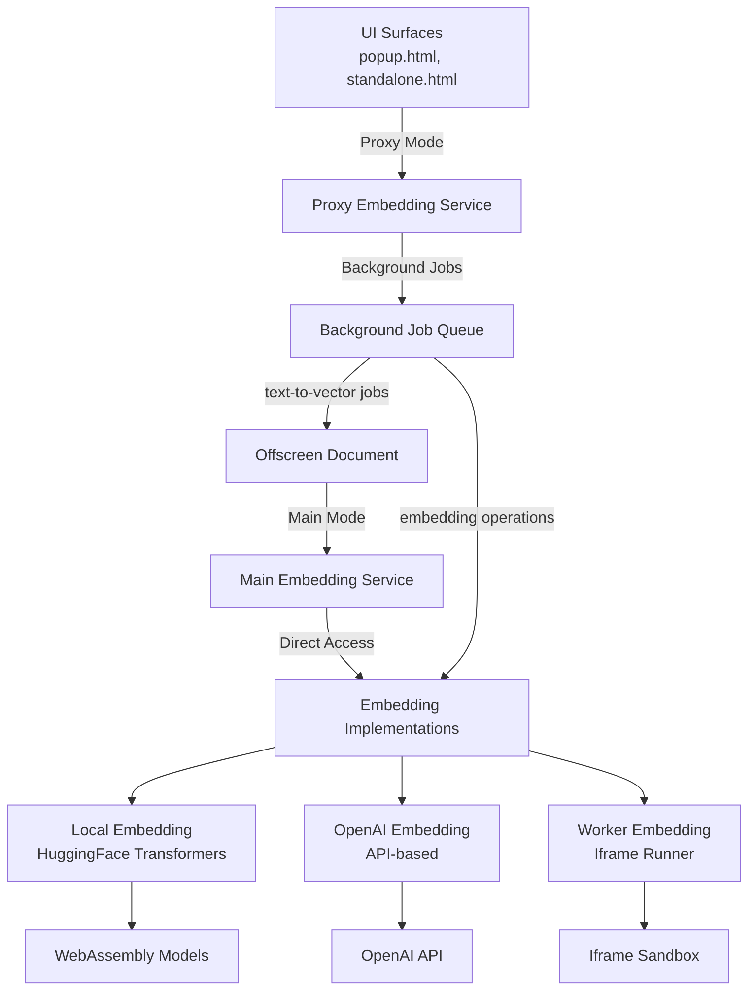

# 🔤 Embedding Service Documentation

## 📋 Overview

The Embedding Service provides a dual-mode architecture for text-to-vector transformation capabilities, supporting both **Main Mode** with direct model access and **Proxy Mode** for cross-context communication. It enables semantic search, similarity matching, and AI-powered memory retrieval through multiple embedding providers with a unified interface.

## 🏗️ Dual-Mode Architecture

### 🔧 Architecture Overview



### 🎯 Mode Characteristics

| Aspect | **Main Mode** | **Proxy Mode** |
|--------|---------------|----------------|
| **Context** | Offscreen Document | UI Surfaces (popup, standalone) |
| **Model Access** | Direct embedding instances | Background job forwarding |
| **Performance** | Fast (direct) | Slight latency (job queue) |
| **Memory Usage** | High (loaded models) | Low (lightweight proxies) |
| **Model Loading** | Handles model downloads | No model responsibility |
| **Initialization** | Real embedding setup | Proxy creation only |

## 🔄 Service Modes

### 🖥️ Main Mode (Offscreen Document)

Full embedding service with direct access to models and heavy processing capabilities.

```typescript
// Initialize in main mode (offscreen document)
import { EmbeddingServiceMain } from '@/services/embedding';

const embeddingService = new EmbeddingServiceMain();
await embeddingService.initialize();

// Direct model access
const vector = await embeddingService.textToVector('Hello world');
```

**Features:**
- ✅ **Real Models**: Direct access to HuggingFace, OpenAI, Worker embeddings
- ✅ **Model Management**: Loading, initialization, and memory management
- ✅ **Full Performance**: No job queue overhead
- ✅ **Batch Processing**: Efficient multi-text processing
- ✅ **Resource Control**: Direct model lifecycle management

### 🎨 Proxy Mode (UI Contexts)

Lightweight service that forwards embedding operations to the main service via background jobs.

```typescript
// Initialize in proxy mode (UI contexts)
import { EmbeddingServiceProxy } from '@/services/embedding';

const embeddingService = new EmbeddingServiceProxy();
await embeddingService.initialize();

// Same interface, background job forwarding
const vector = await embeddingService.textToVector('Hello world');
```

**Features:**
- 🚀 **Lightweight**: Minimal resource usage
- 🔄 **Job Forwarding**: Transparent operation delegation
- 🎯 **Same Interface**: Identical API to main mode
- ⚡ **Responsive UI**: Non-blocking operations
- 🔗 **Auto-Management**: Background job handling

## 🛠️ Embedding Implementations

### 💻 LocalEmbedding (Browser-based)

Uses HuggingFace Transformers.js to run embedding models directly in the browser via WebAssembly.

**Availability:**
- ✅ **Main Mode**: Full implementation with direct model access
- ❌ **Proxy Mode**: Not available (too heavy for UI contexts)

```typescript
// Main mode only
const embedding = await embeddingService.create('local-embed', 'local', {
  modelName: 'nomic-ai/nomic-embed-text-v1.5',
  batchSize: 32
});
```

**Key Features:**
- Fully offline operation
- No API costs
- Complete privacy (no data transmission)
- WebAssembly-based execution
- High memory usage (models loaded in memory)

### 🌐 OpenAIEmbedding (API-based)

Integrates with OpenAI's embedding API for high-quality embeddings with minimal setup.

**Availability:**
- ✅ **Main Mode**: Full implementation
- ✅ **Proxy Mode**: Lightweight local version (API calls directly)

```typescript
// Available in both modes
const embedding = await embeddingService.create('openai-embed', 'openai', {
  modelName: 'text-embedding-3-small',
  apiKey: 'your-api-key'
});
```

**Key Features:**
- High-quality embeddings
- Fast processing
- Low memory usage
- Requires API key and internet
- Pay-per-use model

### 🖼️ WorkerEmbedding (Iframe Runner)

Uses an iframe-based runner system to execute embeddings in a sandboxed environment.

**Availability:**
- ✅ **Main Mode**: Full implementation with iframe management
- ❌ **Proxy Mode**: Not available (complex iframe handling)

```typescript
// Main mode only
const embedding = await embeddingService.create('worker-embed', 'worker', {
  modelName: 'nomic-ai/nomic-embed-text-v1.5',
  runnerUrl: 'https://example.com/runner'
});
```

**Key Features:**
- Sandboxed execution
- Follows same pattern as LLM service
- Communicates via postMessage
- Supports model switching
- Medium memory usage

### 🔄 EmbeddingProxy (Background Job Forwarder)

Proxy implementation that forwards all operations to background jobs for processing in main mode.

**Availability:**
- ❌ **Main Mode**: Not used (direct implementations available)
- ✅ **Proxy Mode**: Used for heavy operations

```typescript
// Automatically used in proxy mode for heavy operations
const embeddingProxy = new EmbeddingProxy('heavy-model', 'local');
const vector = await embeddingProxy.textToVector('Text to process');
```

**Key Features:**
- Zero local processing
- Background job delegation
- Same interface as real embeddings
- Automatic error handling
- No memory overhead

## 📚 Usage Examples

### 🚀 Cross-Context Operations

```typescript
// UI Component (Proxy Mode)
import { serviceManager } from '@/services';

// Initialize with proxy mode
await serviceManager.initialize({ proxy: true });
const embeddingService = serviceManager.getEmbeddingService();

// OpenAI works directly in proxy mode
await embeddingService.create('ui-openai', 'openai', {
  modelName: 'text-embedding-3-small',
  apiKey: process.env.OPENAI_API_KEY
});

// Heavy operations forwarded to background
const vector = await embeddingService.textToVector('UI text processing');
```

```typescript
// Offscreen Document (Main Mode)
import { serviceManager } from '@/services';

// Initialize with main mode
await serviceManager.initialize({ proxy: false });
const embeddingService = serviceManager.getEmbeddingService();

// All implementations available
await embeddingService.create('main-local', 'local', {
  modelName: 'nomic-ai/nomic-embed-text-v1.5'
});

await embeddingService.create('main-worker', 'worker', {
  modelName: 'sentence-transformers/all-MiniLM-L6-v2'
});

// Direct processing
const vectors = await embeddingService.textsToVectors([
  'First document',
  'Second document',
  'Third document'
]);
```

### 🔄 Mode-Aware Development

```typescript
// Check service capabilities
const embeddingService = serviceManager.getEmbeddingService();

if (embeddingService instanceof EmbeddingServiceMain) {
  // Main mode - all implementations available
  console.log('Running in main mode - full model access');

  // Create heavy local embeddings
  await embeddingService.create('heavy-local', 'local', {
    modelName: 'nomic-ai/nomic-embed-text-v1.5'
  });
} else {
  // Proxy mode - lightweight operations only
  console.log('Running in proxy mode - background job forwarding');

  // Use lightweight OpenAI for direct operations
  await embeddingService.create('light-openai', 'openai', {
    modelName: 'text-embedding-3-small'
  });
}
```

### 📊 Performance Optimization

```typescript
// Batch processing considerations
async function optimizedBatchProcessing(documents: string[]) {
  const embeddingService = serviceManager.getEmbeddingService();

  if (embeddingService instanceof EmbeddingServiceMain) {
    // Main mode - efficient batch processing
    return await embeddingService.textsToVectors(documents);
  } else {
    // Proxy mode - smaller batches to avoid job queue bottlenecks
    const batchSize = 10;
    const results: number[][] = [];

    for (let i = 0; i < documents.length; i += batchSize) {
      const batch = documents.slice(i, i + batchSize);
      const batchResults = await embeddingService.textsToVectors(batch);
      results.push(...batchResults);
    }

    return results;
  }
}
```

### 🌉 Background Job Integration

```typescript
// Direct background job usage (advanced)
import { backgroundJob } from '@/services/background-jobs/background-job';

// Create embedding in background
const createResult = await backgroundJob.execute('create-embedding', {
  name: 'background-local',
  type: 'local',
  config: {
    modelName: 'nomic-ai/nomic-embed-text-v1.5'
  }
}, { stream: false });

// Use created embedding
const vectorResult = await backgroundJob.execute('text-to-vector', {
  text: 'Process this text',
  embeddingName: 'background-local'
}, { stream: false });

const vector = await vectorResult.promise;
```

### 🔄 Implementation Selection

```typescript
// Smart implementation selection based on context
class EmbeddingManager {
  private embeddingService: IEmbeddingService;

  constructor(embeddingService: IEmbeddingService) {
    this.embeddingService = embeddingService;
  }

  async createOptimalEmbedding(requiresPrivacy: boolean, needsSpeed: boolean) {
    if (this.embeddingService instanceof EmbeddingServiceMain) {
      if (requiresPrivacy) {
        // Use local embedding for privacy
        return await this.embeddingService.create('private-local', 'local', {
          modelName: 'nomic-ai/nomic-embed-text-v1.5'
        });
      } else if (needsSpeed) {
        // Use OpenAI for speed
        return await this.embeddingService.create('fast-openai', 'openai', {
          modelName: 'text-embedding-3-small'
        });
      } else {
        // Use worker for balance
        return await this.embeddingService.create('balanced-worker', 'worker', {
          modelName: 'sentence-transformers/all-MiniLM-L6-v2'
        });
      }
    } else {
      // Proxy mode - limited to OpenAI
      return await this.embeddingService.create('proxy-openai', 'openai', {
        modelName: 'text-embedding-3-small'
      });
    }
  }
}
```

## 📊 Implementation Comparison

| Implementation | **Main Mode** | **Proxy Mode** | **Privacy** | **Speed** | **Memory** | **Cost** |
|----------------|---------------|-----------------|-------------|-----------|------------|----------|
| **LocalEmbedding** | ✅ Full | ❌ Via Jobs | 🔒 High | ⚡ Medium | 💾 High | 💰 Free |
| **OpenAIEmbedding** | ✅ Full | ✅ Direct | ⚠️ API | ⚡ Fast | 💾 Low | 💰 Pay-per-use |
| **WorkerEmbedding** | ✅ Full | ❌ Via Jobs | 🔒 High | ⚡ Medium | 💾 Medium | 💰 Free |
| **EmbeddingProxy** | ❌ N/A | ✅ Jobs Only | 🔒 Depends | ⚡ Slow | 💾 None | 💰 Depends |

### 🎯 Selection Guidelines

**Use LocalEmbedding when:**
- Complete privacy required
- Offline operation needed
- No API costs acceptable
- Running in main mode

**Use OpenAIEmbedding when:**
- High quality needed
- Fast processing required
- API costs acceptable
- Available in both modes

**Use WorkerEmbedding when:**
- Sandboxed execution needed
- Balance of performance/privacy
- Main mode only

**Use EmbeddingProxy when:**
- Running in proxy mode
- Heavy local models needed
- Background processing acceptable

## 📝 API Reference

### 🏢 IEmbeddingService Interface

```typescript
interface IEmbeddingService {
  // Initialization
  initialize(): Promise<void>;

  // Embedding management
  create(name: string, embeddingType: string, config: any): Promise<BaseEmbedding>;
  get(name: string): Promise<BaseEmbedding | null>;
  has(name: string): boolean;
  remove(name: string): boolean;
  list(): string[];
  clear(): void;

  // Status checking
  isReady(): boolean;
  isReadyByName(name: string): boolean;
  getInfo(): { name: string; type: string; ready: boolean };
  getInfoFor(name: string): { name: string; type: string; ready: boolean };

  // Cleanup
  destroy(): void;

  // Embedding operations
  textToVector(text: string): Promise<number[]>;
  textsToVectors(texts: string[]): Promise<number[][]>;
  textToVectorFor(embeddingName: string, text: string): Promise<number[]>;
  textsToVectorsFor(embeddingName: string, texts: string[]): Promise<number[][]>;
}
```

### 🛠️ Implementation-Specific Configs

```typescript
// Local Embedding Configuration
interface LocalEmbeddingConfig {
  modelName: string; // Default: 'nomic-ai/nomic-embed-text-v1.5'
  batchSize?: number; // Default: 32
  stripNewLines?: boolean; // Default: true
  pretrainedOptions?: any;
  pipelineOptions?: any;
}

// OpenAI Embedding Configuration
interface OpenAIEmbeddingConfig {
  modelName: string; // Default: 'text-embedding-3-small'
  apiKey: string;
  baseUrl?: string; // Default: 'https://api.openai.com/v1'
}

// Worker Embedding Configuration
interface WorkerEmbeddingConfig {
  modelName: string; // Default: 'nomic-ai/nomic-embed-text-v1.5'
  runnerUrl?: string; // Uses WLLAMA_RUNNER_URL with ?mode=embedding
}
```

### 🔄 Service Mode Classes

```typescript
// Main Mode Service
class EmbeddingServiceMain extends EmbeddingServiceCore implements IEmbeddingService {
  // Full implementation with direct model access
}

// Proxy Mode Service
class EmbeddingServiceProxy extends EmbeddingServiceCore implements IEmbeddingService {
  // Lightweight implementation with background job forwarding
}
```

## ⚠️ Error Handling & Recovery

### 🛡️ Mode-Specific Error Handling

```typescript
// Handle mode-specific embedding issues
async function robustEmbeddingOperation(text: string) {
  const embeddingService = serviceManager.getEmbeddingService();

  try {
    return await embeddingService.textToVector(text);
  } catch (error) {
    if (embeddingService instanceof EmbeddingServiceProxy) {
      // Proxy mode - check for job queue issues
      if (error.message.includes('job')) {
        console.error('Background job failed:', error);
        // Retry with direct OpenAI if available
        try {
          return await embeddingService.textToVectorFor('openai-fallback', text);
        } catch (fallbackError) {
          throw new Error('All embedding methods failed');
        }
      }
    } else {
      // Main mode - handle model loading issues
      if (error.message.includes('model')) {
        console.error('Model loading failed:', error);
        // Try alternative implementation
        await embeddingService.create('fallback', 'openai', { /* config */ });
        return await embeddingService.textToVectorFor('fallback', text);
      }
    }
    throw error;
  }
}
```

### 🔧 Initialization Recovery

```typescript
// Robust service initialization
async function initializeEmbeddingService(isOffscreen: boolean) {
  const ServiceClass = isOffscreen ? EmbeddingServiceMain : EmbeddingServiceProxy;
  const embeddingService = new ServiceClass();

  try {
    await embeddingService.initialize();

    if (isOffscreen) {
      // Main mode - create multiple embeddings
      await embeddingService.create('default', 'local', {
        modelName: 'nomic-ai/nomic-embed-text-v1.5'
      });
    } else {
      // Proxy mode - create lightweight embedding
      await embeddingService.create('default', 'openai', {
        modelName: 'text-embedding-3-small',
        apiKey: process.env.OPENAI_API_KEY
      });
    }

    return embeddingService;
  } catch (error) {
    console.error('Embedding service initialization failed:', error);

    // Fallback initialization
    if (isOffscreen) {
      // Try OpenAI as fallback
      await embeddingService.create('fallback', 'openai', { /* config */ });
    }

    return embeddingService;
  }
}
```

## 🏆 Best Practices

### 1. 🎯 Mode-Aware Architecture

```typescript
// Design components to work optimally in both modes
class SemanticSearchManager {
  constructor(private embeddingService: IEmbeddingService) {}

  async initialize() {
    if (this.embeddingService instanceof EmbeddingServiceMain) {
      // Main mode - use high-quality local embedding
      await this.embeddingService.create('search', 'local', {
        modelName: 'nomic-ai/nomic-embed-text-v1.5'
      });
    } else {
      // Proxy mode - use fast OpenAI
      await this.embeddingService.create('search', 'openai', {
        modelName: 'text-embedding-3-small'
      });
    }
  }

  async search(query: string, documents: string[]) {
    const queryVector = await this.embeddingService.textToVectorFor('search', query);

    if (this.embeddingService instanceof EmbeddingServiceMain) {
      // Batch process for efficiency
      const docVectors = await this.embeddingService.textsToVectorsFor('search', documents);
      return this.calculateSimilarities(queryVector, docVectors);
    } else {
      // Process in smaller batches for proxy mode
      const similarities = [];
      for (const doc of documents) {
        const docVector = await this.embeddingService.textToVectorFor('search', doc);
        similarities.push(this.cosineSimilarity(queryVector, docVector));
      }
      return similarities;
    }
  }
}
```

### 2. ⚡ Performance Optimization

```typescript
// Cache embeddings appropriately for each mode
class EmbeddingCache {
  private cache = new Map<string, number[]>();

  constructor(private embeddingService: IEmbeddingService) {}

  async getVector(text: string): Promise<number[]> {
    if (this.cache.has(text)) {
      return this.cache.get(text)!;
    }

    const vector = await this.embeddingService.textToVector(text);

    // Cache more aggressively in proxy mode due to job overhead
    if (this.embeddingService instanceof EmbeddingServiceProxy) {
      this.cache.set(text, vector);
    } else {
      // Limited caching in main mode to preserve memory for models
      if (this.cache.size < 100) {
        this.cache.set(text, vector);
      }
    }

    return vector;
  }
}
```

### 3. 🔄 Resource Management

```typescript
// Proper resource cleanup for both modes
class EmbeddingManager {
  private embeddingService: IEmbeddingService;

  async initialize(isOffscreen: boolean) {
    this.embeddingService = isOffscreen
      ? new EmbeddingServiceMain()
      : new EmbeddingServiceProxy();

    await this.embeddingService.initialize();
  }

  async cleanup() {
    if (this.embeddingService instanceof EmbeddingServiceMain) {
      // Main mode - explicitly destroy models to free memory
      this.embeddingService.destroy();
    } else {
      // Proxy mode - clear lightweight references
      this.embeddingService.clear();
    }
  }
}
```

### 4. 🛡️ Context Detection

```typescript
// Automatic mode detection and service creation
function createEmbeddingService(): IEmbeddingService {
  // Detect context based on environment
  const isOffscreen = typeof window !== 'undefined' &&
                     window.location.pathname.includes('offscreen');

  if (isOffscreen) {
    console.log('Creating main embedding service for offscreen context');
    return new EmbeddingServiceMain();
  } else {
    console.log('Creating proxy embedding service for UI context');
    return new EmbeddingServiceProxy();
  }
}
```

This documentation provides comprehensive coverage of the dual-mode embedding architecture, implementation details, and best practices for building robust cross-context embedding applications with Memorall.