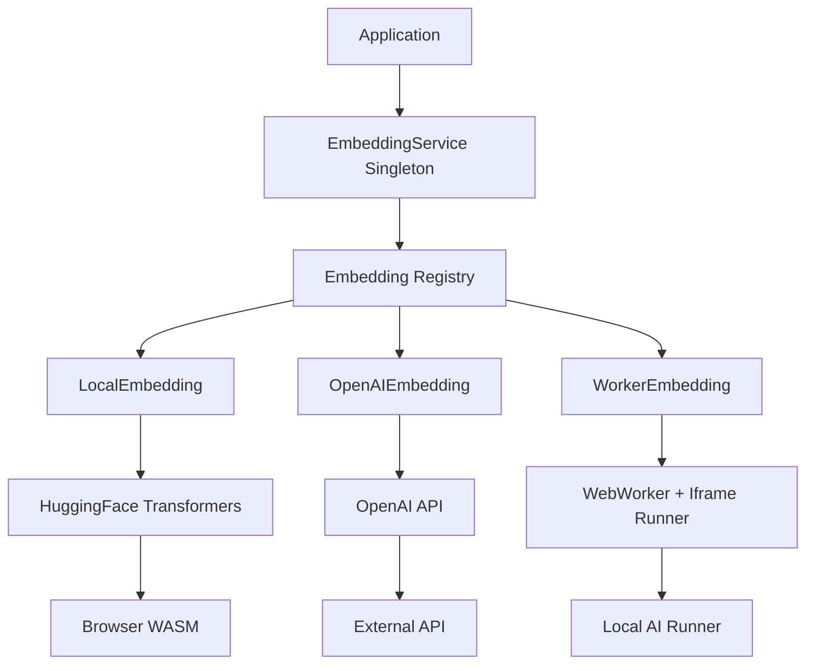
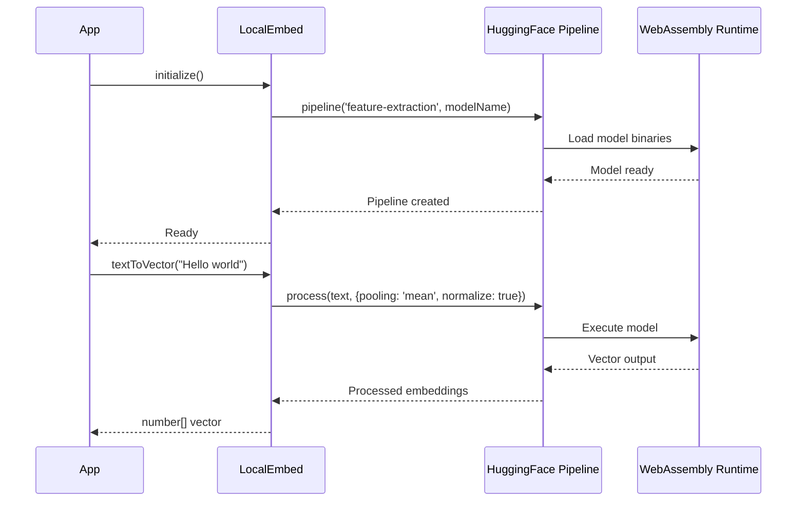
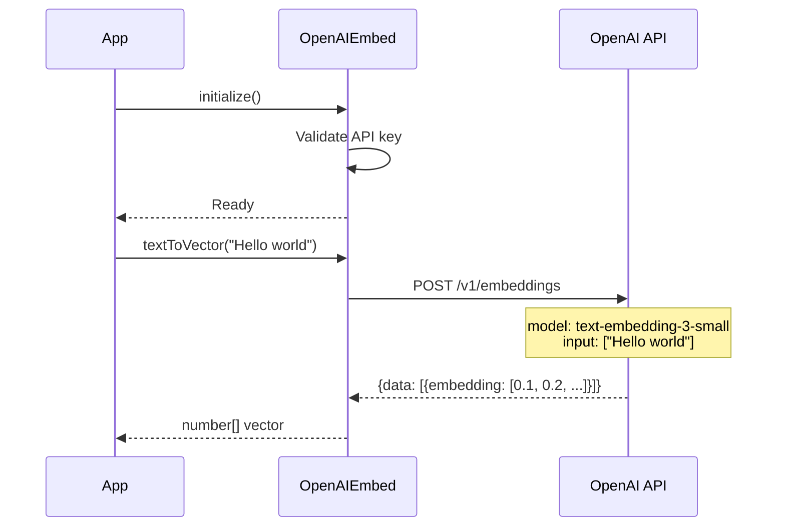
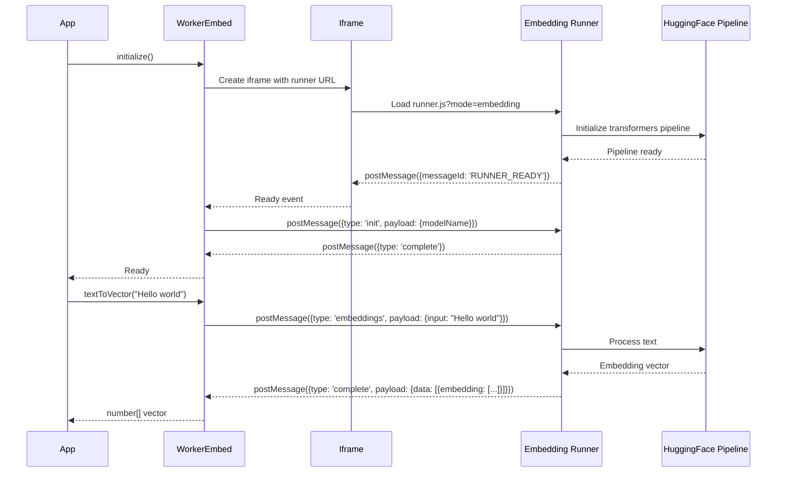

# 🔤 Embedding Service Documentation

## 📋 Overview

The Embedding Service is a core component of Memorall that provides text-to-vector transformation capabilities for semantic search, similarity matching, and AI-powered memory retrieval. It supports multiple embedding providers through a unified interface and includes a registry system for managing multiple embedding models simultaneously.

## 🏗️ Architecture

### 🔧 Service Architecture




## 🛠️ Implementation Types

### 💻 LocalEmbedding (Browser-based)

Uses HuggingFace Transformers.js to run embedding models directly in the browser via WebAssembly.

**Key Features:**
- Fully offline operation
- No API costs
- Complete privacy (no data transmission)
- WebAssembly-based execution

**Flow Diagram:**



### 🌐 OpenAIEmbedding (API-based)

Integrates with OpenAI's embedding API for high-quality embeddings with minimal setup.

**Key Features:**
- High-quality embeddings
- Fast processing
- Requires API key and internet
- Pay-per-use model

**Flow Diagram:**



### 🖼️ WorkerEmbedding (Iframe Runner)

Uses an iframe-based runner system to execute embeddings in a sandboxed environment, similar to the LLM service architecture.

**Key Features:**
- Sandboxed execution
- Follows same pattern as Wllama runner
- Communicates via postMessage
- Supports model switching

**Flow Diagram:**



## 📚 Service Registry System

The EmbeddingService acts as a singleton registry that manages multiple embedding instances:

The EmbeddingService manages multiple embedding instances through a registry pattern:
1. **Create** - Instantiate new embedding with configuration
2. **Initialize** - Set up the embedding model
3. **Register** - Store in the embeddings Map
4. **Retrieve** - Get existing embeddings by name

## ⚙️ Configuration Types

### 💻 LocalEmbedding Configuration
- **modelName**: Default 'nomic-ai/nomic-embed-text-v1.5'
- **batchSize**: Default 32 
- **stripNewLines**: Default true
- **pretrainedOptions**: HuggingFace model options
- **pipelineOptions**: Feature extraction options

### 🌐 OpenAIEmbedding Configuration 
- **modelName**: Default 'text-embedding-3-small'
- **apiKey**: Your OpenAI API key
- **baseUrl**: Default 'https://api.openai.com/v1'

### 🖼️ WorkerEmbedding Configuration
- **modelName**: Default 'nomic-ai/nomic-embed-text-v1.5' 
- **runnerUrl**: Uses WLLAMA_RUNNER_URL with ?mode=embedding

## 🔗 Integration with Memorall

The embedding service integrates with Memorall's database to enable semantic search and memory retrieval through vector similarity matching.

## 📊 Performance Characteristics

| Implementation | Initialization Time | Processing Speed | Memory Usage | Network Required | Cost |
|----------------|-------------------|------------------|--------------|------------------|------|
| LocalEmbedding | 10-30s (first time) | Medium | High | Download only | Free |
| OpenAIEmbedding | <1s | Fast | Low | Always | Pay per use |
| WorkerEmbedding | 10-30s (first time) | Medium | Medium | Download only | Free |

## ⚠️ Error Handling

The service implements comprehensive error handling:

1. **Auto-initialization**: If embedding not ready, automatically initializes
2. **Retry Logic**: Failed requests are retried with exponential backoff
3. **Graceful Degradation**: Falls back to alternative embeddings if available
4. **Clear Error Messages**: Descriptive errors with available alternatives

## 🔒 Thread Safety & Concurrency

The service handles concurrent requests through:
- Loading state management (prevents multiple initializations)
- Request queuing for batch processing
- Singleton pattern for service instance
- Thread-safe embedding operations

## 📚 Usage Examples

### 🚀 Basic Usage

```typescript
import { embeddingService } from '@/services/embedding/embedding-service';

// Create a local embedding instance
const embedding = await embeddingService.create('my-local', 'local', {
  type: 'local',
  modelName: 'nomic-ai/nomic-embed-text-v1.5'
});

// Convert text to vector
const vector = await embeddingService.textToVectorFor('my-local', 'Hello, world!');
console.log(vector); // [0.1, 0.2, 0.3, ...]

// Process multiple texts
const vectors = await embeddingService.textsToVectorsFor('my-local', [
  'First text',
  'Second text',
  'Third text'
]);
```

### ⭐ Using Default Embedding

```typescript
// The service automatically creates a default local embedding
const vector = await embeddingService.textToVector('Some text to embed');

// Get default embedding info
const info = await embeddingService.getInfo('default');
console.log(info); // { name: 'nomic-ai/nomic-embed-text-v1.5', dimensions: 768, type: 'local' }
```

### 🔄 Multiple Embedding Providers

```typescript
// Create different embedding types
await embeddingService.create('fast-local', 'local', {
  type: 'local',
  modelName: 'sentence-transformers/all-MiniLM-L6-v2'
});

await embeddingService.create('openai-quality', 'openai', {
  type: 'openai',
  modelName: 'text-embedding-3-large',
  apiKey: 'your-api-key'
});

await embeddingService.create('worker-sandbox', 'worker', {
  type: 'worker',
  modelName: 'nomic-ai/nomic-embed-text-v1.5'
});

// Use different embeddings for different purposes
const localVector = await embeddingService.textToVectorFor('fast-local', 'Quick processing');
const qualityVector = await embeddingService.textToVectorFor('openai-quality', 'High quality embedding');
const workerVector = await embeddingService.textToVectorFor('worker-sandbox', 'Sandboxed processing');
```

### ⚠️ Error Handling

```typescript
try {
  const embedding = await embeddingService.getRequired('non-existent');
} catch (error) {
  console.error('Embedding not found:', error.message);
  // Error: Embedding 'non-existent' not found. Available: default, my-local
}

try {
  await embeddingService.create('invalid', 'openai', {
    type: 'openai',
    apiKey: 'invalid-key'
  });
} catch (error) {
  console.error('Failed to create embedding:', error.message);
}
```

### 📦 Batch Processing

```typescript
// Efficient batch processing
const documents = [
  'Document 1 content...',
  'Document 2 content...',
  'Document 3 content...',
  // ... many more documents
];

// Process in batches to avoid memory issues
const batchSize = 32;
const allVectors: number[][] = [];

for (let i = 0; i < documents.length; i += batchSize) {
  const batch = documents.slice(i, i + batchSize);
  const batchVectors = await embeddingService.textsToVectors(batch);
  allVectors.push(...batchVectors);
}
```

### 🗄️ Integration with Database

```typescript
import { getDB } from '@/services/database/db';
import { embeddingService } from '@/services/embedding/embedding-service';

async function storeWithEmbedding(content: string) {
  const db = getDB();
  const vector = await embeddingService.textToVector(content);
  
  await db.insert(schema.messages).values({
    content,
    embedding: vector,
    createdAt: new Date()
  });
}

async function searchSimilar(query: string, limit: number = 10) {
  const db = getDB();
  const queryVector = await embeddingService.textToVector(query);
  
  // Using pgvector similarity search
  const results = await db
    .select()
    .from(schema.messages)
    .orderBy(sql`embedding <=> ${queryVector}`)
    .limit(limit);
    
  return results;
}
```

## 📝 API Reference

### 🏢 EmbeddingService

#### 🔄 Singleton Access
```typescript
static getInstance(): EmbeddingService
```

#### 🛠️ Embedding Management
```typescript
async create<K extends keyof EmbeddingRegistry>(
  name: string,
  embeddingType: K,
  config: EmbeddingRegistry[K]['config']
): Promise<EmbeddingRegistry[K]['embedding']>

async get(name: string): Promise<BaseEmbedding | undefined>
async getRequired(name: string): Promise<BaseEmbedding>
has(name: string): boolean
remove(name: string): boolean
```

#### ℹ️ Information Methods
```typescript
getNames(): string[]
getAll(): Map<string, BaseEmbedding>
async getInfo(name: string): Promise<EmbeddingInfo | undefined>
async getAllInfo(): Promise<Record<string, EmbeddingInfo>>
```

#### ⚡ Convenience Methods
```typescript
async textToVector(text: string): Promise<number[]>
async textsToVectors(texts: string[]): Promise<number[][]>
async textToVectorFor(embeddingName: string, text: string): Promise<number[]>
async textsToVectorsFor(embeddingName: string, texts: string[]): Promise<number[][]>
```


## 🏆 Best Practices

### 1. Initialization Strategy
```typescript
// Initialize embeddings at application startup
async function initializeEmbeddings() {
  // Create default for general use
  await embeddingService.create('default', 'local', {
    type: 'local',
    modelName: 'nomic-ai/nomic-embed-text-v1.5'
  });
  
  // Create specialized embeddings if needed
  if (hasOpenAIKey()) {
    await embeddingService.create('high-quality', 'openai', {
      type: 'openai',
      modelName: 'text-embedding-3-large'
    });
  }
}
```

### 2. Model Selection
```typescript
// For general purpose: nomic-ai/nomic-embed-text-v1.5 (768 dimensions)
// For speed: sentence-transformers/all-MiniLM-L6-v2 (384 dimensions)
// For quality: text-embedding-3-large via OpenAI (3072 dimensions)
```

### 3. Memory Management
```typescript
// Clean up embeddings when not needed
embeddingService.remove('temporary-embedding');

// Monitor embedding usage
const activeEmbeddings = embeddingService.getNames();
console.log('Active embeddings:', activeEmbeddings);
```

### 4. Error Recovery
```typescript
async function robustEmbedding(text: string): Promise<number[]> {
  try {
    return await embeddingService.textToVector(text);
  } catch (error) {
    console.warn('Default embedding failed, trying fallback:', error);
    
    // Fallback to a different embedding
    const fallback = await embeddingService.get('fallback') || 
                     await embeddingService.create('fallback', 'local', {
                       type: 'local',
                       modelName: 'sentence-transformers/all-MiniLM-L6-v2'
                     });
    
    return await fallback.textToVector(text);
  }
}
```

This documentation provides a comprehensive overview of the embedding service architecture, implementation details, and integration patterns used in Memorall.