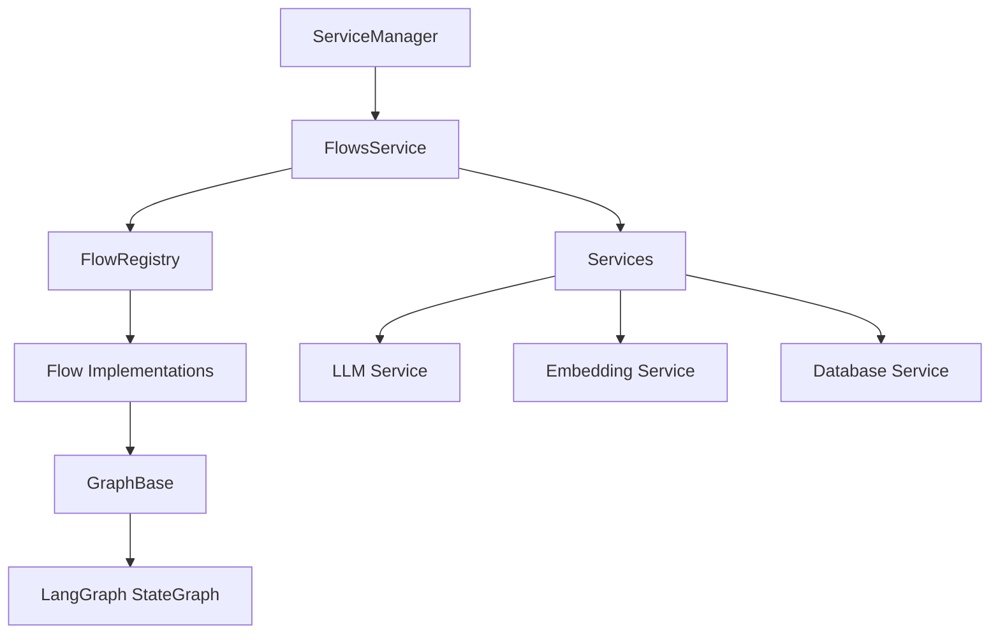

# 🕸️ Flows Service Documentation

## 📋 Overview

The Flows Service orchestrates agent-style workflows using LangGraph Web (`@langchain/langgraph/web`) on top of Memorall's LLM, Embedding, and Database services. It manages multiple flow types through a self-registering pattern where each flow registers itself at module load time, providing type-safe flow creation and service dependency injection managed by ServiceManager.

## 🏗️ Architecture



### Key Components

**FlowRegistry** (Self-Registration Pattern)
- Singleton registry that stores flow factories
- Flows register themselves at module load time
- Type-safe creation via `FlowTypeRegistry` interface merging

**FlowsService** (Managed by ServiceManager)
- Created and initialized by ServiceManager
- Delegates to FlowRegistry for flow creation
- Type-safe `createGraph<K>(flowType, services)` API

**GraphBase** (Abstract Base Class)
- Common base for all flows
- Handles LangGraph compilation, invocation, streaming
- Manages callbacks for UI integration

**Scalability**
- Add new flows by creating graph class, self-registering, and importing
- Each flow extends GraphBase and registers with FlowRegistry
- Type safety through global interface merging

## 📁 Key Files

- `src/services/flows/flows-service.ts` — FlowsService class
- `src/services/flows/flow-registry.ts` — FlowRegistry singleton
- `src/services/flows/index.ts` — Imports flows to trigger registration
- `src/services/flows/interfaces/graph.base.ts` — GraphBase abstract class
- `src/services/flows/graph/*/graph.ts` — Flow implementations

## 🔗 Related Documents

- [Database Service](./database-service.md)
- [Embedding Service](./embedding-service.md)
- [LLM Service](./llm-service.md)
- [Background Jobs](./background-jobs.md)

## 🔧 Flow Architecture

### Self-Registration Pattern

Flows register themselves at module load time for scalability:

```typescript
// At bottom of each flow file (e.g., knowledge/graph.ts)
import { flowRegistry } from "../../flow-registry";

flowRegistry.register({
    flowType: "knowledge",
    factory: (services) => new KnowledgeGraphFlow(services),
});

// Extend global FlowTypeRegistry for type safety
declare global {
    interface FlowTypeRegistry {
        knowledge: {
            services: AllServices;
            flow: KnowledgeGraphFlow;
        };
    }
}
```

**Key Points:**
- Import `flowRegistry` at **top of file** (critical for initialization order)
- Registration happens when module loaded via `src/services/flows/index.ts`
- Global interface merging provides type inference

### FlowsService API

```typescript
class FlowsService {
    createGraph<K extends keyof FlowTypeRegistry>(
        flowType: K,
        services: FlowTypeRegistry[K]["services"]
    ): FlowTypeRegistry[K]["flow"]
}
```

### GraphBase (Base Class)

All flows extend `GraphBase` for common functionality:

```typescript
abstract class GraphBase<N extends string, T extends BaseStateBase, S> {
    protected compile(): CompiledStateGraph<T>
    async invoke(input: Partial<T>, options?: GraphOptions): Promise<T>
    async stream(input: Partial<T>, options?: GraphOptions): AsyncGenerator<Partial<T>>
}
```

### Scalable Architecture

Flows self-register at module load time. New flows are added by:
1. Create flow class extending GraphBase
2. Register with `flowRegistry.register()`
3. Import in `flows/index.ts`

Type-safe creation via `serviceManager.flowsService.createGraph(flowType, services)`

## 📚 Usage Example

```typescript
import { serviceManager } from "@/services";

// Create any registered flow type-safely
const graph = serviceManager.flowsService.createGraph("flowType", {
    llm: serviceManager.llmService,
    embedding: serviceManager.embeddingService,
    database: serviceManager.databaseService,
});

// Stream or invoke
const stream = await graph.stream(initialState);
for await (const partial of stream) {
    console.log(partial);
}
```

## ➕ Adding a New Flow

**1. Create flow file:** `src/services/flows/graph/my-flow/graph.ts`

```typescript
import { END, START, StateGraph } from "@langchain/langgraph/web";
import { Annotation } from "@langchain/langgraph";
import { GraphBase } from "../../interfaces/graph.base";
import { flowRegistry } from "../../flow-registry";
import type { AllServices } from "../../interfaces/tool";

// Define state annotation
export const MyFlowAnnotation = Annotation.Root({
    input: Annotation<string>,
    output: Annotation<string>,
    // ... other state fields
});

export type MyFlowState = typeof MyFlowAnnotation.State;

export class MyFlow extends GraphBase<"process", MyFlowState, AllServices> {
    constructor(services: AllServices) {
        super(services);
        this.workflow = new StateGraph(MyFlowAnnotation);

        // Add nodes
        this.workflow.addNode("process", this.processNode);

        // Add edges
        this.workflow.addEdge(START, "process");
        this.workflow.addEdge("process", END);

        // Compile
        this.compile();
    }

    processNode = async (state: MyFlowState): Promise<Partial<MyFlowState>> => {
        // Implement node logic
        return { output: `Processed: ${state.input}` };
    };
}

// Self-register the flow
flowRegistry.register({
    flowType: "my-flow",
    factory: (services) => new MyFlow(services),
});

// Extend global FlowTypeRegistry for type safety
declare global {
    interface FlowTypeRegistry {
        "my-flow": {
            services: AllServices;
            flow: MyFlow;
        };
    }
}
```

**2. Import in `src/services/flows/index.ts`:**

```typescript
import "./graph/knowledge/graph";
import "./graph/simple/graph";
import "./graph/knowledge-rag/graph";
import "./graph/my-flow/graph"; // Add this line

export { FlowsService } from "./flows-service";
```

**3. Use the flow:**

```typescript
const myFlow = serviceManager.flowsService.createGraph("my-flow", {
    llm: serviceManager.llmService,
    embedding: serviceManager.embeddingService,
    database: serviceManager.databaseService,
});

const result = await myFlow.invoke({ input: "Hello" });
console.log(result.output); // "Processed: Hello"
```

## ➕ Adding a New Tool

**1. Create tool file:** `src/services/flows/tools/weather.ts`

```typescript
import { z } from "zod";
import type { Tool } from "../interfaces/tool";

export const weatherTool: Tool<{ city: string }> = {
    name: "weather",
    description: "Get current weather by city",
    schema: z.object({
        city: z.string().describe("City name")
    }),
    async execute(input) {
        // Implement weather fetching logic
        return `Weather for ${input.city}: 22°C, clear.`;
    },
};
```

**2. Export via `src/services/flows/tools/index.ts`:**

```typescript
import { weatherTool } from "./weather";

export const availableTools = {
    calculator: calculatorTool,
    current_time: currentTimeTool,
    memory_search: memorySearchTool,
    knowledge_graph: knowledgeGraphTool,
    weather: weatherTool, // Add this line
} as const;
```

**3. Tool is automatically available:**
- Listed in prompts via `generateToolInstructions()`
- Parsed by `parseToolCall()` when agent returns `weather(city="Tokyo")`
- Executed by `executeToolByName()` with Zod validation

## ⚠️ Error Handling

**Flow Registration:**
- Import `flowRegistry` at **top of file** with other imports (critical!)
- If flows not registered: `Error: No flow registered for type: knowledge`
- Check `src/services/flows/index.ts` imports all flow files

**Service Dependencies:**
- Flows require services via constructor injection
- Check service readiness: `serviceManager.llmService.isReady()`
- FlowsService managed by ServiceManager (no direct imports)

**Node Execution:**
- Nodes log inputs/outputs using `logInfo` and errors via `logError`
- Tool execution validates arguments with Zod, returns error messages on mismatch
- `GraphBase` exposes `abortController` for cancellation

**Common Issues:**
```typescript
// ❌ Wrong - imports singleton directly
import { flowsService } from "@/services/flows/flows-service";

// ✅ Correct - uses ServiceManager instance
import { serviceManager } from "@/services";
const graph = serviceManager.flowsService.createGraph(...);
```

## 🔗 Integration with Memorall

**ServiceManager:**
- FlowsService created and initialized by ServiceManager
- Access via `serviceManager.flowsService`
- Services injected at flow creation time

**Service Dependencies:**
- **LLM Service:** Required for all flows (entity extraction, chat, RAG). See [llm-service.md](./llm-service.md)
- **Embedding Service:** Used by knowledge graph and RAG flows. See [embedding-service.md](./embedding-service.md)
- **Database Service:** Stores entities, edges, and retrieved context. See [database-service.md](./database-service.md)

**Module Integration:**
- **Knowledge Graph Service:** Uses `KnowledgeGraphFlow` for entity/fact extraction
- **Remember Service:** Processes content through knowledge graph
- **Chat Hook:** Uses `SimpleGraph` and `KnowledgeRAGFlow` for conversations

## 🏆 Best Practices

**Flow Design:**
- Extend `GraphBase` for common functionality (compile, invoke, stream)
- Use `Annotation.Root()` for state definition with type safety
- Register flows at module load time with global interface merging
- Keep node logic focused and composable

**Tool Design:**
- Keep tool outputs concise and textual (they flow back to LLM context)
- Use `generateToolInstructions()` to sync prompts with schemas
- Validate inputs with Zod for type safety
- Return strings (LLM-friendly format)

**Service Usage:**
- Always use `serviceManager.flowsService` (never import directly)
- Check service readiness before creating flows
- Inject all required services at creation time
- Prefer streaming for long-running operations

**Performance:**
- Use streaming (`stream()`) for incremental results
- Implement `onNewChunk` callback for UI updates
- Cache flow instances when appropriate
- Monitor node execution with logging

**Type Safety:**
- Extend `FlowTypeRegistry` for each flow
- Use typed state annotations
- Leverage TypeScript inference in `createGraph()`
- Export state types for consuming code
