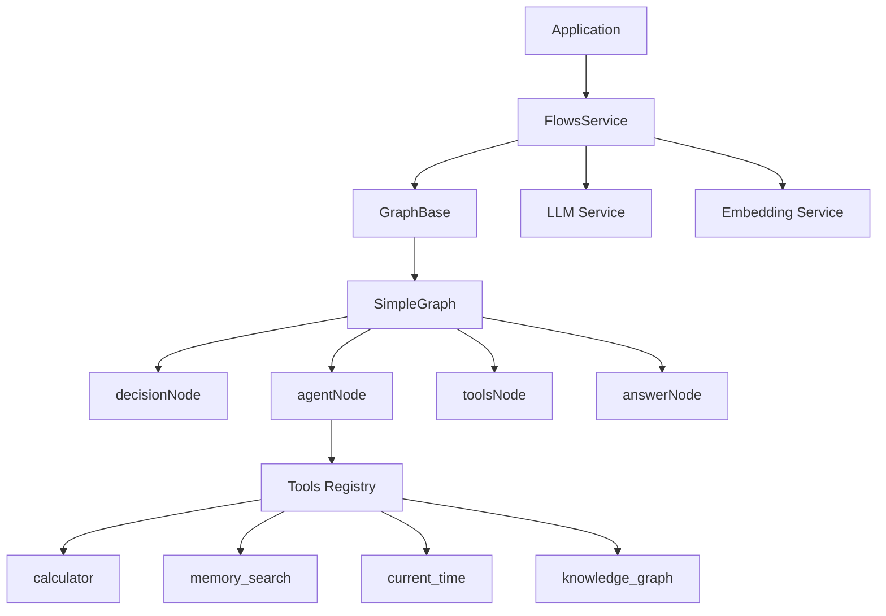

# 🕸️ Flows Service Documentation

## 📋 Overview

The Flows Service orchestrates agent-style workflows using LangGraph Web (`@langchain/langgraph/web`) on top of Memorall's LLM and Embedding services. It provides a typed graph composition layer, a small tooling framework, and a reference graph that decides when to call tools and when to answer directly.

## 🏗️ Architecture



The flows layer composes three primitives:
- Graph runtime: LangGraph Web compiled into a `StateGraph` app with named nodes and conditional edges.
- Services: LLM and Embeddings provided via the existing service singletons; tools can also reach the database service indirectly.
- Tools: Small, typed actions that the agent can call. Tools are described to the LLM and parsed from responses in a Python-like function call format.

## 📁 Key Files

- `src/services/flows/flows-service.ts` — Singleton that initializes the flows subsystem and constructs graphs with required services.
- `src/services/flows/interfaces/graph.base.ts` — Generic `GraphBase` with typed state, compile/invoke/stream helpers, and callbacks.
- `src/services/flows/graph/simple/*` — `SimpleGraph` reference implementation (decision → agent → tools/answer).
- `src/services/flows/tools/*` — Tool system (Zod schemas, prompt instruction generation, parsing, and execution).

## 🔗 Related Documents

- Database Service: `./database-service.md`
- Embedding Service: `./embedding-service.md`
- LLM Service: `./llm-service.md`

## 🔧 Implementation Details

### FlowsService
- Exposes `flowsService` singleton.
- `initialize()` — logs readiness (expandable for future bootstrapping).
- `createGraph('simple', { llm, embedding })` — constructs a `SimpleGraph` with required services.

### GraphBase
- `GraphBase<N, T, S>`: common base for graphs with:
  - `workflow`: a `StateGraph` instance
  - `compile()` returns compiled app
  - `invoke(input, { callbacks })` and `stream(input, { callbacks })`
  - `callbacks.onNewChunk` hook to surface streamed deltas to UI
  - `BaseStateBase` includes `finalMessage` and `actions` aggregation

### SimpleGraph
- Nodes
  - `decisionNode`: asks the LLM if a tool is needed (`YES_USE_TOOL` vs `NO`).
  - `agentNode`: forms next step; if a tool call is parsed, transitions to `tools`.
  - `toolsNode`: executes requested tools and appends tool result steps.
  - `answerNode`: produces the final assistant message.
- Prompts
  - Decision prompt lists available tools and requires explicit `YES_USE_TOOL` or `NO`.
  - Agent prompt includes generated tool instructions from the tools registry.
  - Answer prompt focuses on helpful and accurate responses.

### Tools Layer
- Registry: `availableTools` (calculator, memory_search, current_time, knowledge_graph).
- API:
  - `generateToolInstructions` builds a concise list + parameter summary for system prompts.
  - `parseToolCall` expects `tool_name(param1="value1", ...)` in assistant content.
  - `executeToolByName` validates args via Zod and invokes with or without services.

## 📚 Usage Examples

### 🚀 Initialize and Create a Graph
```ts
import { flowsService } from '@/services/flows';
import { llmService } from '@/services/llm';
import { embeddingService } from '@/services/embedding';

await llmService.initialize();
await embeddingService.initialize();
await flowsService.initialize();

const graph = flowsService.createGraph('simple', { llm: llmService, embedding: embeddingService });
```

### 🌊 Streamed Invocation
```ts
const result = await graph.stream(
  {
    messages: [
      { role: 'user' as const, content: 'What time is it in Tokyo?' },
    ],
    steps: [],
    next: 'decision',
    finalMessage: '',
  },
  {
    callbacks: {
      onNewChunk: (delta) => {
        // UI can append delta.choices[0].delta.content
      },
    },
  },
);
```

### 💬 Non-Streaming Invocation
```ts
const result = await graph.invoke({
  messages: [
    { role: 'user' as const, content: 'Explain vector search briefly.' },
  ],
  steps: [],
  next: 'decision',
  finalMessage: '',
});
```

## ➕ Adding a New Tool
Create `src/services/flows/tools/new-tool.ts`:
```ts
import { z } from 'zod';
import type { Tool } from '../interfaces/tool';

export const weatherTool: Tool<{ city: string }> = {
  name: 'weather',
  description: 'Get current weather by city',
  schema: z.object({ city: z.string().describe('City name') }),
  async execute(input) {
    return `Weather for ${input.city}: 22°C, clear.`;
  },
};
```

Export via `src/services/flows/tools/index.ts`:
```ts
import { weatherTool } from './new-tool';

export const availableTools = {
  // ...existing tools
  weather: weatherTool,
} as const;
```

The tool is automatically listed in prompts through `generateToolInstructions` and parsed by `parseToolCall` when the agent returns `weather(city="...")`.

## ⚠️ Error Handling
- Nodes log inputs/outputs using `logInfo` and errors via `logError`.
- Tool execution validates arguments with Zod and returns clear error messages when mismatched.
- `GraphBase` exposes `abortController` if you need to cancel long operations at the UI level.

## 🔗 Integration with Memorall
- LLM Service: required for nodes (`decision`, `agent`, `answer`). See `./llm-service.md`.
- Embedding Service: used by tools like `memory_search` and `knowledge_graph`. See `./embedding-service.md`.
- Database Service: tools may store or read data (e.g., knowledge graph). See `./database-service.md`.

## 🏆 Best Practices
- Keep tool outputs concise and textual — they flow back into LLM context.
- Use `generateToolInstructions` to keep prompts and parameters in sync with tool schemas.
- Prefer streaming for long answers; use `callbacks.onNewChunk` to render tokens incrementally.
- Start with `SimpleGraph` and extend or create new graphs for advanced behavior.

This documentation follows the same structure and style as the LLM and Embedding service docs. For storage, vectors, and models, reference: `./database-service.md`, `./embedding-service.md`, and `./llm-service.md`.
