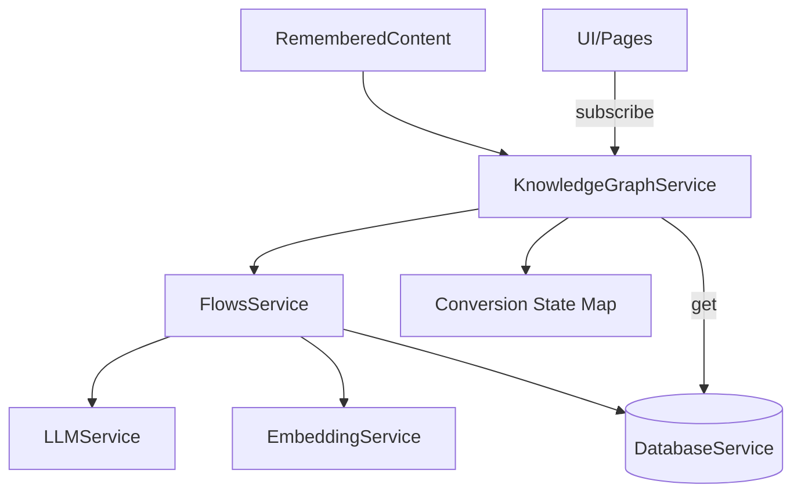

# 🧩 Knowledge Graph Service Documentation

## 📋 Overview

The Knowledge Graph Service converts remembered content into a graph of entities and relations using a streaming flow. It orchestrates LLM- and embedding-powered steps via `flowsService`, persists results to the database, and tracks conversion progress for UI consumption.

## 🏗️ Architecture

### 🔧 Service Architecture



Key characteristics:
- Streams flow updates and maps them to progress states
- Persists created nodes/edges via the database layer
- Provides retrieval of per-page graph data

## 🛠️ Capabilities

- Convert one or multiple pages into graph entities/relations
- Maintain in-memory conversion progress with listeners
- Retrieve graph data for a page (source, entities, relations)

## 📚 Usage Examples

### 🚀 Convert a Page
```typescript
import { knowledgeGraphService } from '@/services/knowledge-graph';

// Start a conversion (throws internally handled errors into progress state)
await knowledgeGraphService.convertPageToKnowledgeGraph(rememberedPage);

// Subscribe to progress
const unsub = knowledgeGraphService.subscribe((map) => {
  const prog = map.get(rememberedPage.id);
  if (prog) console.log(prog.stage, prog.progress);
});

// Fetch resulting graph data
const data = await knowledgeGraphService.getKnowledgeGraphForPage(rememberedPage.id);
```

### 📦 Batch Conversions
```typescript
await knowledgeGraphService.convertMultiplePages(pages);
```

### 🧹 Manage Progress State
```typescript
knowledgeGraphService.clearCompletedConversions();
knowledgeGraphService.clearConversions();
```

## 📝 API Reference

### 🏢 KnowledgeGraphService
```typescript
// Subscriptions
subscribe(listener: (conversions: Map<string, ConversionProgress>) => void): () => void

// Conversions
async convertPageToKnowledgeGraph(page: RememberedContent): Promise<void>
async convertMultiplePages(pages: RememberedContent[]): Promise<void>

// Retrieval
async getKnowledgeGraphForPage(pageId: string): Promise<KnowledgeGraphData | null>
getConversion(pageId: string): ConversionProgress | undefined
getAllConversions(): ConversionProgress[]

// Cleanup
clearConversions(): void
clearCompletedConversions(): void
```

### 📦 Types (selected)
```typescript
export interface KnowledgeGraphData {
  source: any
  entities: KnowledgeGraphEntity[]
  relations: KnowledgeGraphRelation[]
}

export interface ConversionProgress {
  pageId: string
  pageTitle: string
  pageUrl: string
  status: ConversionStatus
  stage: string
  progress: number
  startedAt: Date
  completedAt?: Date
  error?: string
  knowledgeGraph?: KnowledgeGraphData
  stats?: { entitiesExtracted: number; entitiesResolved: number; factsExtracted: number; factsResolved: number; entitiesCreated: number; relationsCreated: number }
}
```

## ⚙️ Flow Stages

The knowledge graph pipeline consists of the following stages:

### 🔍 Entity Loading (`load_entities`)
**Hybrid Search Approach:**
- **SQL Search (60%)**: Direct pattern matching on entity names using `ILIKE` queries
- **Trigram Search (40%)**: Database-level fuzzy text matching using PostgreSQL's `pg_trgm` extension
- **Vector Fallback**: Activates when combined SQL + trigram results < 50% of target limit (200 nodes)

### 📝 Entity Extraction (`extract_entities`)
LLM-powered extraction of entities from page content.

### 🔗 Entity Resolution (`resolve_entities`)
Determines which extracted entities match existing nodes vs. need creation.

### 📊 Fact Extraction (`extract_facts`)
LLM-powered extraction of relationships between entities.

### 🔍 Fact Loading (`load_facts`)
**Hybrid Search Approach:**
- **SQL Search (60%)**: Relationship-based search using resolved entity IDs
- **Trigram Search (40%)**: Database-level fuzzy matching on fact text and edge types
- **Vector Fallback**: Activates when combined SQL + trigram results < 50% of target limit (500 edges)

### 🔗 Fact Resolution (`resolve_facts`)
Determines which extracted facts match existing edges vs. need creation.

### ⏰ Temporal Extraction (`extract_temporal`)
Extraction of temporal information for facts.

### 💾 Database Save (`save_to_database`)
Persists new entities and relationships to the database.

## 🔍 Search Technology

The pipeline uses a **three-tier hybrid search strategy**:

1. **SQL Search**: Fast, exact pattern matching using database indexes
2. **Trigram Search**: Fuzzy text matching using PostgreSQL's `pg_trgm` for typo tolerance
3. **Vector Search**: Semantic similarity using embeddings as intelligent fallback

This approach ensures optimal performance while maintaining high recall through multiple search methodologies.

## ⚠️ Error Handling

- If `llmService` is not ready, conversions fail gracefully with status `failed`
- Exceptions are caught and reflected in the `ConversionProgress` error field

## 🔒 Concurrency

- In-memory map makes per-session state fast; run conversions sequentially for batch operations to avoid contention

## 🏆 Best Practices

- Ensure `llmService` is initialized and has a model loaded prior to conversion
- Use `getKnowledgeGraphForPage` to fetch persisted results after completion
- Subscribe to progress to drive UI feedback

