# 🕸️ Knowledge Graph Flow Documentation

## 📋 Overview

The Knowledge Graph Flow is an intelligent pipeline that transforms conversational content into structured knowledge representations. It extracts entities and their relationships from text, resolves them against existing knowledge, and builds a connected graph of semantic relationships. The system enables AI agents to build persistent memory by understanding and connecting concepts, people, events, and their interactions over time.

## 🏗️ Architecture

### 🔧 Knowledge Graph Pipeline


The Knowledge Graph Flow transforms raw conversations into structured knowledge through:
- **Entity Extraction**: Identifying people, concepts, and objects mentioned
- **Entity Loading**: Searching existing database for similar entities using vector/text search
- **Entity Resolution**: Linking new entities to existing knowledge or marking as new
- **Fact Extraction**: Understanding how entities connect and interact
- **Fact Loading**: Searching existing database for similar relationships
- **Fact Resolution**: Linking new relationships to existing knowledge or marking as new
- **Temporal Extraction**: Capturing when relationships form and change
- **Database Persistence**: Storing resolved entities and facts for future reference

## 🔄 Simple Flow Overview

```mermaid
flowchart TD
    A["📄 Input Content Web page, conversation, document"] --> B["🔍 Extract Entities Find people, places, concepts"]
    B --> C["📚 Load Existing Entities Search for similar entities in DB"]
    C --> D["🔗 Resolve Entities Link to existing knowledge"]
    D --> E["💡 Extract Facts Find relationships between entities"]
    E --> F["📚 Load Existing Facts Search for similar relationships in DB"]
    F --> G["🔄 Resolve Facts Link to existing relationships"]
    G --> H["⏰ Extract Temporal When did relationships form?"]
    H --> I["💾 Save to Database Persistent knowledge storage"]
    I --> J["🕸️ Knowledge Graph Connected web of knowledge"]

    style A fill:#e1f5fe
    style J fill:#f3e5f5
```



**Simple Example**: *"Alice started working at Google in 2020"*

1. **extract_entities**: `Alice` (Person), `Google` (Organization)
2. **load_entities**: Search database for similar entities using vector/text search
3. **resolve_entities**: Link extracted entities to existing ones or mark as new
4. **extract_facts**: `Alice WORKS_FOR Google`
5. **load_facts**: Search database for similar relationships
6. **resolve_facts**: Link to existing relationships or mark as new
7. **extract_temporal**: Extract time information: `valid_at: 2020-01-01`
8. **save_to_database**: Store new entities/relationships in database
9. **Result**: Knowledge graph now knows Alice works at Google since 2020

## 🧠 Core Concepts

### 🎯 What is a Knowledge Graph?

A knowledge graph represents information as a network of interconnected entities and their relationships. Instead of storing isolated facts, it builds a web of knowledge where:

- **Entities** are the "things" in your conversations (people, places, concepts)
- **Relationships** are how these things connect ("Alice works at Google", "Paris is in France")
- **Context** preserves when and where these relationships were established
- **Memory** grows richer as the AI learns more about your world

### 🎪 Why Build Knowledge Graphs?

Traditional AI conversations are stateless - each interaction starts fresh. Knowledge graphs enable:

- **Persistent Memory**: The AI remembers people, projects, and preferences across conversations
- **Context Awareness**: Understanding how current topics relate to past discussions
- **Relationship Understanding**: Recognizing connections between concepts and entities
- **Temporal Tracking**: Knowing when information was established or changed
- **Semantic Search**: Finding relevant information through meaning, not just keywords

## 🛠️ Processing Stages

### 1. 🔍 Entity Extraction
**Purpose**: Identify all meaningful entities mentioned in the current conversation

**What it does**: The system analyzes conversational text to find entities like people, organizations, concepts, locations, products, and events. It always extracts the speaker as the primary entity and identifies other significant mentions.

**Why it matters**: Entities are the building blocks of knowledge. Without identifying "who" and "what" is being discussed, we can't build meaningful relationships.

**Process**:
- Uses specialized LLM prompts to identify entity types
- Extracts entity names, summaries, and classifications
- Generates unique identifiers for each entity
- Handles large content through intelligent chunking

### 2. 📊 Load Existing Entities
**Purpose**: Find related entities already stored in the knowledge graph

**What it does**: Before deciding if an entity is new, the system searches existing knowledge using a sophisticated three-tier hybrid search approach to find potentially related entities with high precision and recall.

**Why it matters**: Prevents duplicate entities and enables linking new information to existing knowledge. Without this step, "John Smith" and "John" might be treated as different people.

**Process**:
- **SQL Search (60%)**: Fast exact pattern matching using database indexes
- **Trigram Search (40%)**: Database-level fuzzy text matching using PostgreSQL's `pg_trgm` extension
- **Vector Fallback**: Semantic similarity search when combined SQL + trigram results < 50% of target
- Deduplication using `combineSearchResultsWithTrigram()` for optimal result merging

### 3. 🔗 Entity Resolution
**Purpose**: Determine which extracted entities match existing knowledge

**What it does**: Compares each newly extracted entity against the loaded existing entities to decide if they represent the same real-world thing. When matches are found, it selects the most complete name.

**Why it matters**: This is where the AI builds consistent identity. It ensures "Dr. Smith", "John Smith", and "the doctor" all resolve to the same person entity, maintaining coherent memory.

**Process**:
- Chunked processing for efficient LLM analysis
- Name and summary comparison for duplicate detection
- Selection of most complete canonical names
- Parallel processing for better performance

### 4. 💡 Fact Extraction
**Purpose**: Identify relationships between the resolved entities

**What it does**: Analyzes the conversation to extract facts about how entities relate to each other. Each fact captures a relationship type, detailed description, and any additional attributes.

**Why it matters**: Entities alone are just a list of things. Facts create the connections that make knowledge meaningful - "Alice works for Google" is more valuable than just knowing "Alice" and "Google" exist.

**Process**:
- Maps entity names to unique identifiers for relationship linking
- Extracts relationship types (WORKS_FOR, LIVES_IN, CREATED, etc.)
- Captures detailed fact descriptions in natural language
- Validates facts against resolved entities

### 5. 📈 Load Existing Facts
**Purpose**: Find related relationships already stored in the knowledge graph

**What it does**: Searches for existing edges (relationships) that might be related to the newly extracted facts, using a sophisticated hybrid search approach to find relevant connections with high accuracy.

**Why it matters**: Prevents duplicate relationships and helps identify when new information updates or contradicts existing knowledge.

**Process**:
- **SQL Search (60%)**: Entity-based search for relationships involving resolved entities
- **Trigram Search (40%)**: Database-level fuzzy matching on fact text and edge types
- **Vector Fallback**: Semantic similarity search when combined SQL + trigram results < 50% of target
- **Relationship Expansion**: Additional search for entity interconnections within remaining capacity
- Dynamic resource allocation and intelligent deduplication

### 6. 🔄 Fact Resolution
**Purpose**: Determine which extracted facts match existing relationships

**What it does**: Compares newly extracted facts against existing relationships to identify duplicates and determine which facts represent new information versus confirmations of existing knowledge.

**Why it matters**: Maintains relationship consistency while allowing for updates and new information. Prevents the graph from becoming cluttered with duplicate relationships.

**Process**:
- Contextual comparison of fact content and relationship types
- Chunked processing for efficient analysis
- Filtering based on entity connection relevance
- Robust error handling for invalid fact references

### 7. ⏰ Temporal Extraction
**Purpose**: Extract time information related to when relationships were established or changed

**What it does**: Analyzes conversation content to identify dates and times that relate to the formation, change, or end of relationships. Converts relative time references into absolute timestamps.

**Why it matters**: Knowledge changes over time. "Alice works at Google" might have been true in 2020 but not in 2024. Temporal information enables the AI to understand the validity periods of relationships.

**Process**:
- Identifies dates directly related to relationship formation/changes
- Converts relative time references ("2 years ago") to absolute dates
- Validates and formats dates in ISO 8601 standard
- Distinguishes between relationship start dates and end dates

### 8. 💾 Database Persistence
**Purpose**: Save the processed knowledge graph to permanent storage

**What it does**: Creates database records for new entities and relationships, generates embeddings for semantic search, and establishes connections between the knowledge and its sources.

**Why it matters**: Makes knowledge persistent across conversations and enables future semantic search and relationship queries.

**Process**:
- Creates source records linking knowledge to its origin
- Inserts new nodes with generated embeddings
- Creates edges with temporal validity information
- Establishes provenance relationships between sources and knowledge

## 🔗 Integration with Memorall

The Knowledge Graph Flow integrates with core Memorall services:

- **LLM Service**: Powers entity extraction, resolution, and temporal analysis
- **Database Service**: Provides persistent storage with vector search capabilities
- **Embedding Service**: Generates semantic vectors for similarity search
- **Vector Search**: Enables finding related entities and facts

## 📊 Performance Characteristics

| Stage | Processing Time | Memory Usage | LLM Calls | Database Queries | Parallel Processing |
|-------|----------------|-------------|-----------|-----------------|-------------------|
| Entity Extraction | 2-5s | Low | 1-3 | 0 | Chunked |
| Entity Resolution | 3-8s | Medium | 2-5 | 2-4 | Yes (2x) |
| Fact Extraction | 3-6s | Low | 1-4 | 0 | Chunked |
| Fact Resolution | 5-10s | Medium | 2-6 | 3-5 | Yes (2x) |
| Temporal Extraction | 2-4s | Low | 1-3 | 0 | Yes (2x) |
| Database Persistence | 1-3s | Medium | 0 | 10-20 | No |

## ⚠️ Error Handling

The Knowledge Graph Flow implements multi-level error recovery:

1. **Stage-level Recovery**: Each processing stage handles errors independently
2. **Chunk-level Resilience**: Individual chunk failures don't stop overall processing
3. **Parsing Fallbacks**: Alternative parsing methods when JSON fails
4. **Database Transactions**: Atomic operations with rollback capabilities
5. **Graceful Degradation**: System continues with partial results when possible

## 🎯 Use Cases

### 🗣️ Personal Assistant Memory
- Remembers your contacts, their roles, and relationships
- Tracks your projects, preferences, and goals over time
- Understands your personal context across conversations

### 📚 Research and Learning
- Builds knowledge maps of topics you're studying
- Connects related concepts and ideas
- Tracks the evolution of your understanding

### 💼 Professional Knowledge Management
- Maps organizational relationships and hierarchies
- Tracks project histories and team connections
- Builds institutional memory across conversations

### 🎨 Creative Project Tracking
- Connects characters, plots, and themes in creative work
- Tracks the development of ideas over time
- Maps relationships between creative elements

## 📝 Configuration Options

### 🤖 LLM Parameters
```typescript
// Entity and Fact Extraction
maxModelTokens: 8192
maxResponseTokens: 4096
temperature: 0.1

// Resolution Processes
maxResponseTokens: 4096-6144
temperature: 0.0
```

### 🔍 Search Configuration
```typescript
// Entity Search Limits
totalLimit: 200
sqlPercentage: 60
trigramPercentage: 40
vectorPercentage: 0 (fallback only)

// Fact Search Limits
totalLimit: 500
sqlPercentage: 60
trigramPercentage: 40
vectorPercentage: 0 (fallback only)
relationExpansion: dynamic
```

### ⚡ Processing Parameters
```typescript
// Chunking Configuration
entityChunkSize: 3
factChunkSize: 4
maxConcurrency: 2
temporalChunkSize: 4
```

## 🏆 Best Practices

### 1. 🎯 Content Preparation
- Provide clear, structured conversational content
- Include speaker identification for better entity extraction
- Use consistent naming for entities across conversations

### 2. 📊 Performance Optimization
- Process related content in batches for better resolution
- Use appropriate chunk sizes based on content complexity
- Monitor processing times and adjust parameters as needed

### 3. 🔍 Quality Assurance
- Review extracted entities for accuracy
- Validate temporal information when available
- Monitor resolution accuracy and adjust prompts if needed

### 4. 🗄️ Data Management
- Regularly review knowledge graph for consistency
- Implement backup strategies for persistent knowledge
- Monitor storage growth and optimize when necessary

## ✅ Issue Tracking and Improvements

### Critical Bugs
- [x] **Parameter Mismatch**: ~~Fix `maxResponseTokens` in `fact-extraction.ts:125`~~ (Actually correct - `mapRefine` uses proper interface)
- [x] **Missing Validation**: Added `pageId` and `title` validation before database operations in `graph.ts:399-406`
- [x] **Entity Mapping**: Improved entity name mapping with conflict resolution in `fact-extraction.ts:60-83`

### Logic Issues
- [ ] **Race Condition**: Add constraint handling for parallel node creation in `graph.ts:441-479`
- [ ] **Memory Management**: Implement Map cleanup in `fact-resolution.ts:52-55`
- [ ] **Error Propagation**: Fix silent date validation failures in `temporal-extraction.ts:112-122`

### Performance Improvements
- [x] **Database Optimization**: ~~Implement full-text search indexes for 5-10x speedup~~ **COMPLETED**: Implemented hybrid search with trigram indexes
- [x] **Trigram Search**: ~~Add PostgreSQL pg_trgm for fuzzy text matching~~ **COMPLETED**: Database-level trigram search with GIN indexes
- [ ] **Embedding Batching**: Batch multiple texts for 80-90% API call reduction
- [ ] **Response Caching**: Implement LLM response caching for similar content
- [ ] **Adaptive Chunking**: Dynamic chunk sizing based on content complexity
- [ ] **Pipeline Parallelization**: Overlap independent stages for 30-40% time reduction

### Recommended Timeline
- **Week 1-2**: Critical bugs and immediate fixes
- **Month 1-2**: Performance optimizations and caching
- **Month 2-3**: Advanced parallelization and monitoring

This documentation provides a complete understanding of how the Knowledge Graph Flow transforms conversations into structured, persistent knowledge that grows smarter over time.