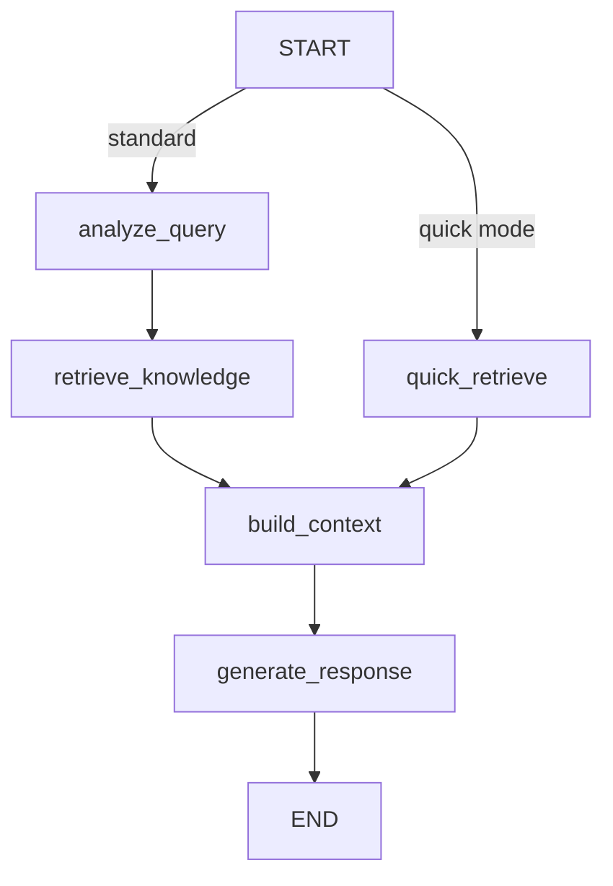

# 🧠 Knowledge RAG Flow Documentation                   

## 📋 Overview
The Knowledge RAG (Retrieval-Augmented Generation) Flow turns a user question into a grounded answer by analysing the request, gathering related graph facts, packaging that context, and prompting an LLM. The flow is implemented in `src/services/flows/graph/knowledge-rag` and runs on top of the shared `GraphBase` utilities. It exposes a configurable pipeline with two operating modes:
  - **Standard mode** (default) runs the full query analysis ➜ retrieval ➜ context ➜ response workflow.
  - **Quick mode** skips LLM-based analysis and performs a fast semantic search followed by graph growth to deliver breadth quickly.
##⚙️Configuration
`KnowledgeRAGFlow` accepts an optional configuration object:
  - `quickMode` *(boolean, default `false`)* – when `true`, start in semantic search mode without query analysis.
  - `maxGrowthLevels` *(number, default `3`)* – limits how many graph expansion rounds are executed in quick mode.
  - `searchLimit` *(number, default `50`)* – upper bound for the number of semantic search hits collected in quick mode.
Internally the standard pipeline keeps fixed limits of **15 nodes** and **20 edges**, combining results from
multiple strategies using a 60% SQL / 40% trigram weighting and optional vector fallback.
## 🏗️ Flow Structure

Each node logs its activity through the shared `actions` array, enabling downstream consumers to surface progress updates in the UI.
## 🔄 Processing Stages
### 1. 🔍 Query Analysis (`analyze_query`)
  - Uses the configured LLM service to run a JSON-format prompt (`QUERY_ANALYSIS_PROMPT`).       
  - Extracts an array of entity strings and one of four intents: `factual`, `relationship`, `summary`,or `exploration`.
  - If the LLM output cannot be parsed, falls back to splitting the query on whitespace (words > 3 characters)
and defaults the intent to `factual`.
  - Emits an action with the entities and intent so callers can surface what the model understood.
### 2. 🧠 Knowledge Retrieval (`retrieve_knowledge`)
  Focuses on high-recall entity and relationship discovery with layered fallbacks:
  - **SQL search (60%)** – `LIKE` filters on node `name`/`summary` and edge `factText`, ordered by freshness.
  - **Trigram search (40%)** – PostgreSQL `pg_trgm` helpers (`trigramSearchNodes` / `trigramSearchEdges`) with a 0.1 similarity threshold.
  - **Vector fallback (up to 40%)** – only triggered when SQL + trigram combined results are below half of the target limit and an embedding service is available. Uses cosine similarity against `name_embedding`/`fact_embedding`.
  - The result sets are merged via `combineSearchResultsWithTrigram`, deduplicating by ID and respecting the configured weights and total caps (15 nodes / 20 edges).
  - Missing nodes referenced by surviving edges are fetched to maintain relationship integrity.
  - Relevance scores:
    - +3 when a node name matches an extracted entity, +2 when the summary matches.
    - Edges gain +2 when `factText` matches entities and +3 / +1 if both / one endpoint is already in the node set.
    - Returns sorted `relevantNodes` / `relevantEdges` and records a detailed action describing the counts per strategy.
### 3. 🧩 Context Building (`build_context`)
  Transforms the scored graph elements into model-ready artifacts:
  - **Definitions** – comma-separated `name: summary` pairs.
  - **Facts** – sentences in the form `<source> <edgeType> <destination>, <factText>`.
  - **Mermaid diagram** – generated via `generateMermaidDiagram`, normalising IDs and truncating long labels. 
  - Packages the textual sections inside an XML-like wrapper: `<definitions>…</definitions>` and `<facts>…<facts>`.
  - Produces an action that includes a formatted Mermaid snippet for quick inspection.
### 4. 🗣️ Response Generation (`generate_response`)
  - Validates the LLM service is ready and interpolates `RESPONSE_GENERATION_PROMPT` with the original query  
and the assembled context.
  - Requests a streamed chat completion (`stream: true`, `temperature: 0.3`, `max_tokens: 4096`).
  - Forwards chunks through the optional graph callbacks while concatenating them into the final answer.
  - Logs the leading part of the response for observability and emits an action with the response length.
## ⚡ Quick Mode (`quick_retrieve`)
When `quickMode` is enabled, the flow skips query analysis and runs:
  1. **Semantic search** – vector-based search (`vectorSearchNodes` / `vectorSearchEdges`) with a 60 / 40 node / edge split against the default embedding model (`textToVector`).
  2. **Graph growth** – iterative expansion (`growKnowledgeGraph`) that:
  - Gathers connected edges for the current node frontier (`expandGraphLevel`).
  - Fetches any newly discovered nodes, capping each level by `nodesPerLevel = 20` and `edgesPerLevel=30`.
  - Assigns diminishing relevance scores per level to prioritise closer information.
  3. The grown node / edge sets merge back into the normal `build_context` ➜ `generate_response` stages, with intent defaulted to `factual` and entities left empty.
## 🛡️ Error Handling & Fallbacks
  - Every node validates critical dependencies (`llm`, `database`, `embedding`) before work begins and throws 
with logged errors if requirements are unmet.
  - Query analysis gracefully falls back to lexical parsing when JSON decoding fails.
  - Trigram and vector searches are wrapped in try / catch blocks so failures degrade gracefully instead of   
aborting retrieval.
  - Graph growth short-circuits if a level produces no new nodes, preventing unnecessary database work.
  - Streaming response generation surfaces chunks as they arrive while still returning the aggregated string if streaming consumers are absent.
## 📈 Operational Notes
  - The flow relies on the shared `actions` array and `logInfo` / `logError` utilities for observability; consumers should surface these actions to users for transparency.
  - Relevance scores are heuristic and meant for ordering only—downstream ranking should prefer structured metadata if available.
  - Keeping node and edge embeddings up to date is important for the vector fallback and quick mode to remain effective.
## ✅ Troubleshooting
  - **Empty or low-quality results**: verify the extracted entities are sensible (check the Query Analysis    
action) and ensure embeddings / trigram indexes exist. The flow automatically escalates to vector search when   
SQL / trigram are insufficient.
  - **Stale relationships**: ensure related nodes carry summaries—missing summaries reduce scoring and may hide nodes from the context section.
  - **Streaming issues**: if the UI cannot handle streamed chunks, disable streaming at the caller layer; the flow already accumulates the full message before returning.
This document reflects the behaviour in `KnowledgeRAGFlow` as implemented in the source files under `src/services/flows/graph/knowledge-rag`.