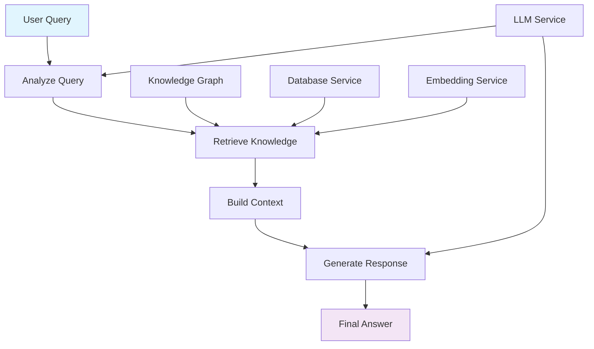

# 🧠 Knowledge RAG Flow Documentation

## 📋 Overview

The Knowledge RAG (Retrieval-Augmented Generation) Flow is an intelligent question-answering system that leverages stored knowledge graphs to provide contextual, fact-based responses. It combines natural language query analysis with sophisticated knowledge retrieval and response generation to deliver accurate, knowledge-grounded answers.

## 🏗️ Architecture

### 🔧 Knowledge RAG Pipeline



The Knowledge RAG Flow transforms user questions into knowledge-grounded answers through:
- **Query Analysis**: Understanding user intent and extracting key entities
- **Knowledge Retrieval**: Finding relevant entities and relationships using hybrid search
- **Context Building**: Structuring retrieved knowledge into coherent context
- **Response Generation**: Creating natural language answers based on retrieved knowledge

## 🔄 Processing Stages

### 1. 🔍 Query Analysis (`analyze_query`)
**Purpose**: Understand the user's question and extract searchable entities

**What it does**: Analyzes the user query using LLM to identify key entities mentioned and determine the query intent (factual, relationship, summary, or exploration).

**Why it matters**: Proper query understanding ensures the retrieval system searches for the right information and structures the response appropriately.

**Process**:
- Uses specialized LLM prompts for entity extraction and intent classification
- Extracts entities mentioned in the question
- Classifies query intent: `factual`, `relationship`, `summary`, or `exploration`
- Provides fallback entity extraction if LLM parsing fails

**Example**:
```
Query: "What projects has Alice worked on at Google?"
Output: {
  entities: ["Alice", "Google", "projects"],
  intent: "factual"
}
```

### 2. 🔍 Knowledge Retrieval (`retrieve_knowledge`)
**Purpose**: Find relevant entities and relationships from the knowledge graph

**What it does**: Uses a sophisticated hybrid search approach to find entities and relationships relevant to the query, with intelligent fallback mechanisms.

**Why it matters**: The quality of retrieved knowledge directly impacts answer accuracy. Multiple search methods ensure high recall while maintaining precision.

**Hybrid Search Strategy**:
#### **For Nodes (Entities):**
- **SQL Search (60%)**: Direct pattern matching on entity names using `LIKE` queries
- **Trigram Search (40%)**: Database-level fuzzy text matching using PostgreSQL's `pg_trgm`
- **Vector Fallback**: Semantic similarity search when combined results < 50% of target (15 nodes)

#### **For Edges (Relationships):**
- **SQL Search (60%)**: Pattern matching on fact text
- **Trigram Search (40%)**: Database-level fuzzy matching on fact text and edge types
- **Vector Fallback**: Semantic similarity search when combined results < 50% of target (20 edges)

**Process**:
1. Extract searchable terms from query entities
2. Parallel search execution across all methods
3. Intelligent fallback activation based on result sufficiency
4. Result deduplication and relevance scoring
5. Missing node resolution for complete relationship context

### 3. 🏗️ Context Building (`build_context`)
**Purpose**: Structure retrieved knowledge into coherent, natural language context

**What it does**: Transforms the retrieved nodes and edges into structured context suitable for LLM consumption, including entity definitions, relationship facts, and visual diagrams.

**Why it matters**: Proper context structuring enables the LLM to understand relationships and generate accurate, well-grounded responses.

**Process**:
- **Definitions Section**: Entity names and their summaries
- **Facts Section**: Relationship descriptions in natural language
- **Mermaid Diagram**: Visual representation of entity connections
- **Context Optimization**: Structured XML-like format for LLM parsing

**Output Format**:
```xml
<definitions>Alice: Software Engineer at Google, Bob: Product Manager at Microsoft</definitions>

<facts>Alice WORKS_FOR Google, Alice started working at Google in 2020. Bob COLLABORATES_WITH Alice, They worked together on the search optimization project.</facts>
```

### 4. 🎯 Response Generation (`generate_response`)
**Purpose**: Generate natural language answers based on retrieved knowledge context

**What it does**: Uses the structured knowledge context to generate comprehensive, accurate answers that cite specific facts and relationships from the knowledge graph.

**Why it matters**: This is where knowledge becomes actionable - transforming structured data into natural, helpful responses that acknowledge knowledge limitations.

**Process**:
- Combines user query with structured knowledge context
- Uses streaming LLM generation for responsive user experience
- Includes citations to specific knowledge graph facts
- Acknowledges information gaps when knowledge is insufficient
- Provides comprehensive answers while staying grounded in available data

## 🧠 Core Concepts

### 🎯 What is Knowledge RAG?

Knowledge RAG combines the benefits of retrieval-based and generation-based AI systems:

- **Retrieval**: Finds relevant information from stored knowledge graphs
- **Augmentation**: Enhances LLM responses with factual, structured knowledge
- **Generation**: Creates natural language answers grounded in retrieved facts

### 🎪 Why Use Knowledge RAG?

Traditional LLMs can hallucinate or provide outdated information. Knowledge RAG provides:

- **Factual Accuracy**: Answers grounded in verified knowledge
- **Source Attribution**: Clear citations to knowledge graph facts
- **Temporal Awareness**: Understanding of when relationships were established
- **Relationship Understanding**: Answers that leverage entity connections
- **Knowledge Gaps**: Honest acknowledgment of missing information

## 📊 Performance Characteristics

| Stage | Processing Time | Memory Usage | LLM Calls | Database Queries | Search Methods |
|-------|----------------|-------------|-----------|-----------------|---------------|
| Query Analysis | 1-3s | Low | 1 | 0 | N/A |
| Knowledge Retrieval | 2-5s | Medium | 0 | 6-12 | SQL + Trigram + Vector |
| Context Building | 0.5-1s | Low | 0 | 1-3 | N/A |
| Response Generation | 3-8s | Medium | 1 (streaming) | 0 | N/A |

## 🔧 Configuration Options

### 🤖 LLM Parameters
```typescript
// Query Analysis
maxTokens: 1024
temperature: 0.1
stream: false

// Response Generation
maxTokens: 4096
temperature: 0.3
stream: true
```

### 🔍 Search Configuration
```typescript
// Node Search Limits
nodeLimit: 15
sqlPercentage: 60
trigramPercentage: 40
vectorFallbackThreshold: 0.5

// Edge Search Limits
edgeLimit: 20
sqlPercentage: 60
trigramPercentage: 40
vectorFallbackThreshold: 0.5

// Trigram Search Parameters
similarityThreshold: 0.1
```

### 📊 Relevance Scoring
```typescript
// Node Relevance
nameMatchScore: 3
summaryMatchScore: 2
baseRelevanceScore: 1

// Edge Relevance
factTextMatchScore: 2
connectedNodesBonus: 3
singleConnectionBonus: 1
```

## 📚 Usage Examples

### 🚀 Basic Query Processing
```typescript
import { KnowledgeRAGFlow } from '@/services/flows/graph/knowledge-rag/graph';

const ragFlow = new KnowledgeRAGFlow(services);

// Process a user query
const initialState = {
  query: "What projects has Alice worked on?",
  sessionId: "user-123"
};

const result = await ragFlow.run(initialState);
console.log(result.finalMessage); // Generated answer
console.log(result.mermaidDiagram); // Visual knowledge graph
```

### 🔄 Streaming Response
```typescript
const ragFlow = new KnowledgeRAGFlow(services);

// Set up streaming callback
ragFlow.setCallbacks({
  onNewChunk: (chunk) => {
    console.log(chunk.choices[0].delta.content);
  }
});

const result = await ragFlow.run({
  query: "How is Alice connected to Google?"
});
```

### 📊 Query Analysis Only
```typescript
// Analyze query intent and entities
const analysisResult = await ragFlow.analyzeQueryNode({
  query: "Tell me about the relationship between Alice and Bob"
});

console.log(analysisResult.extractedEntities); // ["Alice", "Bob"]
console.log(analysisResult.queryIntent); // "relationship"
```

## 🔍 Search Technology Deep Dive

### 🎯 Hybrid Search Strategy

The Knowledge RAG system uses a **three-tier hybrid search** approach:

1. **SQL Search (60%)**: Fast, exact pattern matching using database indexes
   - Direct `LIKE` queries on entity names and fact text
   - Leverages existing database indexes for optimal performance
   - High precision for exact and partial matches

2. **Trigram Search (40%)**: Fuzzy text matching using PostgreSQL's `pg_trgm`
   - Database-level trigram similarity computation
   - Excellent for handling typos and variations
   - Uses GIN indexes for efficient trigram matching

3. **Vector Search (Fallback)**: Semantic similarity using embeddings
   - Activates only when primary methods yield insufficient results
   - Provides semantic understanding beyond text similarity
   - Computationally expensive but highly effective fallback

### 🚀 Performance Optimizations

**Database-Level Processing**: All search operations occur within PostgreSQL, minimizing data transfer and leveraging database optimizations.

**Intelligent Fallback**: Vector search only activates when needed, reducing computational overhead while maintaining high recall.

**Parallel Search Execution**: SQL and trigram searches execute concurrently for optimal performance.

**Smart Resource Allocation**: Dynamic limit adjustment based on search result quality.

## 🎯 Query Intent Classification

The system recognizes four types of query intents:

### 📋 Factual Queries
**Intent**: `factual`
**Example**: "What is Alice's role at Google?"
**Response Style**: Direct, fact-based answers with specific details

### 🔗 Relationship Queries
**Intent**: `relationship`
**Example**: "How is Alice connected to Bob?"
**Response Style**: Focus on connections and relationship types

### 📊 Summary Queries
**Intent**: `summary`
**Example**: "Tell me about Alice's background"
**Response Style**: Comprehensive overview with multiple facts

### 🧭 Exploration Queries
**Intent**: `exploration`
**Example**: "What else should I know about this project?"
**Response Style**: Discovery-oriented with related information

## ⚠️ Error Handling

The Knowledge RAG Flow implements comprehensive error recovery:

### 🔄 Stage-Level Recovery
- Each processing stage handles errors independently
- Failed stages don't prevent other stages from executing
- Graceful degradation with partial results

### 📝 Query Analysis Fallbacks
```typescript
// Primary: LLM-based entity extraction and intent classification
// Fallback: Simple word-based entity extraction with default intent
fallbackEntities: query.split(" ").filter(word => word.length > 3)
fallbackIntent: "factual"
```

### 🔍 Search Resilience
- Individual search method failures don't break retrieval
- Automatic fallback activation when primary methods fail
- Empty result handling with appropriate user feedback

### 💬 Response Generation Safeguards
- Acknowledgment of knowledge limitations
- Clear distinction between known facts and missing information
- Source attribution for all cited information

## 🏆 Best Practices

### 1. 🎯 Query Optimization
- Use specific entity names for better retrieval accuracy
- Include context about the type of information needed
- Ask focused questions rather than broad, open-ended queries

### 2. 📊 Knowledge Graph Quality
- Ensure comprehensive entity coverage in knowledge base
- Maintain accurate relationship descriptions
- Include temporal information when available

### 3. ⚡ Performance Tuning
- Monitor search result distribution across methods
- Adjust similarity thresholds based on knowledge graph characteristics
- Use streaming responses for better user experience

### 4. 🔍 Response Quality
- Review generated answers for factual accuracy
- Validate that responses stay grounded in retrieved knowledge
- Monitor for appropriate acknowledgment of knowledge gaps

## 📈 Monitoring and Analytics

### 🔍 Search Performance Metrics
```typescript
// Track search method effectiveness
searchMetrics: {
  sqlResults: number,
  trigramResults: number,
  vectorResults: number,
  fallbackActivated: boolean,
  totalRetrievalTime: number
}
```

### 📊 Query Analysis Metrics
```typescript
// Monitor query understanding accuracy
analysisMetrics: {
  entitiesExtracted: number,
  intentClassification: string,
  llmParsingSuccess: boolean,
  fallbackUsed: boolean
}
```

### 🎯 Response Quality Indicators
```typescript
// Assess response generation quality
responseMetrics: {
  knowledgeContextLength: number,
  citedFactsCount: number,
  responseLength: number,
  streamingChunks: number
}
```

## ✅ Troubleshooting

### Common Issues and Solutions

**Low Retrieval Results**:
- Check entity name variations in knowledge graph
- Verify trigram search threshold (default: 0.1)
- Ensure adequate knowledge graph coverage

**Poor Answer Quality**:
- Review knowledge context structure
- Validate entity relationship completeness
- Check LLM prompt effectiveness

**Slow Performance**:
- Monitor database query execution times
- Verify trigram GIN index presence
- Consider query complexity reduction

This documentation provides comprehensive understanding of how the Knowledge RAG Flow transforms user queries into knowledge-grounded, accurate responses using sophisticated retrieval and generation techniques.