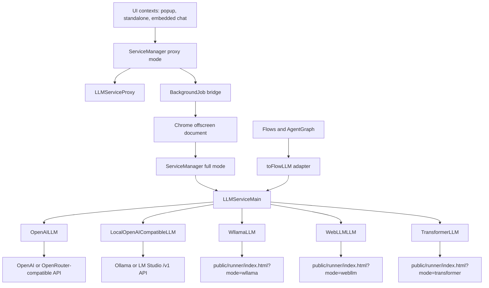
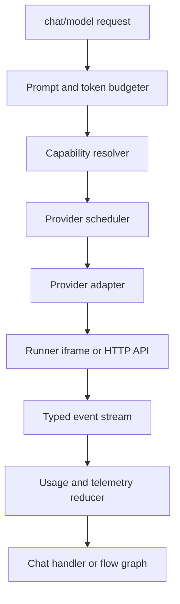

# LLM Architecture And Scalability Review

Last reviewed: 2026-08-09

## Scope

This document summarizes how LLM capabilities are implemented in Memorall and reviews the design for scalability, reliability, and maintainability. It focuses on the current implementation in:

- `src/services/llm`
- `public/runner`
- `src/services/background-jobs`
- `scripts/offscreen.ts`
- `src/services/flows-legacy` (Memorall-owned stored-flow compatibility)
- `src/services/flow-service-adapters.ts`
- `src/services/service-manager.ts`

The existing `docs/llm-service.md` describes the high-level dual-mode service. This review updates that picture with the current provider set, runner behavior, tool-calling path, job transport, and scalability risks.

## Executive Summary

The project uses a browser-extension-friendly LLM architecture:

- UI contexts run lightweight proxy services.
- The offscreen document owns heavyweight services and model runtimes.
- A background job bridge connects UI and offscreen execution.
- All providers are normalized behind an OpenAI-compatible `chat.completions` interface.
- Local browser inference runs in hidden runner iframes.
- Remote and local-server inference runs through OpenAI-compatible HTTP APIs.
- Agent flows consume the LLM service through a flow adapter, not through provider-specific code.

The architecture is well aligned with Chrome extension constraints. The strongest design choice is the split between proxy mode and full/offscreen mode, which keeps UI bundles lighter and isolates model memory. The main scalability problems are around concurrency, cancellation, streaming memory use, and static model capability metadata.

## High-Level Architecture



## Core Layers

### 1. ServiceManager Chooses The Runtime Mode

`ServiceManager` creates either proxy services or full services depending on the `proxy` option.

- Proxy mode dynamically imports lightweight classes, including `LLMServiceProxy`, so UI contexts avoid importing WebLLM, Wllama, Transformers.js, PGlite, and other heavy dependencies (`src/services/service-manager.ts:125`, `src/services/service-manager.ts:136`, `src/services/service-manager.ts:150`, `src/services/service-manager.ts:163`).
- Full mode dynamically imports heavyweight implementations, including `LLMServiceMain`, in the offscreen document (`src/services/service-manager.ts:171`, `src/services/service-manager.ts:184`, `src/services/service-manager.ts:197`).
- LLM initialization is intentionally non-fatal: if it fails, the app logs and continues (`src/services/service-manager.ts:331`).

This is the right extension architecture. It keeps the visible UI responsive and concentrates high-memory workloads in a document context that supports DOM APIs and iframes.

### 2. Offscreen Document Owns Heavy Work

The extension creates and watches an offscreen document for LLM, embedding, graph, and job processing.

- The background service worker creates `offscreen.html` and runs a watchdog every minute (`src/background/core/offscreen.ts:51`, `src/background/core/offscreen.ts:87`, `src/background.ts:84`).
- The offscreen entry initializes shared storage, full `ServiceManager`, and job processing (`scripts/offscreen.ts:168`, `scripts/offscreen.ts:183`, `scripts/offscreen.ts:207`).
- Stored jobs are processed sequentially from IndexedDB, while immediate bridge jobs are processed directly (`scripts/offscreen.ts:300`, `scripts/offscreen.ts:331`).

This gives the app a central place to keep models loaded and process agent jobs even when the UI surface changes.

### 3. LLM Service Contract

The LLM service is split into two interfaces:

- `BaseLLM` is the provider-level contract for a single implementation (`src/services/llm/interfaces/base-llm.ts`).
- `ILLMService` is the service-level contract for named providers, current model state, model listing, serving, token limits, chat completions, unload/delete, and tool capabilities (`src/services/llm/interfaces/llm-service.interface.ts`).

Important normalized capabilities:

- OpenAI-compatible `chatCompletions`.
- Streaming and non-streaming overloads.
- `models`, `serve`, `unload`, and `delete`.
- `getMaxModelTokens` and `getMaxResponseTokens`.
- Tool capability discovery with `supportsTools` and `getToolCapabilities`.

### 4. Shared Core State

`LLMServiceCore` owns shared behavior used by both main and proxy services:

- A `Map<string, BaseLLM>` of named services.
- Current model persistence in the database and shared storage (`src/services/llm/llm-service-core.ts:205`, `src/services/llm/llm-service-core.ts:237`, `src/services/llm/llm-service-core.ts:245`, `src/services/llm/llm-service-core.ts:277`).
- Current model listeners.
- Local server config restoration for LM Studio and Ollama (`src/services/llm/llm-service-core.ts:316`).
- Shared token-limit and tool-capability delegation.

The current model is represented as:

```ts
{
  modelId: string;
  provider: ServiceProvider;
  serviceName: string;
}
```

This is important because provider and service name are not inferred. Callers must explicitly pass both model identity and service identity, which avoids ambiguous routing.

### 5. Main LLM Service

`LLMServiceMain` creates real provider implementations:

- `wllama` -> `WllamaLLM`
- `webllm` -> `WebLLMLLM`
- `transformer` -> `TransformerLLM`
- `openai` and `openrouter` -> `OpenAILLM`
- `ollama` and `lmstudio` -> `LocalOpenAICompatibleLLM`

Provider creation is in `src/services/llm/llm-service-main.ts:38`. Model serving is centralized in `serveFor` (`src/services/llm/llm-service-main.ts:170`). Before serving a heavy model, it unloads loaded models from other non-OpenAI services (`src/services/llm/llm-service-main.ts:186`, `src/services/llm/llm-service-main.ts:319`).

Main mode uses lazy service creation:

- It restores local server services.
- It creates the current model's service when needed.
- It avoids eagerly preloading the selected model on startup (`src/services/llm/llm-service-main.ts:343`).

This is good for startup time and memory, but it means the first call can pay model setup cost.

### 6. Proxy LLM Service

`LLMServiceProxy` runs in UI contexts.

- OpenAI, OpenRouter, Ollama, and LM Studio are created locally because they are lightweight HTTP clients.
- Wllama, WebLLM, and Transformer services are created through background jobs, then represented locally by `LLMProxy` (`src/services/llm/llm-service-proxy.ts:23`, `src/services/llm/llm-service-proxy.ts:87`).
- Heavy operations such as model serving, model listing, unload/delete, token limits, and chat completion are forwarded to the offscreen context through jobs.

This provides a uniform API to UI code while avoiding heavy runtime ownership in the UI.

### 7. Background Job Transport

`BackgroundJob` has two job paths:

- `createJob` persists the job to IndexedDB and notifies offscreen (`src/services/background-jobs/background-job.ts:171`, `src/services/background-jobs/background-job.ts:199`).
- `execute` skips persistence and sends directly to offscreen for lower latency (`src/services/background-jobs/background-job.ts:291`, `src/services/background-jobs/background-job.ts:312`, `src/services/background-jobs/background-job.ts:316`).

The LLM operation handler owns jobs such as:

- `get-current-model`
- `get-all-models`
- `get-models-for-service`
- `get-max-model-tokens`
- `get-max-response-tokens`
- `serve-model`
- `unload-model`
- `delete-model`
- `create-llm-service`
- `chat-completion`
- provider auth restore/remove
- system spec detection

The chat job handler is separate and handles user-facing chat modes:

- `normal`
- `agent`
- `custom`

It streams chunks to progress updates, accumulates message parts, persists final assistant messages, and records metadata such as usage and timing (`src/services/background-jobs/handlers/process-chat.ts:450`, `src/services/background-jobs/handlers/process-chat.ts:710`, `src/services/background-jobs/handlers/process-chat.ts:753`, `src/services/background-jobs/handlers/process-chat.ts:1037`).

### 8. Provider Implementations

#### OpenAILLM

`OpenAILLM` is a lightweight fetch/SSE adapter for OpenAI-compatible endpoints.

- `GET /models` returns normalized `ModelInfo`.
- `POST /chat/completions` supports streaming and non-streaming.
- Tool calls are passed through natively.
- Token limits are inferred from a hard-coded `WELL_KNOWN_MODELS` table with fallback values (`src/services/llm/implementations/openai-llm.ts:31`, `src/services/llm/implementations/openai-llm.ts:223`, `src/services/llm/implementations/openai-llm.ts:235`).

#### LocalOpenAICompatibleLLM

`LocalOpenAICompatibleLLM` supports LM Studio and Ollama-compatible `/v1` endpoints.

- It does not probe the local server during initialization.
- It uses `/models` when available.
- It supports native tools for known model patterns and prompt-injection fallback for others.
- Token limits currently fall back to `10000` context and `5000` response tokens (`src/services/llm/implementations/local-openai-llm.ts:93`, `src/services/llm/implementations/local-openai-llm.ts:98`).

#### WllamaLLM

`WllamaLLM` runs GGUF models through a hidden runner iframe.

- The TypeScript adapter owns iframe creation and `postMessage` RPC.
- The runner uses Wllama v3, Hugging Face download URLs, OPFS/cache manager, optional WebGPU, CPU fallback, and multimodal projector discovery.
- It builds memory hints from device specs and model metadata before sending requests to the runner.
- The runner can clamp context length and response token count based on memory (`public/runner/modes/wllama-runner.js:34`, `public/runner/modes/wllama-runner.js:205`, `public/runner/modes/wllama-runner.js:230`, `public/runner/modes/wllama-runner.js:440`).

#### WebLLMLLM

`WebLLMLLM` runs WebLLM through a hidden iframe.

- It uses `MLCEngine`, WebGPU, prebuilt app config, cache detection, and a load-stall timeout (`public/runner/modes/webllm-runner.js:291`, `public/runner/modes/webllm-runner.js:318`, `public/runner/modes/webllm-runner.js:394`).
- It computes prompt budget from WebLLM internals and memory hints before completion (`public/runner/modes/webllm-runner.js:514`, `public/runner/modes/webllm-runner.js:529`, `public/runner/modes/webllm-runner.js:575`).
- The TypeScript adapter currently reports WebLLM iframe incompatibility in some browser contexts.

#### TransformerLLM

`TransformerLLM` runs Hugging Face Transformers.js through a runner iframe.

- It supports model catalog loading, cache inspection, WebGPU capability reporting, dtype/device fallback, and vision/tool capability metadata.
- Generation uses `withGPULock` to serialize GPU execution (`public/runner/modes/transformmers/chat-completions.js:377`, `public/runner/modes/transformmers/chat-completions.js:378`).
- Prompt budget and memory clamping are explicit (`public/runner/modes/transformmers/chat-completions.js:87`, `public/runner/modes/transformmers/chat-completions.js:114`, `public/runner/modes/transformmers/chat-completions.js:125`).

### 9. Runner Lifecycle

All local browser runners use `ModelLifecycleManager`.

Key behavior:

- Deduplicates concurrent loads for the same model (`public/runner/utils/model-lifecycle.js:108`).
- Waits for an in-progress load before switching models (`public/runner/utils/model-lifecycle.js:113`).
- Unloads a different current model before loading a new one (`public/runner/utils/model-lifecycle.js:123`).
- Auto-unloads loaded models after an idle timeout, defaulting to five minutes (`public/runner/utils/model-lifecycle.js:5`, `public/runner/utils/model-lifecycle.js:232`).

This is a good memory management baseline for browser-local inference.

### 10. Flow And Agent Integration

Flows do not know provider details. `toFlowLLM` adapts `ILLMService` into the flow-core LLM contract (`src/services/flow-service-adapters.ts:231`, `src/services/flow-service-adapters.ts:235`, `src/services/flow-service-adapters.ts:239`, `src/services/flow-service-adapters.ts:244`).

`AgentGraph` runs a tool-calling loop:

1. Add/normalize the system prompt.
2. Call `llm.chatCompletions` with tools and `stream: true`.
3. Merge streamed tool-call deltas.
4. Execute tools.
5. Append tool results.
6. Continue until final answer or max iterations.

The legacy LLM call is made in `src/services/flows-legacy/graph/agent/graph.ts`. Its loop guard checks `currentIteration >= maxIterations`; the legacy default remains 100 for stored-flow compatibility. New standalone runs use the bounded limits in `packages/agent-harness/core/src/limits.ts` (default 10 iterations).

## Scalability Review Findings

### P0 resolved: Iframe streaming events are routed by request

The public LLM surface remains OpenAI-compatible: callers pass a completion request and receive a completion or stream, without managing transport IDs. The iframe runner uses private request correlation because `postMessage` is a shared event bus. Wllama, WebLLM, and Transformer adapters now route progress, chunks, and terminal events to the matching pending request only. Global progress events are dispatched after request-local delivery.

- Wllama: `src/services/llm/implementations/wllama-llm.ts`
- WebLLM: `src/services/llm/implementations/webllm-llm.ts`
- Transformer: `src/services/llm/implementations/transformer-llm.ts`

Each adapter also serializes iframe RPC operations through `IframeRuntime`. This prevents unsafe overlap between local model operations while retaining the same external completion interface.

Verification:

- `src/services/llm/implementations/__tests__/iframe-request-routing.dom.test.ts` proves that two pending requests do not cross-deliver progress, chunks, or stream completion events.
- The same suite proves queued iframe operations execute in order.

### P0 resolved: Proxy cancellation reaches the offscreen provider

`LLMProxy` now keeps the caller's `AbortSignal` locally, binds it to the internally created job, and requests cancellation by job ID when the caller aborts. The offscreen LLM handler owns a job-to-controller map, including a record of cancellation received before the LLM job begins.

The offscreen handler injects the resulting real `AbortSignal` into both streaming and non-streaming completion requests. Providers that support abortion pass it to their runners; all providers stop forwarding canceled responses to the caller.

Verification:

- `src/services/background-jobs/handlers/__tests__/process-llm-sandbox-web.test.ts` covers cancellation of an active request and one canceled before it starts.

### P1 resolved: LLM operation streaming no longer retains all chunks

The `chat-completion` LLM operation handler forwards each chunk through progress metadata and returns only `{ streamed: true }` at completion. The offscreen context no longer keeps a duplicate array of every emitted chunk.

This removes the primary duplicate-buffer memory cost for long generations. A future enhancement can attach compact final metadata such as model, usage, and finish reason.

### P1: Immediate jobs are fast but not durable

`backgroundJob.execute` skips IndexedDB persistence and sends jobs directly to offscreen (`src/services/background-jobs/background-job.ts:312`). This lowers latency, but if the offscreen document dies during a heavy call, the job cannot be replayed from the queue.

Recommended fix:

- Keep immediate execution for small metadata calls.
- Use persisted jobs for model load, long generation, and deletion operations.
- Add idempotency keys for model-serving operations so a restarted offscreen document can safely resume or report the final loaded state.

### P1 partially resolved: Heavy local providers need a formal scheduler

`IframeRuntime` now serializes iframe RPC operations per provider, eliminating unsafe concurrent local operations. Transformer generation continues to use its GPU lock. The remaining work is operational: expose queue state and introduce separate priorities for generation, loading, unloading, and deletion.

Recommended fix:

- Expose queue state to UI so users can see "queued", "loading", "generating", and "cancelling".
- Add operation classes and priorities when the UI needs to manage contention explicitly.

### P1: Agent loop default can run too long

The legacy compatibility default is 100 in `src/services/flows-legacy/graph/agent/state.ts`. This protects stored flows from a silent behavior change, but new standalone runs default to 10 iterations for local browser inference, API cost control, and tool-heavy flows.

Recommended fix:

- Lower default max iterations to a practical value such as 8 to 12.
- Add a token budget, tool-call budget, wall-clock timeout, and repeated-tool-call loop detector.
- Expose these limits in flow config.
- Persist the stop reason in message metadata.

### P1: Context budgeting is split across providers

Local browser runners contain detailed context and memory clamps:

- Wllama memory context: `public/runner/modes/wllama-runner.js:34`, `public/runner/modes/wllama-runner.js:427`
- WebLLM prompt and memory budget: `public/runner/modes/webllm-runner.js:514`, `public/runner/modes/webllm-runner.js:575`
- Transformer prompt and memory budget: `public/runner/modes/transformmers/chat-completions.js:87`, `public/runner/modes/transformmers/chat-completions.js:114`

Remote and local OpenAI-compatible providers use hard-coded or fallback context limits (`src/services/llm/implementations/openai-llm.ts:31`, `src/services/llm/implementations/openai-llm.ts:223`, `src/services/llm/implementations/local-openai-llm.ts:93`).

Recommended fix:

- Add a central prompt-budgeting service before the provider call.
- Use actual tokenizer estimates when available, otherwise conservative token estimates.
- Reserve output tokens before adding retrieval context or tool traces.
- Apply summarization or compaction before a provider rejects the request.
- Store model metadata with source and freshness, not only hard-coded pattern matches.

### P2: Static remote model metadata will drift

`OpenAILLM` uses a hard-coded `WELL_KNOWN_MODELS` list and pattern matching for token limits and tool capabilities (`src/services/llm/implementations/openai-llm.ts:31`, `src/services/llm/implementations/openai-llm.ts:130`, `src/services/llm/implementations/openai-llm.ts:156`). Local OpenAI-compatible providers use generic fallbacks.

Recommended fix:

- Add provider-specific metadata refresh where APIs expose model details.
- Allow user overrides per provider/model.
- Store model capability probes such as native tools, streaming tool calls, vision, context window, and max output tokens.
- Mark hard-coded values as fallbacks in UI and logs.

### P2: postMessage origin handling should be stricter

Adapters send messages to runner iframes with `"*"` (`src/services/llm/implementations/wllama-llm.ts:653`, `src/services/llm/implementations/webllm-llm.ts:610`, `src/services/llm/implementations/transformer-llm.ts:649`). Runner replies fall back to `"*"` for null origins (`public/runner/utils/common.js:3`, `public/runner/utils/common.js:4`, `public/runner/utils/common.js:16`).

The adapters do verify `event.source` before processing messages, which is good. Still, stricter origin handling is preferable for an extension that runs model and tool messages through iframe RPC.

Recommended fix:

- Compute and use the exact extension origin for runner iframe messages where possible.
- Keep source checks.
- Add protocol version and expected mode checks to every reply.
- Reject unexpected runner modes/endpoints during initialization.

### P2: Test coverage should target cross-context failure modes

Existing tests cover token usage utilities, flow adapters, graph tool-call merging, and service class creation. The missing high-value tests are cross-context and concurrency tests:

- Two simultaneous streams to the same iframe provider.
- Abort from UI proxy to offscreen runner.
- Offscreen restart during long `execute` call.
- Long stream memory growth.
- Tool-call streaming for prompt-injection and native modes.
- Provider scheduler ordering: serve, generate, unload, delete.
- Current model synchronization across database and shared storage.

## Recommended Target Architecture

The current architecture can scale if it adds a thin orchestration layer between `LLMServiceMain` and provider adapters:



Responsibilities:

- Budgeter: trims, summarizes, or rejects before provider invocation.
- Capability resolver: decides native tools, prompt-injection fallback, vision support, max context, and max output.
- Scheduler: serializes unsafe provider operations and exposes queue status.
- Provider adapter: stays focused on translating OpenAI-compatible requests to the provider.
- Typed event stream: routes events by job/request correlation, carries cancellation, and avoids duplicate buffering.
- Usage reducer: normalizes actual or estimated token usage once.

## Improvement Roadmap

### Completed

1. Route iframe events through internal request correlation and serialize local iframe RPC.
2. Add cross-context cancellation for proxied chat completions.
3. Stop retaining all streamed chunks in `process-llm-operations`.

### Next

1. Lower default agent max iterations and add budgets.
2. Add centralized context budgeting.
3. Add model/capability metadata refresh and user overrides.
4. Persist long-running model operations or make them resumable.

### Later

1. Harden postMessage target origin and protocol validation.
2. Expand observability: queue time, load time, first-token latency, tokens/sec, memory-fit decisions, abort reason, offscreen restart count.
3. Add cross-context integration tests and runner protocol tests.
4. Split docs into stable architecture docs and operational troubleshooting docs.

## Scalability Scorecard

| Area | Current State | Risk | Recommended Direction |
| --- | --- | --- | --- |
| UI responsiveness | Good proxy/full split | Low | Keep dynamic imports and offscreen ownership |
| Provider abstraction | Good OpenAI-compatible surface | Low | Keep provider-specific logic behind adapters |
| Local model memory | Good lifecycle manager, idle unload, and serialized iframe RPC | Medium | Expose queue state and priorities |
| Streaming | Stream-only LLM operation transport | Low | Add compact final metadata where useful |
| Concurrency | Request-safe event delivery and serialized local iframe RPC | Low | Add queue priority only if UI needs it |
| Cancellation | Proxy cancellation reaches offscreen provider | Medium | Add real-runner integration coverage |
| Agent loops | Functional but high default limit | Medium | Add iteration, token, tool, and time budgets |
| Context limits | Stronger for local runners than remote APIs | Medium | Central budgeter before provider call |
| Model metadata | Useful but static | Medium | Refresh/probe capabilities and allow overrides |
| Offscreen durability | Watchdog exists, immediate jobs are not persisted | Medium | Persist or make heavy calls resumable |
| Security hardening | Source checks exist, target origin is broad | Medium | Strict origin and protocol validation |

## Bottom Line

The LLM implementation is already organized around the right boundaries for a Chrome extension: UI proxy, offscreen ownership, provider adapters, and flow-level abstraction. The next scalability step is not a rewrite. It is tightening the runtime contract around local provider concurrency, streaming, cancellation, and context budgets.

If those pieces are added, this design can support larger local models, multiple chat surfaces, richer tool flows, and longer-running agent tasks without turning the UI or offscreen document into an unpredictable shared-state bottleneck.
