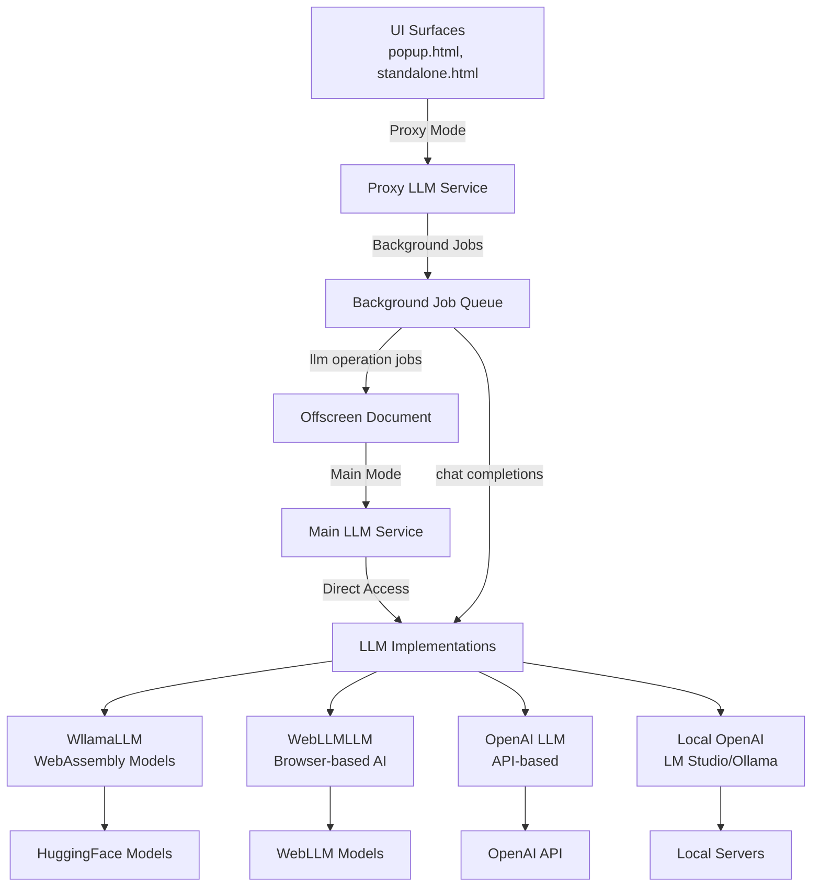

# 🤖 LLM Service Documentation

## 📋 Overview

The LLM Service provides a dual-mode architecture for large language model capabilities, supporting both **Main Mode** with direct model access and **Proxy Mode** for cross-context communication. It enables chat completions, text generation, and AI-powered assistance through multiple LLM providers with a unified OpenAI-compatible interface.

## 🏗️ Dual-Mode Architecture

### 🔧 Architecture Overview



### 🎯 Mode Characteristics

| Aspect | **Main Mode** | **Proxy Mode** |
|--------|---------------|----------------|
| **Context** | Offscreen Document | UI Surfaces (popup, standalone) |
| **Model Access** | Direct LLM instances | Background job forwarding |
| **Performance** | Fast (direct) | Slight latency (job queue) |
| **Memory Usage** | Very High (loaded models) | Low (lightweight proxies) |
| **Model Loading** | Handles model downloads | No model responsibility |
| **Model Serving** | Direct model management | Background job delegation |
| **Chat Completions** | Direct inference | Job queue processing |

## 🔄 Service Modes

### 🖥️ Main Mode (Offscreen Document)

Full LLM service with direct access to models and heavy AI processing capabilities.

```typescript
// Initialize in main mode (offscreen document)
import { LLMServiceMain } from '@/services/llm';

const llmService = new LLMServiceMain();
await llmService.initialize();

// Direct model access
const response = await llmService.chatCompletions({
  messages: [{ role: 'user', content: 'Hello!' }]
});
```

**Features:**
- ✅ **Real Models**: Direct access to Wllama, WebLLM, OpenAI, Local implementations
- ✅ **Model Management**: Loading, serving, unloading, and memory management
- ✅ **Full Performance**: No job queue overhead
- ✅ **Streaming Support**: Real-time response streaming
- ✅ **Resource Control**: Direct model lifecycle management

### 🎨 Proxy Mode (UI Contexts)

Lightweight service that forwards LLM operations to the main service via background jobs.

```typescript
// Initialize in proxy mode (UI contexts)
import { LLMServiceProxy } from '@/services/llm';

const llmService = new LLMServiceProxy();
await llmService.initialize();

// Same interface, background job forwarding
const response = await llmService.chatCompletions({
  messages: [{ role: 'user', content: 'Hello!' }]
});
```

**Features:**
- 🚀 **Lightweight**: Minimal resource usage
- 🔄 **Job Forwarding**: Transparent operation delegation
- 🎯 **Same Interface**: Identical API to main mode
- ⚡ **Responsive UI**: Non-blocking AI operations
- 🔗 **Auto-Management**: Background job handling

## 🛠️ LLM Implementations

### 💻 WllamaLLM (WebAssembly-based)

Uses WebAssembly to run language models directly in the browser through an iframe runner system.

**Availability:**
- ✅ **Main Mode**: Full implementation with iframe management
- ❌ **Proxy Mode**: Not available (too heavy for UI contexts)

```typescript
// Main mode only
const llm = await llmService.create('wllama-model', {
  type: 'wllama',
  url: 'https://your-runner-url.com'
});

// Serve a model from HuggingFace
await llmService.serveFor('wllama-model', 'microsoft/Phi-3-mini-4k-instruct-gguf');
```

**Key Features:**
- Fully offline operation after model download
- No API costs or usage limits
- Complete privacy (no data transmission)
- WebAssembly-based execution
- Very high memory usage (models loaded in memory)
- Progress tracking for model downloads

### 🌐 WebLLMLLM (Browser-based AI)

Advanced browser-based language models using WebLLM for efficient in-browser inference.

**Availability:**
- ✅ **Main Mode**: Full implementation with WebGPU acceleration
- ❌ **Proxy Mode**: Not available (complex GPU resource management)

```typescript
// Main mode only
const llm = await llmService.create('webllm-model', {
  type: 'webllm',
  modelId: 'Llama-3-8B-Instruct-q4f32_1'
});
```

**Key Features:**
- WebGPU acceleration for faster inference
- Optimized for browser environments
- Advanced model caching
- Lower memory usage than Wllama
- Modern browser requirements

### 🌐 OpenAI LLM (API-based)

Integrates with OpenAI's API for high-quality language model capabilities with minimal setup.

**Availability:**
- ✅ **Main Mode**: Full implementation
- ✅ **Proxy Mode**: Lightweight local version (API calls directly)

```typescript
// Available in both modes
const llm = await llmService.create('openai-gpt', {
  type: 'openai',
  apiKey: 'your-api-key',
  baseURL: 'https://api.openai.com/v1'
});
```

**Key Features:**
- High-quality responses
- Fast processing
- Latest model access
- Low memory usage
- Requires API key and internet
- Pay-per-use model

### 🏠 Local OpenAI Compatible (LM Studio & Ollama)

Single implementation for both LM Studio and Ollama via their OpenAI-compatible endpoints.

**Availability:**
- ✅ **Main Mode**: Full implementation
- ✅ **Proxy Mode**: Lightweight local version (direct HTTP calls)

```typescript
// Available in both modes
// LM Studio
const lmStudio = await llmService.create('lm-studio', {
  type: 'lmstudio',
  baseURL: 'http://localhost:1234/v1'
});

// Ollama
const ollama = await llmService.create('ollama', {
  type: 'ollama',
  baseURL: 'http://localhost:11434/v1'
});
```

**Key Features:**
- Local server integration
- OpenAI-compatible API
- No API costs
- Privacy-focused (local processing)
- Requires local server setup
- Low memory usage (server handles models)

### 🔄 LLMProxy (Background Job Forwarder)

Proxy implementation that forwards all operations to background jobs for processing in main mode.

**Availability:**
- ❌ **Main Mode**: Not used (direct implementations available)
- ✅ **Proxy Mode**: Used for heavy operations

```typescript
// Automatically used in proxy mode for heavy operations
const llmProxy = new LLMProxy('heavy-model', 'wllama');
const response = await llmProxy.chatCompletions({
  messages: [{ role: 'user', content: 'Process this' }]
});
```

**Key Features:**
- Zero local processing
- Background job delegation
- Same interface as real LLMs
- Automatic error handling
- No memory overhead
- Streaming support via job queue

## 📚 Usage Examples

### 🚀 Cross-Context Operations

```typescript
// UI Component (Proxy Mode)
import { serviceManager } from '@/services';

// Initialize with proxy mode
await serviceManager.initialize({ proxy: true });
const llmService = serviceManager.getLLMService();

// OpenAI works directly in proxy mode
await llmService.create('ui-openai', {
  type: 'openai',
  apiKey: process.env.OPENAI_API_KEY
});

// Heavy operations forwarded to background
const response = await llmService.chatCompletions({
  messages: [{ role: 'user', content: 'UI chat message' }]
});
```

```typescript
// Offscreen Document (Main Mode)
import { serviceManager } from '@/services';

// Initialize with main mode
await serviceManager.initialize({ proxy: false });
const llmService = serviceManager.getLLMService();

// All implementations available
await llmService.create('main-wllama', {
  type: 'wllama'
});

await llmService.create('main-webllm', {
  type: 'webllm',
  modelId: 'Llama-3-8B-Instruct-q4f32_1'
});

// Direct processing with streaming
const stream = llmService.chatCompletions({
  messages: [{ role: 'user', content: 'Tell me a story' }],
  stream: true
});

for await (const chunk of stream) {
  console.log(chunk.choices[0]?.delta?.content || '');
}
```

### 🔄 Mode-Aware Development

```typescript
// Check service capabilities
const llmService = serviceManager.getLLMService();

if (llmService instanceof LLMServiceMain) {
  // Main mode - all implementations available
  console.log('Running in main mode - full model access');

  // Create heavy local models
  await llmService.create('heavy-wllama', {
    type: 'wllama'
  });

  // Serve a model with progress tracking
  await llmService.serveFor('heavy-wllama', 'microsoft/Phi-3-mini-4k-instruct-gguf',
    (progress) => console.log(`Loading: ${progress.percent}%`)
  );
} else {
  // Proxy mode - lightweight operations only
  console.log('Running in proxy mode - background job forwarding');

  // Use lightweight OpenAI for direct operations
  await llmService.create('light-openai', {
    type: 'openai',
    apiKey: process.env.OPENAI_API_KEY
  });
}
```

### 📊 Performance Optimization

```typescript
// Context-aware chat completions
async function optimizedChatCompletion(messages: any[], streaming = false) {
  const llmService = serviceManager.getLLMService();

  if (llmService instanceof LLMServiceMain) {
    // Main mode - use local models for privacy/speed
    const localModel = await llmService.get('local-wllama') ||
      await llmService.create('local-wllama', { type: 'wllama' });

    if (streaming) {
      return llmService.chatCompletions({ messages, stream: true });
    }
    return llmService.chatCompletions({ messages });
  } else {
    // Proxy mode - use API for faster response
    const apiModel = await llmService.get('api-openai') ||
      await llmService.create('api-openai', {
        type: 'openai',
        apiKey: process.env.OPENAI_API_KEY
      });

    // Note: Streaming in proxy mode goes through job queue
    return llmService.chatCompletions({ messages, stream: streaming });
  }
}
```

### 🌉 Background Job Integration

```typescript
// Direct background job usage (advanced)
import { backgroundJob } from '@/services/background-jobs/background-job';

// Serve model in background
const serveResult = await backgroundJob.execute('serve-model', {
  serviceName: 'background-wllama',
  modelRepo: 'microsoft/Phi-3-mini-4k-instruct-gguf'
}, { stream: true });

// Monitor progress
for await (const progress of serveResult.stream) {
  if (progress.type === 'progress') {
    console.log(`Model loading: ${progress.progress}%`);
  } else if (progress.type === 'completed') {
    console.log('Model ready:', progress.result);
    break;
  }
}

// Chat completion via background job
const chatResult = await backgroundJob.execute('get-all-models', {
  serviceName: 'background-wllama'
}, { stream: false });

const models = await chatResult.promise;
```

### 🔄 Implementation Selection

```typescript
// Smart implementation selection based on requirements
class LLMManager {
  private llmService: ILLMService;

  constructor(llmService: ILLMService) {
    this.llmService = llmService;
  }

  async createOptimalLLM(
    requiresPrivacy: boolean,
    needsSpeed: boolean,
    allowsAPIUsage: boolean
  ) {
    if (this.llmService instanceof LLMServiceMain) {
      if (requiresPrivacy && !allowsAPIUsage) {
        // Use local Wllama for complete privacy
        return await this.llmService.create('private-wllama', {
          type: 'wllama'
        });
      } else if (needsSpeed && allowsAPIUsage) {
        // Use OpenAI for speed
        return await this.llmService.create('fast-openai', {
          type: 'openai',
          apiKey: process.env.OPENAI_API_KEY
        });
      } else {
        // Use WebLLM for balance
        return await this.llmService.create('balanced-webllm', {
          type: 'webllm',
          modelId: 'Llama-3-8B-Instruct-q4f32_1'
        });
      }
    } else {
      // Proxy mode - limited to API-based solutions
      if (allowsAPIUsage) {
        return await this.llmService.create('proxy-openai', {
          type: 'openai',
          apiKey: process.env.OPENAI_API_KEY
        });
      } else {
        // Use local server if available
        return await this.llmService.create('proxy-local', {
          type: 'lmstudio',
          baseURL: 'http://localhost:1234/v1'
        });
      }
    }
  }
}
```

### 🌊 Streaming Support

```typescript
// Streaming works across both modes
async function streamingChat(message: string) {
  const llmService = serviceManager.getLLMService();

  const stream = llmService.chatCompletions({
    messages: [{ role: 'user', content: message }],
    stream: true
  });

  let fullResponse = '';

  if (llmService instanceof LLMServiceMain) {
    // Main mode - direct streaming
    for await (const chunk of stream) {
      const content = chunk.choices[0]?.delta?.content || '';
      fullResponse += content;
      process.stdout.write(content);
    }
  } else {
    // Proxy mode - streaming via background jobs
    for await (const chunk of stream) {
      const content = chunk.choices[0]?.delta?.content || '';
      fullResponse += content;
      process.stdout.write(content);
    }
  }

  return fullResponse;
}
```

## 📊 Implementation Comparison

| Implementation | **Main Mode** | **Proxy Mode** | **Privacy** | **Speed** | **Memory** | **Cost** | **Setup** |
|----------------|---------------|-----------------|-------------|-----------|------------|----------|-----------|
| **WllamaLLM** | ✅ Full | ❌ Via Jobs | 🔒 High | ⚡ Medium | 💾 Very High | 💰 Free | 🔧 Easy |
| **WebLLMLLM** | ✅ Full | ❌ Via Jobs | 🔒 High | ⚡ Fast | 💾 High | 💰 Free | 🔧 Medium |
| **OpenAI LLM** | ✅ Full | ✅ Direct | ⚠️ API | ⚡ Very Fast | 💾 Low | 💰 Pay-per-use | 🔧 Easy |
| **Local OpenAI** | ✅ Full | ✅ Direct | 🔒 High | ⚡ Fast | 💾 Low | 💰 Free | 🔧 Hard |
| **LLMProxy** | ❌ N/A | ✅ Jobs Only | 🔒 Depends | ⚡ Slow | 💾 None | 💰 Depends | 🔧 Auto |

### 🎯 Selection Guidelines

**Use WllamaLLM when:**
- Complete privacy required
- Offline operation needed
- No API costs acceptable
- Running in main mode
- Don't mind longer initialization

**Use WebLLMLLM when:**
- Need good performance with privacy
- Want modern browser features
- WebGPU acceleration available
- Main mode only

**Use OpenAI LLM when:**
- High quality needed
- Fast processing required
- API costs acceptable
- Available in both modes

**Use Local OpenAI when:**
- Want local control with API interface
- Have local server setup
- Need privacy with good performance
- Available in both modes

**Use LLMProxy when:**
- Running in proxy mode
- Heavy local models needed
- Background processing acceptable

## 📝 API Reference

### 🏢 ILLMService Interface

```typescript
interface ILLMService {
  // Initialization
  initialize(): Promise<void>;

  // LLM management
  create<K extends string>(name: string, config: any): Promise<BaseLLM>;
  get(name: string): Promise<BaseLLM | undefined>;
  has(name: string): boolean;
  remove(name: string): boolean;
  list(): string[];
  clear(): void;

  // Current model management
  getCurrentModel(): Promise<CurrentModelInfo | null>;
  setCurrentModel(modelId: string, provider: ServiceProvider, serviceName: string): Promise<void>;
  clearCurrentModel(): Promise<void>;
  onCurrentModelChange(listener: (model: CurrentModelInfo | null) => void): () => void;

  // Status checking
  isReady(): boolean;
  isReadyByName(name: string): boolean;
  getInfo(): { name: string; type: string; ready: boolean };
  getInfoFor(name: string): { name: string; type: string; ready: boolean };

  // Cleanup
  destroy(): void;

  // Model operations
  models(): Promise<{ object: "list"; data: ModelInfo[] }>;
  modelsFor(name: string): Promise<{ object: "list"; data: ModelInfo[] }>;

  // Chat completions
  chatCompletions(request: ChatCompletionRequest): Promise<ChatCompletionResponse> | AsyncIterableIterator<ChatCompletionChunk>;
  chatCompletionsFor(name: string, request: ChatCompletionRequest): Promise<ChatCompletionResponse> | AsyncIterableIterator<ChatCompletionChunk>;

  // Model serving
  serve(model: string, onProgress?: (progress: ProgressEvent) => void): Promise<ModelInfo>;
  serveFor(name: string, model: string, onProgress?: (progress: ProgressEvent) => void): Promise<ModelInfo>;

  // Model lifecycle
  unload(modelId: string): Promise<void>;
  unloadFor(name: string, modelId: string): Promise<void>;
  deleteModel(modelId: string): Promise<void>;
  deleteModelFor(name: string, modelId: string): Promise<void>;
}
```

### 🛠️ Implementation-Specific Configs

```typescript
// Wllama Configuration
interface WllamaConfig {
  type: 'wllama';
  url?: string; // Runner URL
}

// WebLLM Configuration
interface WebLLMConfig {
  type: 'webllm';
  modelId: string; // WebLLM model identifier
}

// OpenAI Configuration
interface OpenAIConfig {
  type: 'openai';
  apiKey: string;
  baseURL?: string; // Default: 'https://api.openai.com/v1'
}

// LM Studio Configuration
interface LMStudioConfig {
  type: 'lmstudio';
  baseURL: string; // e.g., 'http://localhost:1234/v1'
  apiKey?: string; // Optional for local servers
}

// Ollama Configuration
interface OllamaConfig {
  type: 'ollama';
  baseURL: string; // e.g., 'http://localhost:11434/v1'
  apiKey?: string; // Optional for local servers
}
```

### 🔄 Service Mode Classes

```typescript
// Main Mode Service
class LLMServiceMain extends LLMServiceCore implements ILLMService {
  // Full implementation with direct model access
}

// Proxy Mode Service
class LLMServiceProxy extends LLMServiceCore implements ILLMService {
  // Lightweight implementation with background job forwarding
}
```

## ⚠️ Error Handling & Recovery

### 🛡️ Mode-Specific Error Handling

```typescript
// Handle mode-specific LLM issues
async function robustChatCompletion(messages: any[]) {
  const llmService = serviceManager.getLLMService();

  try {
    return await llmService.chatCompletions({ messages });
  } catch (error) {
    if (llmService instanceof LLMServiceProxy) {
      // Proxy mode - check for job queue issues
      if (error.message.includes('job')) {
        console.error('Background job failed:', error);
        // Retry with direct API if available
        try {
          return await llmService.chatCompletionsFor('openai-fallback', { messages });
        } catch (fallbackError) {
          throw new Error('All LLM methods failed');
        }
      }
    } else {
      // Main mode - handle model loading issues
      if (error.message.includes('model')) {
        console.error('Model loading failed:', error);
        // Try alternative implementation
        await llmService.create('fallback', { type: 'openai', /* config */ });
        return await llmService.chatCompletionsFor('fallback', { messages });
      }
    }
    throw error;
  }
}
```

### 🔧 Model Management Recovery

```typescript
// Robust model serving with fallbacks
async function serveModelWithFallback(modelRepo: string) {
  const llmService = serviceManager.getLLMService();

  if (llmService instanceof LLMServiceMain) {
    try {
      // Try Wllama first
      const wllama = await llmService.get('wllama') ||
        await llmService.create('wllama', { type: 'wllama' });

      return await llmService.serveFor('wllama', modelRepo);
    } catch (error) {
      console.warn('Wllama failed, trying WebLLM:', error);

      try {
        // Fallback to WebLLM
        const webllm = await llmService.create('webllm-fallback', {
          type: 'webllm',
          modelId: 'Llama-3-8B-Instruct-q4f32_1'
        });

        return { modelId: 'Llama-3-8B-Instruct-q4f32_1' };
      } catch (webllmError) {
        console.error('All local models failed:', webllmError);
        throw new Error('No local models available');
      }
    }
  } else {
    // Proxy mode - delegate to background
    throw new Error('Model serving not directly available in proxy mode');
  }
}
```

## 🏆 Best Practices

### 1. 🎯 Mode-Aware Architecture

```typescript
// Design components to work optimally in both modes
class AIAssistant {
  constructor(private llmService: ILLMService) {}

  async initialize() {
    if (this.llmService instanceof LLMServiceMain) {
      // Main mode - use local model for privacy
      await this.llmService.create('assistant', { type: 'wllama' });
      await this.llmService.serveFor('assistant', 'microsoft/Phi-3-mini-4k-instruct-gguf');
    } else {
      // Proxy mode - use fast API
      await this.llmService.create('assistant', {
        type: 'openai',
        apiKey: process.env.OPENAI_API_KEY
      });
    }
  }

  async chat(message: string) {
    const response = await this.llmService.chatCompletionsFor('assistant', {
      messages: [{ role: 'user', content: message }]
    });

    return response.choices[0].message.content;
  }
}
```

### 2. ⚡ Resource Management

```typescript
// Proper model lifecycle management
class ModelManager {
  private llmService: ILLMService;

  async initialize(isOffscreen: boolean) {
    this.llmService = isOffscreen
      ? new LLMServiceMain()
      : new LLMServiceProxy();

    await this.llmService.initialize();
  }

  async loadModel(modelType: string, config: any) {
    const llm = await this.llmService.create('active-model', config);

    if (this.llmService instanceof LLMServiceMain && modelType === 'wllama') {
      // Only serve models in main mode
      await this.llmService.serveFor('active-model', config.modelRepo);
    }

    return llm;
  }

  async cleanup() {
    if (this.llmService instanceof LLMServiceMain) {
      // Unload models to free memory
      try {
        await this.llmService.unload('active-model');
      } catch (error) {
        console.warn('Model unload failed:', error);
      }
    }

    this.llmService.clear();
  }
}
```

### 3. 🔄 Context Detection

```typescript
// Automatic mode detection and service creation
function createLLMService(): ILLMService {
  // Detect context based on environment
  const isOffscreen = typeof window !== 'undefined' &&
                     window.location.pathname.includes('offscreen');

  if (isOffscreen) {
    console.log('Creating main LLM service for offscreen context');
    return new LLMServiceMain();
  } else {
    console.log('Creating proxy LLM service for UI context');
    return new LLMServiceProxy();
  }
}
```

### 4. 📊 Performance Monitoring

```typescript
// Monitor LLM performance across modes
class LLMPerformanceMonitor {
  constructor(private llmService: ILLMService) {}

  async measureChatCompletion(messages: any[]) {
    const startTime = performance.now();

    try {
      const response = await this.llmService.chatCompletions({ messages });
      const endTime = performance.now();

      const metrics = {
        duration: endTime - startTime,
        mode: this.llmService instanceof LLMServiceMain ? 'main' : 'proxy',
        success: true,
        tokenCount: response.usage?.total_tokens || 0
      };

      console.log('LLM Performance:', metrics);
      return response;
    } catch (error) {
      const endTime = performance.now();

      console.error('LLM Performance Error:', {
        duration: endTime - startTime,
        mode: this.llmService instanceof LLMServiceMain ? 'main' : 'proxy',
        success: false,
        error: error.message
      });

      throw error;
    }
  }
}
```

This documentation provides comprehensive coverage of the dual-mode LLM architecture, implementation details, and best practices for building robust cross-context AI applications with Memorall.