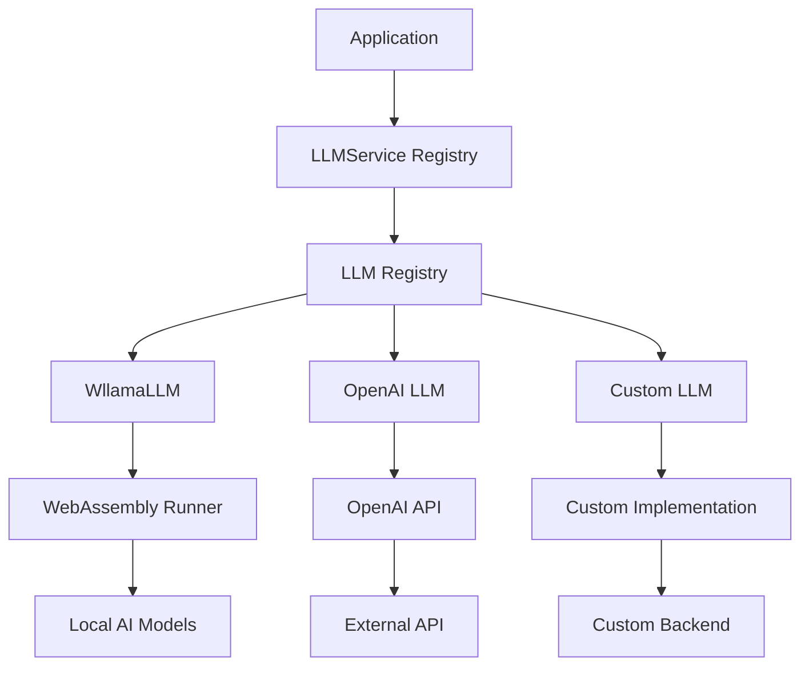

# 🤖 LLM Service Documentation

## 📋 Overview

The LLM Service is a core component of Memorall that provides large language model capabilities for chat completions, text generation, and AI-powered assistance. It supports multiple LLM providers through a unified OpenAI-compatible interface and includes a registry system for managing multiple language models simultaneously.

## 🏗️ Architecture

### 🔧 Service Architecture



The LLM Service follows a registry pattern with multiple implementation types:
- **WllamaLLM**: Browser-based WebAssembly execution
- **OpenAI LLM**: API-based integration
- **Local OpenAI-Compatible LLM**: Unified local client for LM Studio and Ollama
- **Custom LLM**: Extensible for additional providers

## 🛠️ Implementation Types

### 💻 WllamaLLM (Browser-based)

Uses WebAssembly-based language models that run entirely in the browser through an iframe runner system.

**Key Features:**
- Fully offline operation after model download
- No API costs or usage limits
- Complete privacy (no data transmission)
- Supports HuggingFace model loading
- WebAssembly-based execution

**How it works:**
1. **Initialize** - Create iframe with Wllama runner
2. **Serve** - Load model from HuggingFace with progress tracking
3. **Chat** - Send messages and receive AI responses
4. **Stream** - Support real-time response streaming

### 🌐 OpenAI LLM (API-based)

Integrates with OpenAI's API for high-quality language model capabilities with minimal setup.

**Key Features:**
- High-quality responses
- Fast processing
- Latest model access
- Requires API key and internet
- Pay-per-use model

#### Using Local OpenAI-Compatible Servers (LM Studio, Ollama)
- You can point the OpenAI provider to a local server by setting `baseURL` to your local endpoint and (optionally) leaving the API key empty.
- Examples:
  - LM Studio: `http://localhost:1234/v1`
  - Ollama (OpenAI-compatible): `http://localhost:11434/v1`
- Streaming and non-streaming chat completions are supported via SSE.
- If `baseURL` is the default `https://api.openai.com/v1`, an API key is required; for local hosts (`localhost`, `127.0.0.1`, `0.0.0.0`) the API key may be omitted.

### 🧩 Local OpenAI-Compatible (LM Studio & Ollama)

Single implementation for both LM Studio and Ollama via their OpenAI-compatible endpoints.

```typescript
import { llmService } from '@/services/llm';

// LM Studio
await llmService.create('lmstudio', { type: 'lmstudio', baseURL: 'http://localhost:1234/v1' });

// Ollama (ensure OpenAI-compatible API is enabled, e.g., http://localhost:11434/v1)
await llmService.create('ollama', { type: 'ollama', baseURL: 'http://localhost:11434/v1' });

const resp = await llmService.chatCompletionsFor('lmstudio', {
  model: 'your-model-id',
  messages: [{ role: 'user', content: 'Hello local LLM!' }],
});

// Streaming
const stream = llmService.chatCompletionsFor('ollama', {
  model: 'llama3',
  messages: [{ role: 'user', content: 'Stream a story' }],
  stream: true,
});
for await (const chunk of stream) process.stdout.write(chunk.choices[0]?.delta?.content || '');
```

### 🔧 Custom LLM (Extensible)

Placeholder for custom LLM implementations that can be added to the registry.

**Key Features:**
- Extensible architecture
- Custom backend integration
- Flexible configuration
- Maintains OpenAI-compatible interface

## 📚 Service Registry System

The LLMService manages multiple LLM instances through a registry pattern:
1. **Create** - Instantiate new LLM with configuration
2. **Initialize** - Set up the language model
3. **Register** - Store in the LLMs Map
4. **Retrieve** - Get existing LLMs by name

## ⚙️ Configuration Types

### 💻 WllamaLLM Configuration
- **url**: Runner URL (defaults to WLLAMA_RUNNER_URL)
- **type**: 'wllama'

### 🌐 OpenAI Configuration
- **apiKey**: Your OpenAI API key
- **baseURL**: API endpoint (defaults to OpenAI)
- **type**: 'openai'

### 🔧 Custom Configuration
- **type**: 'custom'
- **[key: string]**: Any custom properties needed

## 🔗 Integration with Memorall

The LLM service integrates with Memorall's conversation system and memory retrieval to provide contextual AI assistance based on stored knowledge and chat history.

## 📊 Performance Characteristics

| Implementation | Initialization Time | Response Speed | Memory Usage | Network Required | Cost |
|----------------|-------------------|----------------|--------------|------------------|------|
| WllamaLLM | 30-120s (first time) | Medium | Very High | Download only | Free |
| OpenAI LLM | <1s | Very Fast | Low | Always | Pay per use |
| Custom LLM | Varies | Varies | Varies | Depends | Varies |

## ⚠️ Error Handling

The service implements comprehensive error handling:

1. **Auto-initialization**: If LLM not ready, automatically initializes
2. **Retry Logic**: Failed requests are retried with exponential backoff
3. **Graceful Degradation**: Falls back to alternative LLMs if available
4. **Clear Error Messages**: Descriptive errors with available alternatives

## 🔒 Thread Safety & Concurrency

The service handles concurrent requests through:
- Loading state management (prevents multiple initializations)
- Request queuing for chat completions
- Singleton pattern for service instance
- Thread-safe LLM operations

## 📚 Usage Examples

### 🚀 Basic Usage

```typescript
import { LLMService } from '@/services/llm/llm-service';

const llmService = new LLMService();

// Create a Wllama LLM instance
const llm = await llmService.create('my-local', 'wllama', {
  type: 'wllama'
});

// Serve a model from HuggingFace
await llmService.serve('my-local', {
  username: 'microsoft',
  repo: 'Phi-3-mini-4k-instruct-gguf'
});

// Chat completion
const response = await llmService.chatCompletions('my-local', {
  messages: [
    { role: 'user', content: 'Hello, how are you?' }
  ]
});

console.log(response.choices[0].message.content);
```

### ⭐ Using Default LLM

```typescript
// The service can create a default LLM automatically
const response = await llmService.chatCompletions({
  messages: [
    { role: 'system', content: 'You are a helpful assistant.' },
    { role: 'user', content: 'Explain quantum computing briefly.' }
  ]
});
```

### 🔄 Multiple LLM Providers

```typescript
// Create different LLM types
await llmService.create('local-phi', 'wllama', {
  type: 'wllama'
});

await llmService.create('openai-gpt', 'openai', {
  type: 'openai',
  apiKey: 'your-api-key'
});

// Use different LLMs for different purposes
const localResponse = await llmService.chatCompletionsFor('local-phi', {
  messages: [{ role: 'user', content: 'Quick question' }]
});

const qualityResponse = await llmService.chatCompletionsFor('openai-gpt', {
  messages: [{ role: 'user', content: 'Complex reasoning task' }]
});
```

### 🌊 Streaming Responses

```typescript
// Stream chat completions
const stream = llmService.chatCompletions('my-local', {
  messages: [{ role: 'user', content: 'Tell me a story' }],
  stream: true
});

for await (const chunk of stream) {
  if (chunk.choices[0]?.delta?.content) {
    process.stdout.write(chunk.choices[0].delta.content);
  }
}
```

### ⚠️ Error Handling

```typescript
try {
  const llm = await llmService.getRequired('non-existent');
} catch (error) {
  console.error('LLM not found:', error.message);
  // Error: LLM 'non-existent' not found. Available: default, my-local
}

try {
  await llmService.create('invalid', 'openai', {
    type: 'openai',
    apiKey: 'invalid-key'
  });
} catch (error) {
  console.error('Failed to create LLM:', error.message);
}
```

### 📦 Model Management

```typescript
// Load a model from HuggingFace with progress tracking
await llmService.serve('my-local', {
  username: 'microsoft',
  repo: 'Phi-3-mini-4k-instruct-gguf'
}, (progress) => {
  console.log(`Loading: ${progress.percent}%`);
});

// List available models
const models = await llmService.models('my-local');
console.log('Available models:', models.data);

// Unload a model to free memory
await llmService.unload('my-local', 'microsoft/Phi-3-mini-4k-instruct-gguf');

// Delete a model permanently
await llmService.delete('my-local', 'microsoft/Phi-3-mini-4k-instruct-gguf');
```

### 🗄️ Integration with Memory

```typescript
import { getDB } from '@/services/database/db';
import { embeddingService } from '@/services/embedding/embedding-service';

async function chatWithMemory(query: string, llmName: string = 'default') {
  const db = getDB();
  
  // Search for relevant memories
  const queryVector = await embeddingService.textToVector(query);
  const relevantMemories = await db
    .select()
    .from(schema.messages)
    .orderBy(sql`embedding <=> ${queryVector}`)
    .limit(5);
  
  // Build context from memories
  const context = relevantMemories
    .map(memory => memory.content)
    .join('\n');
  
  // Generate response with context
  const response = await llmService.chatCompletions(llmName, {
    messages: [
      { role: 'system', content: `Use this context: ${context}` },
      { role: 'user', content: query }
    ]
  });
  
  return response.choices[0].message.content;
}
```

## 📝 API Reference

### 🏢 LLMService

#### 🛠️ LLM Management
```typescript
async create<K extends keyof LLMRegistry>(
  name: string,
  llmType: K,
  config: LLMRegistry[K]['config']
): Promise<LLMRegistry[K]['llm']>

async get(name: string): Promise<BaseLLM | undefined>
async getRequired(name: string): Promise<BaseLLM>
has(name: string): boolean
remove(name: string): boolean
```

#### ℹ️ Information Methods
```typescript
getNames(): string[]
getAll(): Map<string, BaseLLM>
async getInfo(name: string): Promise<LLMInfo | undefined>
async getAllInfo(): Promise<Record<string, LLMInfo>>
```

#### ⚡ Convenience Methods
```typescript
async chatCompletions(request: ChatCompletionRequest): Promise<ChatCompletionResponse>
async chatCompletions(request: ChatCompletionRequest & {stream: true}): AsyncIterableIterator<ChatCompletionChunk>
async chatCompletionsFor(llmName: string, request: ChatCompletionRequest): Promise<ChatCompletionResponse>
async serve(llmName: string, request: ServeRequest, onProgress?: (progress: ProgressEvent) => void): Promise<ModelInfo>
async models(llmName: string): Promise<ModelsResponse>
async unload(llmName: string, modelId: string): Promise<void>
async delete(llmName: string, modelId: string): Promise<void>
```

## 🏆 Best Practices

### 1. 🚀 Initialization Strategy
```typescript
// Initialize LLMs at application startup
async function initializeLLMs() {
  const llmService = new LLMService();
  
  // Create default for general use
  await llmService.create('default', 'wllama', {
    type: 'wllama'
  });
  
  // Load a model
  await llmService.serve('default', {
    username: 'microsoft',
    repo: 'Phi-3-mini-4k-instruct-gguf'
  });
  
  // Create specialized LLMs if needed
  if (hasOpenAIKey()) {
    await llmService.create('high-quality', 'openai', {
      type: 'openai',
      apiKey: process.env.OPENAI_API_KEY
    });
  }
}
```

### 2. 🎯 Model Selection
- **For privacy & offline**: Wllama with Phi-3-mini (3.8B parameters)
- **For quality**: OpenAI GPT-4 or Claude via API
- **For speed**: Smaller quantized models (Q4_K_M)
- **For reasoning**: Larger models like Phi-3-medium

### 3. 💾 Memory Management
```typescript
// Clean up LLMs when not needed
llmService.remove('temporary-llm');

// Unload models to free memory
await llmService.unload('default', 'large-model-id');

// Monitor LLM usage
const activeLLMs = llmService.getNames();
console.log('Active LLMs:', activeLLMs);
```

### 4. 🔄 Error Recovery
```typescript
async function robustChatCompletion(messages: ChatMessage[]): Promise<string> {
  try {
    const response = await llmService.chatCompletions({ messages });
    return response.choices[0].message.content;
  } catch (error) {
    console.warn('Default LLM failed, trying fallback:', error);
    
    // Fallback to a different LLM
    const fallback = await llmService.get('fallback') || 
                     await llmService.create('fallback', 'wllama', {
                       type: 'wllama'
                     });
    
    const response = await fallback.chatCompletions({ messages });
    return response.choices[0].message.content;
  }
}
```

This documentation provides a comprehensive overview of the LLM service architecture, implementation details, and integration patterns used in Memorall.
