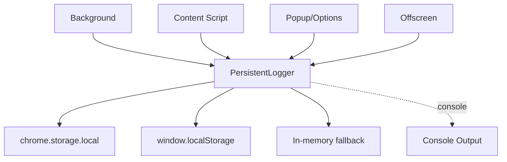

# 📝 Logging Service Documentation

## 📋 Overview

The Persistent Logger captures structured logs across extension contexts and persists them for later inspection and export. It gracefully degrades when `chrome.storage.local` is unavailable by using `localStorage` or in-memory storage.

## 🏗️ Architecture

### 🔧 Service Architecture



Key characteristics:
- Single, shared logger with structured entries
- Retains up to 1000 most recent logs
- Filterable retrieval and JSON export

## 🛠️ Capabilities

- Levels: debug, info, warn, error
- Context/source tagging: background, content, popup, options, offscreen
- Optional URL and error stack attachment
- Filtering by level, source, time range, and search string

## 📚 Usage Examples

### ✍️ Write Logs
```typescript
import { persistentLogger } from '@/services/logging/persistent-logger';

await persistentLogger.info('Started processing', { id: 123 }, 'background', location.href);
await persistentLogger.warn('Partial failure', { details: '...' }, 'offscreen');
await persistentLogger.error('Boom', new Error('Oops'), 'background');
```

### 🔎 Read, Filter, Export
```typescript
const all = await persistentLogger.getLogs();
const errors = await persistentLogger.getLogs({ level: 'error' });
const lastHour = await persistentLogger.getLogs({
  timeRange: { start: new Date(Date.now() - 3600_000), end: new Date() },
});

const json = await persistentLogger.exportLogs();
console.log('Export JSON:', json);

const stats = await persistentLogger.getLogStats();
console.log(stats.total, stats.byLevel.error);
```

### 🧹 Cleanup
```typescript
await persistentLogger.clearLogs();
```

## 📝 API Reference

### 🏢 PersistentLogger
```typescript
// Core
async log(level: LogLevel, message: string, data?: unknown, source?: LogEntry['source'], url?: string): Promise<void>
async debug(message: string, data?: unknown, source?: LogEntry['source'], url?: string): Promise<void>
async info(message: string, data?: unknown, source?: LogEntry['source'], url?: string): Promise<void>
async warn(message: string, data?: unknown, source?: LogEntry['source'], url?: string): Promise<void>
async error(message: string, data?: unknown, source?: LogEntry['source'], url?: string): Promise<void>

// Read & manage
async getLogs(filter?: LogFilter): Promise<LogEntry[]>
async clearLogs(): Promise<void>
async exportLogs(): Promise<string>
async getLogStats(): Promise<{ total: number; byLevel: Record<LogLevel, number>; bySource: Record<LogEntry['source'], number>; oldestLog?: string; newestLog?: string }>
```

### 📦 Types (selected)
```typescript
export type LogLevel = 'debug' | 'info' | 'warn' | 'error'

export interface LogEntry {
  id: string
  timestamp: string
  level: LogLevel
  message: string
  data?: unknown
  source: 'background' | 'content' | 'popup' | 'options' | 'offscreen'
  url?: string
  error?: string
}

export interface LogFilter {
  level?: LogLevel
  source?: LogEntry['source']
  timeRange?: { start: Date; end: Date }
  search?: string
}
```

## ⚠️ Error Handling

- Logging never throws; on storage failure, entries still emit to console
- When storage is unavailable, entries are kept in memory with optional localStorage mirror

## 🔒 Thread Safety & Retention

- Singleton with FIFO retention up to 1000 entries
- Consistent structure across contexts for reliable postmortems

## 🏆 Best Practices

- Include `source` and `url` to improve traceability
- Log structured `data` objects; avoid stringifying beforehand
- Use `getLogStats()` for quick health summaries

