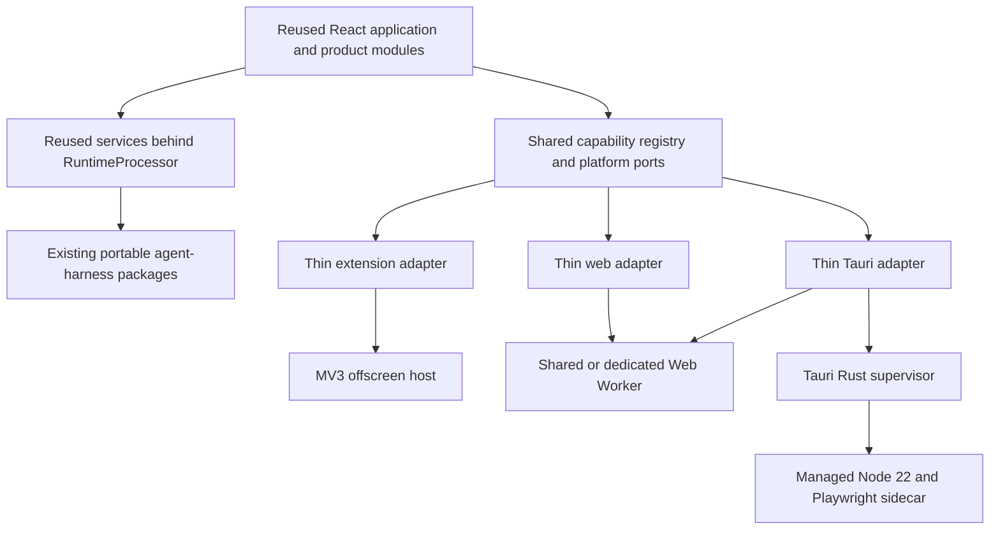

# Multi-environment Memorall architecture

Status: accepted for incremental implementation
Last reviewed: 2026-08-13
Owners: Memorall maintainers

## Decision summary

Memorall will ship from one shared product codebase to three environments:

- the existing Chrome/Edge Manifest V3 extension;
- a Vite web application deployed at `/memorall/studio/` on GitHub Pages;
- a Tauri 2 desktop application for macOS, Linux, and Windows.

Maximum reuse is a release requirement. The React application, routes, stores,
database schema and migrations, services, jobs, flows, model adapters, virtual
filesystem, and `packages/agent-harness` remain shared. Platform code may contain
only entrypoints, transports, permissions, capability declarations, and native
integration. A platform must not copy product behavior to obtain feature parity.

Data remains local to an installation. A versioned `.memorall` container provides
backup and transfer; this project does not introduce automatic cloud sync.



## Repository fit and critique

The current repository already contains the reusable center of the design:

- `src/main` is a single React route tree with feature modules and stores.
- `src/services` owns product behavior, database access, jobs, models, flows,
  filesystem behavior, and the extension's main/proxy service split.
- `packages/agent-harness` already separates portable contracts from browser and
  Node adapters.
- PGlite, Drizzle schema, and all migrations already have one source of truth.

The current constraint is transport coupling, not missing product abstractions.
Chrome APIs are used by the app shell, job notifications, database RPC, storage,
filesystem invalidation, language, navigation, and several extension-only features.
The migration therefore extracts ports around those calls in small batches. It
does not move the product into three new application directories.

The first boundary-check rollout is deliberately ratcheted. Existing Chrome
coupling is recorded as baseline debt while new shared modules are required to be
platform-clean. Each migration batch removes paths from the baseline until the
final hard rule is reached. Failing the repository immediately for historical
coupling would stop the extension from being releasable and would encourage a
large, risky rewrite.

### Rejected approaches

1. **A global Chrome shim.** It hides missing capabilities, makes extension
   semantics appear available in web/desktop, and keeps business code coupled to
   MV3 lifecycle behavior. Explicit ports make unsupported behavior visible.
2. **Copied web and desktop feature apps.** Copies would drift in routes, schema,
   migrations, jobs, flows, and tests. `apps/*` may contain shells only.
3. **A full Rust rewrite.** It would duplicate mature TypeScript services and the
   agent harness. Rust is restricted to supervision and least-privilege native
   operations.
4. **Loading remote content in Tauri.** The desktop frontend is the bundled shared
   application; remote content expands the trust boundary and breaks offline use.
5. **Cross-origin-isolation service-worker hacks on GitHub Pages.** Pages cannot
   reliably set COOP/COEP response headers. Web ships a single-thread WASM
   baseline and detects WebGPU instead of claiming unsupported WASM threads.
6. **Packaging Node into a fake single binary.** Wrappers commonly break
   `process.execPath`, `node -e`, child processes, and npm. Desktop bundles a real,
   pinned Node 22 runtime and npm CLI.
7. **Calling the local executor a security sandbox.** Child processes run with
   user privileges. The executor is opt-in, approval-gated, scoped, observable,
   limited, and cancellable, but it is not hostile-code isolation.
8. **A second desktop database.** Native SQLite/Postgres would split schema and
   migrations. All three environments keep PGlite and IndexedDB persistence.

## Code ownership and import boundaries

| Location | Ownership | Allowed environment dependencies |
|---|---|---|
| `src/main/` | Shared React UI and routes | Platform contracts/current composition only |
| `src/services/` | Shared product behavior | Injected ports; legacy exceptions are ratcheted |
| `packages/agent-harness/` | Portable execution packages | Package-specific browser/Node adapters |
| `src/platform/contracts/` | Platform-neutral contracts | No Chrome, Tauri, or Node built-ins |
| `src/platform/extension/` | MV3 adapters | Chrome APIs |
| `src/platform/web/` | Web adapters | Standard browser/worker APIs |
| `src/platform/desktop/` | Tauri frontend adapters | `@tauri-apps/*` only here |
| `apps/web/` | Vite entry, worker host, PWA/deploy config | No copied product pages/services |
| `apps/desktop/` | Tauri entry, Rust supervisor, Node sidecar | Rust/Node only in their native areas |

Automated checks enforce:

- adapters cannot import one another;
- `apps/web` and the desktop frontend cannot define product pages, schema,
  migrations, job registries, or flow registries;
- new shared files cannot import or reference `chrome`, `@tauri-apps/*`, or
  `node:*`;
- environment bundles are scanned for foreign adapter markers;
- every adapter passes the same contract suites.

## Platform ports

Ports are small and injected. A build-time alias resolves
`@/platform/current` to the selected composition so unused adapters can be
tree-shaken and bundle-scanned.

```ts
type AppEnvironment = "extension" | "web" | "desktop";

type CapabilityId =
  | "page.capture"
  | "activity.browser"
  | "browser.automation"
  | "sandbox.browser"
  | "executor.local"
  | "filesystem.native"
  | "mcp.stdio"
  | "notifications.native"
  | "updates.native"
  | "ai.webgpu"
  | "ai.wasmThreads";

interface CapabilityState {
  available: boolean;
  reason?: string;
  requiresAction?: "permission" | "download" | "approval";
}

interface CapabilityRegistry {
  get(id: CapabilityId): CapabilityState;
  subscribe(listener: () => void): () => void;
}

interface RuntimeTransport {
  request<T>(method: string, params: unknown, signal?: AbortSignal): Promise<T>;
  stream<T>(method: string, params: unknown, signal?: AbortSignal): AsyncIterable<T>;
  close(): Promise<void>;
}

interface AssetResolver {
  url(path: string): string;
}

interface KeyValueStore {
  get<T>(key: string): Promise<T | null>;
  set<T>(key: string, value: T): Promise<void>;
  remove(key: string): Promise<void>;
  subscribe<T>(key: string, listener: (value: T | null) => void): () => void;
}
```

Navigation requests, lifecycle signals, external links, notifications, and the
database's lower-level RPC transport are separate ports. They are not methods on
an unbounded global `Platform` service.

## Shared runtime

The behavior currently hosted by `scripts/offscreen.ts` becomes a reusable
`RuntimeProcessor`. Initialization, queue draining, direct jobs, progress,
cancellation, completion, and shutdown receive services and transports through
constructor dependencies.

- **Extension:** an offscreen document owns `RuntimeProcessor`; Chrome runtime
  messages and ports are transport adapters. MV3 listeners remain registered
  synchronously in the service-worker entrypoint.
- **Web:** a `SharedWorker` is preferred. A `DedicatedWorker` fallback acquires a
  Web Lock for the active dataset before opening PGlite so multiple tabs cannot
  become competing writers.
- **Desktop:** shared JS/WASM services run in a `DedicatedWorker`. Native requests
  relay through a `MessagePort` to the main webview and then through narrow Tauri
  channels.

`BackgroundJob`, database proxy/handler, shared storage, and filesystem events
accept injected transports. `ServiceManager.create()` creates isolated instances;
`ServiceManager.getInstance()` remains temporarily for compatibility.

PGlite and the existing migrations remain canonical. Browser persistence uses an
`idb://` dataset. IndexedDB is the baseline because PGlite currently recommends it
for browser compatibility. PGlite data-directory dumps are for PGlite restore and
are versioned with the export manifest.

## Desktop trust boundary

The Tauri Rust layer is intentionally narrow:

- resolve app-data and selected workspace paths;
- supervise the pinned Node runtime and sidecar;
- negotiate a versioned RPC protocol and forward streaming events;
- expose scoped dialog, notification, updater, and filesystem operations;
- enforce Tauri capabilities that do not grant general shell access.

The sidecar reuses `@memorall/agent-harness-node` and supports health, shutdown,
cancellation, managed workspace operations, local executor sessions, package
operations, MCP stdio, managed Chromium installation, and Playwright browser/DOM
operations. Chromium is pinned to Playwright and downloaded into application data
only when automation is enabled.

Local executor defaults:

- disabled until explicitly enabled;
- approval before each operation, with session-only approval as an option;
- command, working directory, network intent, and workspace shown to the user;
- application secrets removed from child environments;
- file operations restricted to selected roots;
- workspace diffs confirmed before flush;
- process, duration, output, and concurrency limits;
- process-tree cleanup on cancellation or exit.

## Portable dataset format

`.memorall` is a ZIP with a root `manifest.json`:

```ts
interface MemorallExportManifest {
  format: "memorall-export";
  formatVersion: 1;
  appVersion: string;
  sourceEnvironment: AppEnvironment;
  exportedAt: string;
  databaseSchemaVersion: number;
  entries: Array<{ path: string; sha256: string; size: number }>;
  includesCredentials: boolean;
}
```

Entries include a PGlite data archive, logical document/workspace archive, and
portable settings/flows/agent configuration. Credentials are excluded by default.
Optional credential transfer is a separate passphrase-encrypted package.

Import always targets a new staging dataset:

1. validate container paths, sizes, format version, and checksums;
2. restore PGlite and logical files under a fresh dataset id;
3. run shared migrations and representative integrity checks;
4. atomically change `activeDatasetId`;
5. restart services against the imported dataset;
6. retain the previous dataset until restart succeeds; roll back the pointer on
   failure.

## Feature matrix

Legend: ✅ supported; ◐ capability, permission, download, or provider dependent;
— unavailable by design.

| Feature | Browser extension | Tauri desktop | Web on GitHub Pages |
|---|---:|---:|---:|
| Reused React workspace and routes | ✅ | ✅ | ✅ |
| Remote-provider chat | ✅ | ✅ | ◐ provider CORS |
| Ollama/LM Studio | ◐ server CORS | ✅ sidecar transport | ◐ server CORS |
| Local CPU/WASM models and embeddings | ✅ | ✅ | ✅ single-thread |
| WebGPU acceleration | ◐ | ◐ system webview | ◐ browser/hardware |
| PGlite memory, topics, and graph | ✅ | ✅ | ✅ |
| Document library and virtual workspace | ✅ | ✅ | ✅ |
| Native folder access | — | ✅ | ◐ browser picker |
| Agents, flows, builder, and RAG | ✅ | ✅ | ✅ |
| In-page assistant and selection capture | ✅ | — | — |
| Active-tab capture and screenshots | ✅ | — | — |
| Browser activity tracking | ✅ | — | — |
| Agent browser automation | ✅ extension tabs | ✅ managed Chromium | — |
| AlmostNode browser execution | ✅ | — | ✅ after adapter extraction |
| Native commands, npm, and local servers | — | ✅ opt-in | — |
| MCP HTTP/SSE | ✅ | ✅ | ✅ |
| MCP stdio | — | ✅ | — |
| Notifications | ✅ | ✅ native | ◐ browser permission |
| Automatic updates | ✅ store | ✅ Tauri updater | ✅ deployment refresh |
| Offline after assets/models are cached | ✅ | ✅ | ✅ |
| Backup/export/import | ✅ | ✅ | ✅ |
| Automatic cross-device synchronization | — | — | — |

## Test strategy and gates

Unit tests precede environment E2E. Reusable contract suites cover:

- `KeyValueStore`: CRUD, missing values, structured values, subscriptions,
  unsubscribe, concurrent updates, and failures;
- `RuntimeTransport`: request, ordered streams, cancellation, timeout, close,
  duplicate response rejection, disconnect, and reconnect;
- `AssetResolver`: roots, nesting, encoding, `/memorall/studio/`, and traversal rejection;
- `CapabilityRegistry`: static/runtime changes, required action, reason, cleanup;
- database RPC: parameters, arrays, dates, errors, transactions, serialization;
- event buses: local/cross-context dispatch, de-duplication, cleanup.

Runtime tests cover partial initialization failure, progress order, shutdown,
restart, persisted/direct jobs, queue recovery, cancellation, late completion,
service-manager isolation, flow equivalence, capability filtering, web locking, and
schema equivalence. Platform suites cover MV3 routing and lifecycle, Pages routing
and workers, and desktop protocol/approval/path/capability behavior. Data suites
cover manifests, SHA-256, corruption, future versions, staging, rollback,
representative records/files/flows/settings, and wrong passphrases.

New platform, transport, sidecar protocol, and import/export modules require 90%
line and 85% branch coverage. Existing tests are not deleted to satisfy adapters.
Architecture checks and unit tests run before extension, web, or Tauri E2E.

## Rollout

1. Land this ADR, contracts, in-memory adapters, extension composition, reusable
   contract tests, and ratcheted architecture checks.
2. Move app lifecycle, navigation, assets, storage notifications, language,
   external links, and filesystem events behind ports in small extension-safe
   changes.
3. Extract `RuntimeProcessor`; add Chrome Port and MessagePort transports and run
   identical job/database suites against both.
4. Add the Vite Pages shell with hash routing, worker host, locking, IndexedDB,
   quota diagnostics, isolated AlmostNode scope, and versioned PWA shell cache.
5. Add the Tauri shell, Rust supervisor, sidecar protocol, real Node 22/npm bundle
   packaging, approval UI, and managed Playwright Chromium.
6. Add portable dataset export/staging import/rollback and cross-environment tests.
7. Add signed/notarized desktop artifacts, updater channels, independent release
   jobs, and beta promotion gates.

The extension remains a release gate after every step.

## Implementation checkpoint (2026-08-13)

This ADR is executable and the first cross-environment vertical slice is in the
repository. Completed in this checkpoint:

- shared platform contracts, capability registry, asset resolver, IndexedDB and
  in-memory stores, and extension/web/desktop compositions;
- one shared React bootstrap with environment-selected browser/hash routing and
  extension navigation/lifecycle adapters;
- factory-created `ServiceManager` and injectable `BackgroundJob` dependencies
  with compatibility singletons retained;
- a reusable `RuntimeProcessor`, active in the MV3 offscreen host and in the
  non-extension compatibility host, plus MessagePort request/stream/cancel
  transports for worker migration;
- extracted job initialization, shared-storage change bus, and database RPC
  server adapters;
- Vite GitHub Pages and desktop frontend builds reusing `src/main`, including the
  Pages base path, PWA shell cache, SharedWorker/DedicatedWorker connection
  scaffolds, and Web Lock helper;
- Tauri 2/Rust supervisor and least-privilege capability scaffolds, versioned
  allowlisted Node sidecar protocol, executor approval policy, and direct reuse of
  `@memorall/agent-harness-node` with explicit Node/npm executable paths;
- `.memorall` ZIP manifest/archive validation, SHA-256 checks, credential
  exclusion, size/path hardening, and staging import/rollback coordination;
- architecture checks, compiled-artifact ratchets, a local/manual GitHub Pages
  deployment command, reusable contract tests, runtime tests, archive/import
  tests, and sidecar tests;
- repeatable unpacked-extension E2E for both Extension.js dev output and the
  production build, static-server Pages E2E, and native-host desktop smoke tests.

Generated output has one repository-level contract:

```text
publish/
  extension/{chromium,chrome,edge,firefox,dev/chromium}
  web/studio/
  desktop/frontend/
  desktop/{windows,macos,linux}/
  .cache/{tauri,tauri-sidecars}/
  test-logs/
```

Extension.js may use `dist/` transiently while its dev/build producer is active,
but tests and consumers load the snapshotted artifact from `publish/`. Tauri
Cargo output and generated sidecar inputs also remain below `publish/.cache/`.

Local acceptance results on 2026-08-13:

| Surface | Command | Result |
|---|---|---|
| Extension.js development output | `yarn test:e2e:extension:dev` | Passed 3/3 tests after snapshotting Extension.js output and loading `publish/extension/dev/chromium` unpacked in headed Chromium |
| Production extension output | `yarn test:e2e:extension:build` | MV3 audit passed and 3/3 tests passed after loading `publish/extension/chromium` unpacked in headed Chromium |
| GitHub Pages layout | `yarn test:e2e:web` | Passed 2/2 tests at `/memorall/studio/` through the checked-in static server, including a hash-route reload |
| Windows Tauri application | `yarn test:e2e:desktop` | Built the native executable, Node sidecar, MSI, and NSIS installer under `publish/desktop/windows`; the executable remained open for the smoke interval |
| Windows visual launch | local Computer Use inspection | The packaged WebView2 window reached the shared Memorall onboarding workspace |

These are local/on-demand gates. No new platform E2E or deployment GitHub Actions
workflow was added. The manual Pages command publishes `publish/web` to
`gh-pages`; publishing itself was not performed during this checkpoint.

The following release work remains intentionally open and must not be represented
as production-ready:

- move the full non-extension service host from the current main-thread
  compatibility path into the Shared/Dedicated Worker and expose all database/job
  RPC over MessagePort;
- decide whether to patch or accept the two `chrome.runtime` feature-detection
  references emitted by the upstream Transformers library; all Memorall-owned
  extension transports are now excluded from web/desktop application chunks and
  the bundle check fails if the upstream-only count increases. The 16 references
  in copied AlmostNode/vendor static assets are tracked separately;
- finish AlmostNode service-worker asset/scope extraction and web quota/capability
  diagnostics;
- implement Rust sidecar process supervision and streaming channels, supply the
  pinned per-target Node 22/npm archives, implement managed Chromium download and
  Playwright operations, and add native approval/diff UI;
- connect PGlite `dumpDataDir()` and the logical filesystem to the portable archive
  interfaces, add encrypted credential packages, and implement concrete staging
  dataset storage/cleanup;
- run the remaining Tauri packaging commands on their native operating systems:
  the Windows executable, MSI, and NSIS installer have been built and opened on
  Windows; macOS still must build/notarize on macOS, and Linux still must build on
  Linux. The local smoke runner intentionally rejects cross-OS packaging claims;
- install a Rust toolchain in CI, compile/package Tauri on all target triples, and
  add signing, notarization, updater, WebDriver, transfer-direction, and release
  promotion gates.

The current web and desktop frontend bundles are development milestones, not
release artifacts, until those open gates are complete.

## Architecture decision records

### ADR-001 — One shared product application

Accepted. All environments mount `src/main`; shells cannot copy pages or services.

### ADR-002 — Explicit ports and build-time composition

Accepted. Platform capability and transport differences are explicit, with the
current adapter selected by an exact build alias.

### ADR-003 — PGlite/IndexedDB in all frontend environments

Accepted. One schema and migration set is worth more than environment-specific
database optimization until profiling proves otherwise.

### ADR-004 — Worker-hosted shared runtime

Accepted. Offscreen, shared worker, and dedicated worker are hosts for the same
processor, not separate implementations.

### ADR-005 — Narrow Tauri supervisor plus real Node runtime

Accepted. Rust supervises and authorizes; the existing Node harness executes.

### ADR-006 — Local executor is approval-gated, not secure isolation

Accepted. Product wording and controls must reflect the actual trust boundary.

### ADR-007 — Versioned local transfer, no sync

Accepted. Imports stage and roll back; credentials are excluded by default.

## Sources

- [Tauri architecture](https://v2.tauri.app/concept/architecture/)
- [Tauri commands, events, and channels](https://v2.tauri.app/develop/calling-rust/)
- [Tauri capabilities](https://v2.tauri.app/security/capabilities/)
- [Tauri sidecars](https://v2.tauri.app/develop/sidecar/)
- [Tauri GitHub pipelines](https://v2.tauri.app/distribute/pipelines/github/)
- [Tauri WebDriver testing](https://v2.tauri.app/develop/tests/webdriver/)
- [Chrome MV3 service workers](https://developer.chrome.com/docs/extensions/develop/migrate/to-service-workers)
- [Chrome offscreen documents](https://developer.chrome.com/docs/extensions/reference/api/offscreen)
- [PGlite filesystems](https://pglite.dev/docs/filesystems)
- [PGlite API and data-directory dumps](https://pglite.dev/docs/api)
- [Vite static deployment](https://vite.dev/guide/static-deploy.html)
- [SharedWorker](https://developer.mozilla.org/en-US/docs/Web/API/SharedWorker)
- [Web Locks API](https://developer.mozilla.org/en-US/docs/Web/API/Web_Locks_API)
- [Wllama thread requirements](https://github.com/ngxson/wllama)
- [GitHub Pages custom-header limitation](https://github.com/orgs/community/discussions/13309)
