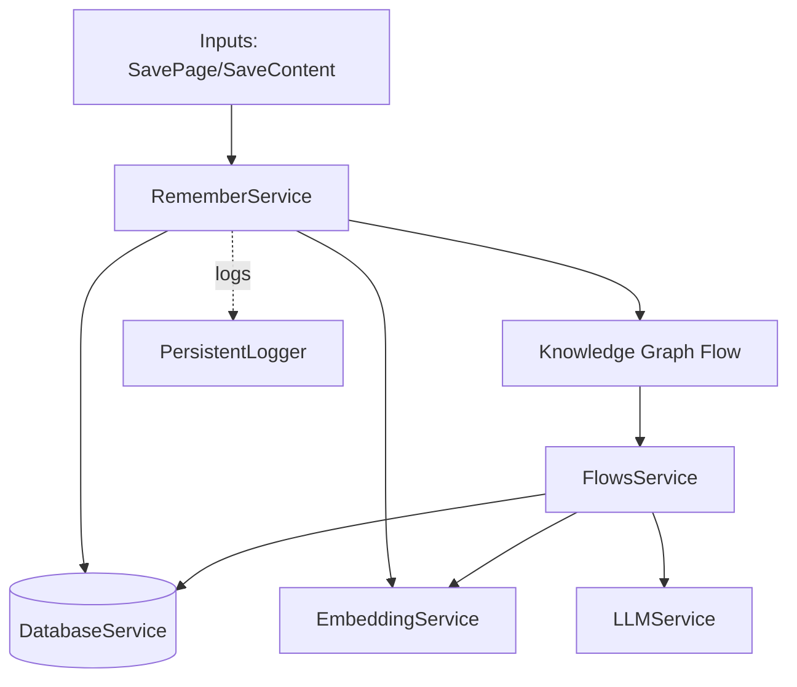

# 🧠 Remember Service Documentation

## 📋 Overview

The Remember Service ingests and persists content (web pages, selections, user input, raw text, file uploads). It stores normalized records in the database, enriches them with search vectors and optional embeddings, and can trigger downstream Knowledge Graph processing. It provides search, retrieval, and metadata updates (tags, favorite, archive).

## 🏗️ Architecture

### 🔧 Service Architecture



Key characteristics:
- Normalizes input into a unified content schema
- Calculates search vectors and quality scores; optionally adds embeddings
- Persists to `rememberedContent` and exposes CRUD and search
- Optionally invokes the Knowledge Graph flow downstream

## 🛠️ Capabilities

- Save page HTML with extracted article metadata
- Save generic content (selection, user input, raw text, file uploads)
- Generate embeddings when a DOM context is available
- Search with filters, sort, pagination
- Update metadata: tags, favorite/archive toggles
- Retrieve by URL or ID; delete content

## 📚 Usage Examples

### 🚀 Initialize and Save a Page
```typescript
import { rememberService } from '@/services/remember/remember-service';

await rememberService.initialize();

const result = await rememberService.savePage({
  html: '<html>...</html>',
  url: 'https://example.com',
  title: 'Example',
  metadata: { domain: 'example.com', description: 'Sample' } as any,
  article: { content: '<p>...</p>', textContent: '...', length: 123 } as any,
});

if (result.success) console.log('Saved id:', result.pageId);
```

### ✍️ Save Generic Content
```typescript
await rememberService.saveContentDirect({
  sourceType: 'selection',
  sourceUrl: 'https://example.com/page',
  title: 'My Snippet',
  rawContent: 'raw',
  cleanContent: 'clean',
  textContent: 'Some selected text...',
  sourceMetadata: { pageTitle: 'Example' } as any,
  extractionMetadata: {},
});
```

### 🔎 Search and Manage
```typescript
const search = await rememberService.searchPages({
  query: 'example',
  limit: 20,
  sortBy: 'createdAt',
});

// Toggle flags
await rememberService.toggleFavorite(search.pages[0].id);
await rememberService.toggleArchive(search.pages[0].id);

// Tagging
await rememberService.addTags(search.pages[0].id, ['ai', 'research']);
```

## 📝 API Reference

### 🏢 RememberService
```typescript
// Lifecycle
async initialize(): Promise<void>

// Ingest
async savePage(data: SavePageData): Promise<RememberThisResponse>
async saveContentDirect(data: SaveContentData): Promise<RememberThisResponse>
async savePageBasic(data: SavePageData): Promise<RememberThisResponse>
async updatePage(pageId: string, data: SavePageData): Promise<RememberThisResponse>

// Retrieval & Search
async findByUrl(url: string): Promise<RememberedContent | null>
async getPageById(id: string): Promise<RememberedContent | null>
async searchPages(options?: SearchOptions): Promise<SearchResult>

// Mutations
async deletePage(id: string): Promise<boolean>
async toggleFavorite(id: string): Promise<boolean>
async toggleArchive(id: string): Promise<boolean>
async addTags(id: string, newTags: string[]): Promise<boolean>
```

### 📦 Types (selected)
```typescript
export interface SavePageData {
  html: string; url: string; title: string;
  metadata: PageMetadata; article: ReadabilityArticle;
}

export interface SaveContentData {
  sourceType: 'webpage' | 'selection' | 'user_input' | 'raw_text' | 'file_upload';
  sourceUrl?: string; originalUrl?: string; title: string;
  rawContent: string; cleanContent: string; textContent: string;
  sourceMetadata: PageMetadata | SelectionMetadata | UserInputMetadata;
  extractionMetadata: ReadabilityArticle | Record<string, unknown>;
}
```

## ⚠️ Error Handling

- Initialization validates DatabaseService; logs and throws on fatal failures
- Embedding generation is best-effort; failures are logged and ignored
- Knowledge Graph processing is optional; errors do not block saves

## 🔒 Thread Safety & Concurrency

- Singleton pattern with idempotent `initialize()`
- Database access executed via `databaseService.use` boundaries

## 🏆 Best Practices

- Always `initialize()` early in long-lived contexts
- Provide meaningful `title` and `textContent` to improve embeddings/search
- Use `saveContentDirect` for non-web pages; `savePage` for HTML + Readability
- Batch UI updates after mutations to avoid flicker

## 🔗 Integration

- Downstream: Knowledge Graph via `flowsService` with `llmService` and `embeddingService`
- Observability: `persistentLogger` records key stages and errors

## 📊 Notes

- Embeddings are skipped in Service Worker contexts (no DOM)
- Search vector uses trimmed, normalized text; tags stored as arrays

