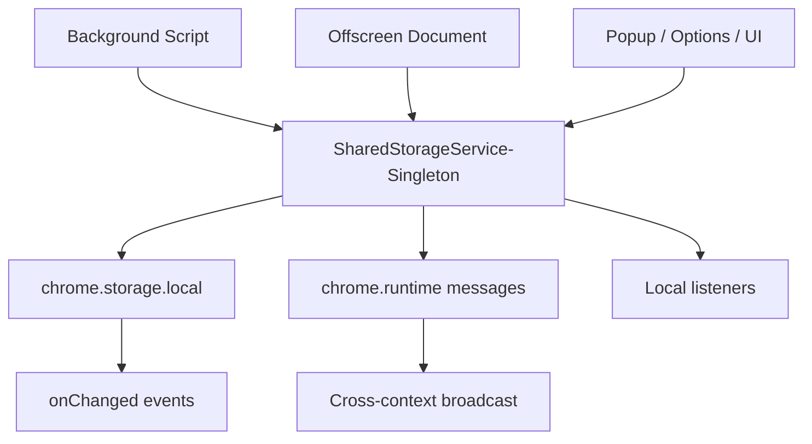

# 📦 Shared Storage Service Documentation

## 📋 Overview

The Shared Storage Service provides a unified, type-safe wrapper around `chrome.storage.local` with reliable, cross-context change notifications. It keeps Background, Offscreen, and UI contexts in sync by combining native `chrome.storage.onChanged` events with explicit `chrome.runtime` message broadcasts.

## 🏗️ Architecture

### 🔧 Service Architecture



Key characteristics:
- Singleton service accessible from any extension context
- Subscribes to native `storage.onChanged` and `runtime.onMessage`
- Broadcasts `STORAGE_CHANGED` messages to ensure all contexts receive updates
- Maintains per-key listener sets for efficient, targeted notifications

## 🛠️ Capabilities

- Automatic change notifications across all contexts
- Type-safe get/set/remove via generics
- Graceful handling when Chrome storage is unavailable
- Per-key subscriptions with easy cleanup
- Utility helpers for debugging: `getAllKeys()`, `clear()`

## 📚 Usage Examples

### 🚀 Basic Operations
```typescript
import { sharedStorageService } from '@/services/shared-storage';

// Initialize (once per context)
await sharedStorageService.initialize();

// Set data
await sharedStorageService.set('my-key', { data: 'value' });

// Get data (typed)
type MyType = { data: string };
const value = await sharedStorageService.get<MyType>('my-key');

// Remove data
await sharedStorageService.remove('my-key');
```

### 🔔 Subscriptions
```typescript
// Listen for changes to a specific key
const unsubscribe = sharedStorageService.subscribe<{ data: string }>('my-key', (event) => {
  console.log('Storage changed:', event.key, event.oldValue, '→', event.newValue);
  // event.timestamp is provided for ordering/diagnostics
});

// Later, clean up the listener
unsubscribe();
```

### 🔍 Debug Utilities
```typescript
// List all keys
const keys = await sharedStorageService.getAllKeys();

// Clear all keys (notifies listeners for each removed key)
await sharedStorageService.clear();
```

## 📝 API Reference

### 📦 Types
```typescript
export interface StorageChangeEvent<T = any> {
  key: string;
  oldValue: T | null;
  newValue: T | null;
  timestamp: number;
}

export type StorageChangeListener<T = any> = (event: StorageChangeEvent<T>) => void;
```

### 🏢 Service
```typescript
// Lifecycle
async initialize(): Promise<void>
isAvailable(): boolean

// CRUD
async get<T = any>(key: string): Promise<T | null>
async set<T = any>(key: string, value: T): Promise<void>
async remove(key: string): Promise<void>

// Events
subscribe<T = any>(key: string, listener: StorageChangeListener<T>): () => void

// Utilities
async getAllKeys(): Promise<string[]>
async clear(): Promise<void>
```

## ⚙️ Configuration

- No configuration is required. Call `initialize()` once in each active context (e.g., Background, Offscreen, Popup/Options) before use.

## 🔗 Integration

- Background and Offscreen scripts call `initialize()` during startup.
- Other services (e.g., `LLMService`) persist state through `SharedStorageService` and subscribe for updates to remain consistent across contexts.

## ⚠️ Error Handling

- Detects unavailable `chrome.storage.local` and logs a warning.
- `get()` returns `null` if storage is unavailable or the key is missing.
- `set()` and `remove()` no-op with warnings when storage is unavailable.
- Broadcast failures are safely ignored when a context is not ready.

## 🔒 Thread Safety & Concurrency

- Singleton pattern prevents duplicate instances per context.
- Idempotent `initialize()` safeguards against repeated setup.
- Per-key listener sets ensure isolated, thread-safe notifications.

## 🏆 Best Practices

- Initialize early in each context to avoid missed events.
- Namespace keys (e.g., `llm/currentModel`, `ui/theme`) to minimize collisions.
- Store typed objects and narrow access via helpers to reduce casting.
- Avoid rapid, high-frequency writes; Chrome storage has write quotas.
- Unsubscribe listeners when views unmount to prevent leaks.

## 📊 Limits & Notes

- `chrome.storage.local` is asynchronous and quota-limited; batch updates when possible.
- Cross-context sync uses both native `onChanged` and explicit `STORAGE_CHANGED` messages for reliability.
- Timestamps on events help with ordering in complex flows.

What it does:
- Initializes the service
- Sets, reads, and updates a test key
- Subscribes and logs change events
- Cleans up by removing the key

## 🧭 Migration Notes

### ✅ Completed
- LLMService uses SharedStorageService for persistence
- Background script initializes SharedStorageService
- Cross-context synchronization verified

### 🔄 Future Migrations
- Background job queue adoption for better sync
- User preferences/settings storage
- Extension configuration storage
- Theme/UI state storage
