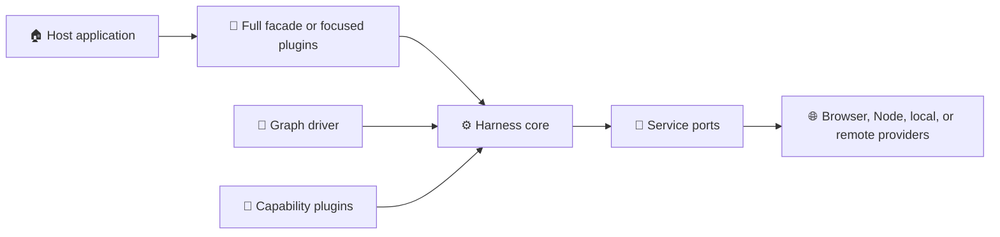

# ⚡ Agent Harness

> A composable, side-effect-free runtime for building tool-using agents that run
> in browsers, workers, and Node.js.

**Status:** private Yarn workspace family · **Version:** `0.1.0` · **Runtime:**
ESM, modern browsers/workers, Node.js 22+

Agent Harness turns a model API into a controlled execution system. It owns
plugin composition, graph execution, tools, services, streaming events,
cancellation, deadlines, checkpoints, and sandbox lifecycle. Applications keep
their prompts, data models, UI, persistence policy, and provider credentials.

## ✨ Why Use It?

- 🧩 **Compose explicitly:** install only the graphs and capabilities an agent needs.
- 🌍 **Run anywhere:** keep universal code free of DOM, Chrome, and Node assumptions.
- 🔌 **Replace providers:** bind models, filesystems, browsers, MCP servers, and
  sandboxes through stable service ports.
- 📡 **Observe every run:** consume JSON-safe model, tool, usage, and lifecycle events.
- 🛑 **Stay in control:** propagate cancellation, deadlines, output limits, and cleanup.
- 🧪 **Test with confidence:** reuse fake services and provider conformance suites.
- 📦 **Scale gradually:** start with the full facade, then import focused packages
  when bundle size or ownership requires it.

## 🧭 Choose Your Package

| Package | Icon | Use it for |
|---|:---:|---|
| [`@memorall/agent-harness`](./full/README.md) | 🚀 | The easiest complete facade and explicit presets |
| [`@memorall/agent-harness-core`](./core/README.md) | ⚙️ | Contracts, plugins, runs, events, lifecycle, and persistence ports |
| [`@memorall/agent-harness-langgraph`](./langgraph/README.md) | 🔁 | ReAct agent loops and ordered step pipelines backed by LangGraph |
| [`@memorall/agent-harness-standard`](./standard/README.md) | 🧰 | Filesystem, web, planner, skills, chat, compaction, and delegation capabilities |
| [`@memorall/agent-harness-sandbox`](./sandbox/README.md) | 🧪 | Provider-neutral sandbox sessions, tools, profiles, and workspace sync |
| [`@memorall/agent-harness-mcp`](./mcp/README.md) | 🔌 | HTTP/SSE MCP discovery, lifecycle, and structured tool adaptation |
| [`@memorall/agent-harness-browser`](./browser/README.md) | 🌐 | Browser/worker platform, OPFS, IndexedDB, and DOM content adapters |
| [`@memorall/agent-harness-node`](./node/README.md) | 🟢 | Node platform, filesystem, stores, stdio MCP, Playwright, and local sandbox |
| [`@memorall/agent-harness-compat`](./compatibility/README.md) | 🧭 | Explicit bridges for legacy graph, step, and tool IDs |

### Fastest path

Use the full facade plus one platform package:

```text
Browser app  → agent-harness + agent-harness-browser
Node service → agent-harness + agent-harness-node
Library      → agent-harness-core + only the plugins it needs
```

All packages are private in this repository today. Internal dependencies use
`workspace:^`; their manifests and exports are ready for later independent
publication.

## 🚀 Quick Start

This Node example runs the generic `agent` graph with a model adapter. A real
adapter can call any provider as long as it implements `ModelService`.

```ts
import {
  MODEL_SERVICE,
  createFullHarness,
  type ModelService,
} from "@memorall/agent-harness";
import { createNodePlatform } from "@memorall/agent-harness-node";

const model: ModelService = {
  async *stream(request) {
    const last = request.messages.at(-1)?.content ?? "";
    yield { type: "text.delta", text: `Received: ${String(last)}` };
    yield {
      type: "completed",
      message: { role: "assistant", content: `Received: ${String(last)}` },
    };
  },
};

const harness = createFullHarness({
  platform: createNodePlatform(),
  preset: {
    standard: false,
    sandbox: false,
    mcp: false,
  },
  services: {
    [MODEL_SERVICE.id]: model,
  },
});

const run = harness.run({
  graph: "agent",
  input: {
    messages: [{ role: "user", content: "Hello, harness" }],
  },
});

for await (const event of run) {
  if (event.type === "model.delta") console.log(event.delta);
}

console.log(await run.result());
await harness.close();
```

The harness is intentionally model-provider neutral. Convert provider streams
into `ModelStreamEvent` values at the adapter boundary.

## 🏗️ How It Fits Together



The dependency direction always points toward `core`. Universal packages never
import application code or concrete platform services.

## 🧠 Core Concepts

| Concept | Responsibility |
|---|---|
| **Harness instance** | Owns frozen plugins, registries, services, limits, and stores |
| **Run** | Owns input, scope, cancellation, deadline, events, runtime state, and result |
| **Graph** | Coordinates model calls, tools, steps, and checkpoint state |
| **Plugin** | Explicitly registers graphs, steps, tools, and service requirements |
| **Service token** | Connects a portable capability to a host implementation |
| **Tool** | Validates model input and returns text plus optional structured content |
| **Platform** | Supplies clock, UUID, scheduling, and optional fetch primitives |
| **Provider session** | Holds replaceable browser, local, or remote execution state |

## 🛡️ Runtime Guarantees

- Imports do not mutate global registries or install features.
- Every harness instance owns frozen registries and service bindings.
- Events, public errors, IDs, cursors, and checkpoints are JSON-serializable.
- One `AbortSignal` and deadline flow through graphs, models, tools, and providers.
- Bounded queues and output limits prevent unlimited model-context growth.
- Tools enter a model call only through explicit graph and capability selection.
- Browser and Node implementations satisfy the same portable contracts.

## 🧪 Develop And Verify

Run these commands from the repository root:

```bash
corepack enable
yarn install --immutable
yarn dev                 # Harness watch + extension hot reload
yarn harness:watch       # Harness packages only
yarn harness:boundaries
yarn harness:typecheck
yarn harness:test
yarn harness:pack
yarn harness:smoke
```

`yarn check:agent-harness` runs the complete package contract. Packed-consumer
smoke tests install generated tarballs into clean Node, Vite, Web Worker, and
Service Worker fixtures, so repository aliases or undeclared dependencies cannot
hide packaging defects.

For focused package work, start the solution watcher from the umbrella:

```bash
yarn --cwd packages/agent-harness dev
```

Or watch a single package and its TypeScript project references:

```bash
yarn workspace @memorall/agent-harness-sandbox dev
```

Every package provides `build`, `clean`, `dev`, `watch`, `typecheck`, `test`, and
`pack` scripts. `dev` performs an incremental TypeScript project build and keeps
its published `dist/` exports current. The root extension `dev`, `build`, and
`package` workflows always create an initial harness build before consuming
those exports.

## 📚 More Documentation

- [Agent Harness Architecture](../../docs/agent-harness-architecture.md)
- [Sandbox Architecture Review](../../docs/agent-harness-sandbox-review.md)
- [Memorall compatibility runtime](../../src/services/flows-legacy/README.md)

Start with the [full facade](./full/README.md) for application development, or
open the [core package](./core/README.md) when designing a new graph driver or
capability plugin.
