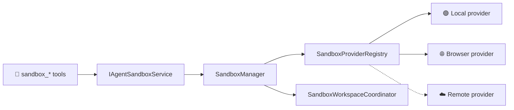

# 🧪 Agent Harness Sandbox

> One stable sandbox contract for browser, local, remote, and future providers.

[← Workspace guide](../README.md) · **Package:** `@memorall/agent-harness-sandbox`

The sandbox package owns orchestration, not a concrete runtime. It manages
provider registration, reusable sessions, capabilities, opaque IDs, process
cursors, workspace synchronization, normalized errors, grouped model tools, and
provider conformance tests.

## 🏗️ Architecture



Models never select providers, create sessions, or synchronize files. The host
binds those lifecycle decisions before a run.

## 🎛️ Tool Profiles

| Profile | Model-facing tools |
|---|---|
| `execution` | `sandbox_inspect`, `sandbox_run`, `sandbox_process`, `sandbox_packages` |
| `web_app` | execution tools plus `sandbox_preview`, `sandbox_network` |
| `stateful` | web app tools plus `sandbox_snapshot` |

Capability gating removes tools that the selected provider cannot implement.
Unsupported operations are absent, not documented optimistically and rejected
only after the model calls them.

## 🚀 Bind A Provider

```ts
import { createNodePlatform } from "@memorall/agent-harness-node";
import { NodeLocalSandboxProvider } from "@memorall/agent-harness-node";
import {
  SANDBOX_SERVICE,
  SandboxManager,
  SandboxProviderRegistry,
  sandboxPlugin,
} from "@memorall/agent-harness-sandbox";

const platform = createNodePlatform();
const providers = new SandboxProviderRegistry()
  .register(new NodeLocalSandboxProvider());

const sandbox = new SandboxManager(
  providers,
  { providerId: "node-local", sessionPolicy: "reuse-conversation" },
  platform,
);

const plugins = [sandboxPlugin({ profile: "web_app" })];
const services = { [SANDBOX_SERVICE.id]: sandbox };
```

A remote provider implements `SandboxProvider`; tools, graphs, events, and
result parsing stay unchanged.

## 🔒 Stable Cross-Provider Contracts

- IDs and process cursors are opaque strings.
- calls carry operation IDs, cancellation signals, and deadlines;
- outputs are bounded and report truncation/continuation metadata;
- failures use stable `SandboxError` codes and retryability metadata;
- workspace conflicts are reported instead of overwriting newer host files;
- session lifecycle and workspace flush remain harness-owned.

## 🧪 Provider Conformance

The `@memorall/agent-harness-sandbox/testing` subpath exports a fake remote
provider and reusable conformance helpers. Every provider should pass the same
suite before it is advertised to agents.
